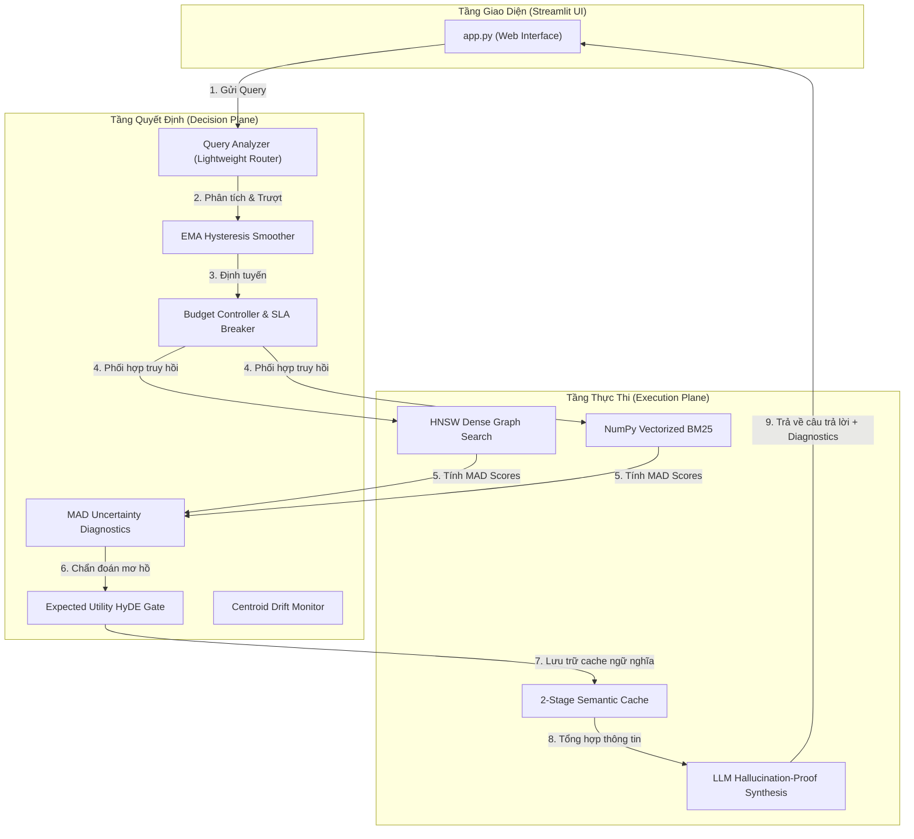
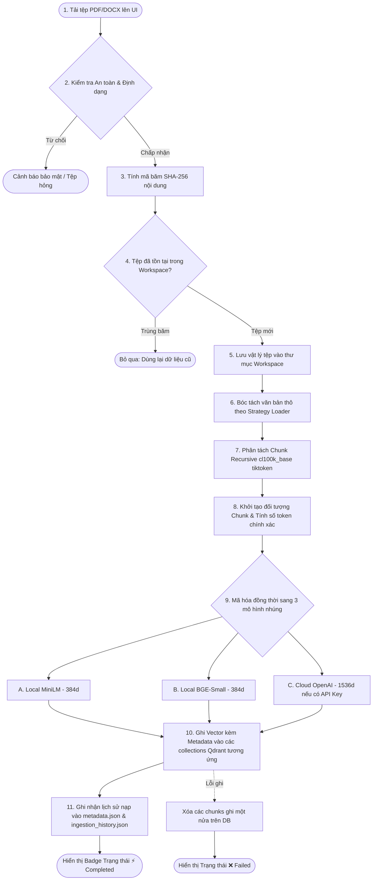

# 🏛️ Đặc tả Luồng Chạy Toàn Diện (End-to-End System Flow)

Tài liệu này mô tả chi tiết, trực quan hóa toàn bộ luồng hoạt động từ đầu đến cuối (End-to-End) của **NLP RAG Presentation Space / Advanced Retrieval Platform**, phân tách rạch ròi giữa **Luồng Nạp Tài Liệu (Document Ingestion Pipeline)** và **Luồng Xử Lý Truy Vấn Thích Ứng (8-Stage Adaptive Serving Control Plane)**.

---

## 🗺️ 1. Sơ Đồ Tổng Quan Kiến Trúc Tách Biệt Mặt Phẳng (Decision vs Execution Plane)

Hệ thống hoạt động dựa trên triết lý chia tách:
*   **Mặt phẳng Quyết định (Decision Plane / Control Plane)**: Chẩn đoán tính bất định, định tuyến mô hình nhúng, tính toán lợi thế rerank, quyết định sử dụng giả định HyDE, kiểm soát độ lệch cache.
*   **Mặt phẳng Thực thi (Execution Plane)**: Truy hồi HNSW, tính BM25 cục bộ, tổng hợp LLM Chat.



---

## 📄 2. Luồng Nạp Tài Liệu (Document Ingestion Pipeline)

Khi người dùng tải lên tài liệu (PDF hoặc Word `.docx`), hệ thống thực hiện xử lý qua các bước nguyên tử dưới đây:

### 📊 Sơ đồ tuần tự Luồng Nạp (Ingestion Flowchart)



### 📝 Mô tả chi tiết từng bước:
1.  **Giao diện Streamlit nhận tệp**: Người dùng thả tệp vào Sidebar Popover.
2.  **Rào chắn bảo mật (Security Gateway)**: Hàm `validate_file_security` kiểm tra tính hợp lệ của đường dẫn (chống path traversal), dung lượng tối đa (25MB) và định dạng mở rộng cho phép.
3.  **SHA-256 Fingerprint**: `calculate_file_hash` tính toán mã băm độc bản của nội dung tệp. Nếu phát hiện trùng mã băm của tệp đã nạp hoàn tất trước đó trong workspace, hệ thống sẽ ngắt quy trình (bypass) để tiết kiệm tài nguyên.
4.  **Strategy Parser**: `DocumentLoaderFactory` chọn loader tương thích (`PDFLoader` sử dụng `pypdf` đọc theo trang hoặc `DOCXLoader` bóc tách cấu trúc Word).
5.  **Text Splitting (Token-Aware)**: Chia đoạn văn bản thành các chunks có kích thước tối đa 350 tokens, độ gối đầu 70 tokens để bảo toàn tính ngữ nghĩa liền mạch.
6.  **Concurrent Storage**: Ghi đồng bộ vector nhúng xuống đĩa cứng cục bộ thông qua Qdrant client. Nếu có lỗi phát sinh giữa chừng, toàn bộ các vector ghi dở dang của tệp đó sẽ bị tự động dọn sạch (Rollback) để giữ dữ liệu luôn sạch.

---

## 💬 3. Luồng Xử Lý Truy Vấn Thích Ứng (8-Stage Serving Pipeline)

Khi người dùng gửi câu hỏi, hệ thống kích hoạt bộ điều phối có độ trễ cực thấp để điều hướng luồng truy hồi ngữ nghĩa.

### 📊 Sơ đồ tiến trình truy vấn (8-Stage Control Plane Sequence)

```mermaid
sequenceDiagram
    autonumber
    actor User as Người dùng (Streamlit UI)
    participant RAG as Orchestrator (rag_pipeline.py)
    participant Analyzer as Q-Analyzer (query_analyzer.py)
    participant Cache as Cache Manager (query_cache.py)
    participant Expander as Q-Expander (query_expander.py)
    participant DB as Vector Store (Qdrant Client)
    participant LLM as API Service (ChatModelService)

    User->>RAG: Gửi Câu hỏi (Query)
    
    %% STAGE 1
    rect rgb(25, 30, 45)
        note right of RAG: Stage 1: Cheap Query Profiling
        RAG->>Analyzer: route_query(query)
        Analyzer->>Analyzer: Phân loại intent & EMA hysteresis trượt
        Analyzer-->>RAG: Định tuyến Resolved Path (exact / baseline / advanced / openai)
    end

    %% STAGE 7 (Pre-retrieval)
    rect rgb(30, 40, 50)
        note right of RAG: Stage 7: 2-Stage Cache Lookup
        RAG->>Cache: lookup_cache(query, query_vector)
        Cache->>Cache: Khớp Exact (L1) + Khớp Ngữ nghĩa Qdrant (L2)
        alt Cache Hit (Có sẵn phản hồi)
            Cache-->>RAG: Trả về Cached Answer
            RAG-->>User: Hiển thị ngay câu trả lời (Latency < 2ms)
        end
    end

    %% STAGE 2 & 4
    rect rgb(25, 30, 45)
        note right of RAG: Stage 2 & 4: Parallel Hedged Search & SLA Breaker
        RAG->>DB: Thực hiện Dense HNSW Search (ANN)
        RAG->>RAG: Chạy song song Local BM25 Lexical Search (NumPy)
        alt ANN trễ > 40ms (Ngắt mạch Circuit Breaker)
            RAG->>RAG: Drop Rerank & Lấy ngay kết quả BM25 Lexical làm fallback
        else ANN chạy nhanh < 40ms
            DB-->>RAG: Trả về HNSW dense candidate chunks
        end
    end

    %% STAGE 3
    rect rgb(30, 40, 50)
        note right of RAG: Stage 3: Multi-Signal Uncertainty Diagnostics
        RAG->>Analyzer: diagnose_uncertainty(raw_scores)
        Analyzer->>Analyzer: Chuẩn hóa Robust MAD & Tính toán Entropy H_q
        Analyzer-->>RAG: Uncertainty Report (is_uncertain = True/False)
    end

    %% STAGE 5
    rect rgb(25, 30, 45)
        note right of RAG: Stage 5: Expected Utility HyDE Gate
        alt is_uncertain == True
            RAG->>Expander: evaluate_hyde_utility(entropy, gap)
            Expander-->>RAG: Run HyDE (True/False)
            opt Run HyDE == True
                RAG->>LLM: Sinh văn bản giả định (Hypothetical document)
                RAG->>Expander: validate_double_lock(hypothesis)
                Expander->>Expander: Check Cosine >= 0.78 & Bảo toàn technical anchors >= 0.85
                Expander-->>RAG: Chấp nhận / Từ chối HyDE doc
                RAG->>DB: Tìm kiếm bằng HyDE doc nhúng (nếu được chấp nhận)
            end
        end
    end

    %% STAGE 6
    rect rgb(30, 40, 50)
        note right of RAG: Stage 6: Rerank Benefit Predictor
        RAG->>RAG: Đánh giá expected gain (Skip Rerank nếu expected gain < 5%)
        RAG->>RAG: Duy trì 8% ngẫu nhiên cho Contextual Bandit exploration
    end

    %% STAGE 8
    rect rgb(25, 30, 45)
        note right of RAG: Stage 8: LLM Dispatch & Calibrated Synthesis
        RAG->>LLM: Gửi ngữ cảnh (context chunks) + Câu hỏi
        LLM-->>RAG: Trả về câu trả lời tổng hợp (Answer)
        RAG->>Cache: store_cache(query, response) (Ghi nhớ bất đồng bộ)
    end

    RAG-->>User: Trả về Answer + Báo cáo Diagnostics (Latency spans)
```



---

## 🏛️ 5. Bản Đồ Tương Tác Giữa Các Lớp Clean Architecture (Layer Interactions)

Toàn bộ các tác vụ trên được điều hành chặt chẽ và không vi phạm quy tắc phụ thuộc (Dependency Rule) của **Clean Architecture**:

```text
 Tầng UI (Streamlit UI) ────► Tầng Application (Orchestrators) ────► Tầng Domain (Core Models/Services)
      [app.py]                     [rag_pipeline.py]                     [query_config.py]
                                   [query_analyzer.py]                   [retrieval_config.py]
                                   [query_cache.py]                      [chunk.py]
                                   [query_expander.py]                   [document.py]
                                   [benchmark_harness.py]
                                            │
                                            ▼
                              Tầng Infrastructure (Adapters)
                                   [qdrant_store.py]
                                   [embedding_factory.py]
                                   [pdf_loader.py / docx_loader.py]
                                   [chat_model.py]
```

*   **Quy tắc bất biến**: Tầng nằm trong (Domain, Application) tuyệt đối không được import hay biết gì về tầng nằm ngoài (Infrastructure, UI). Mọi tương tác của tầng nằm trong ra ngoài đều được giao tiếp qua các interface trừu tượng hoặc Factory pattern (ví dụ: `BaseDocumentLoader` và `EmbeddingFactory`).
