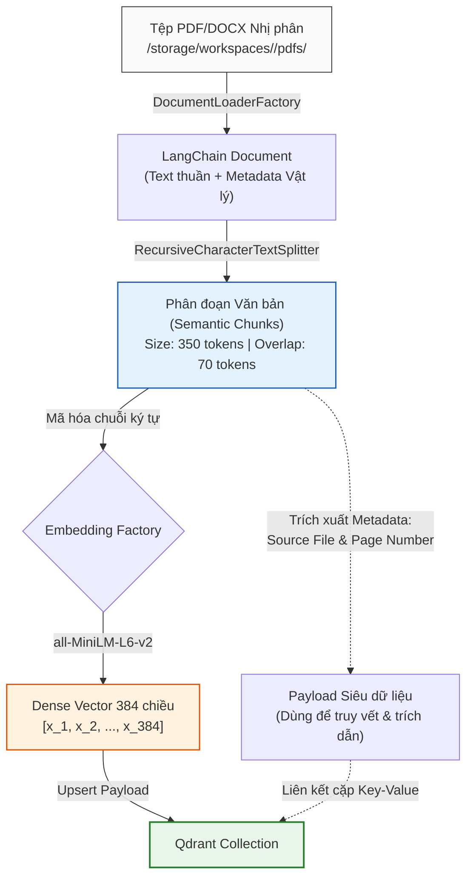

# 🏛️ Tài liệu Phân tích Kỹ thuật: Quy trình Chuyển đổi Tài liệu sang Không gian Vector (Vector Space)

Tài liệu này phân tích chi tiết quá trình kỹ thuật và toán học diễn ra tại Backend sau khi hệ thống tiếp nhận tệp tin tài liệu (PDF/Word), cho đến khi tài liệu được chuyển hóa thành các tọa độ biểu diễn ngữ nghĩa trong Không gian Vector (**Vector Space**) của Qdrant.

---

## 🔄 1. Sơ đồ Luồng Dữ liệu & Biến đổi Trạng thái

Dưới đây là mô hình chi tiết mô tả cách một dòng dữ liệu nhị phân (Binary Stream) của tệp tin được phân rã, cấu trúc hóa, toán học hóa và ghi nhận vào cơ sở dữ liệu Vector cục bộ:



---

## 🧬 2. Chi tiết 5 Bước Kỹ thuật Cốt lõi (Step-by-Step Backend Tracing)

### Bước 2.1: Giải mã & Tải Tài liệu (Document Loading)
* **Thành phần sử dụng**: `DocumentLoaderFactory` điều động `PDFLoader` (`PyPDFLoader`) hoặc `DOCXLoader` (`Docx2txtLoader`).
* **Cơ chế xử lý**: 
  1. Bộ giải mã đọc luồng byte từ đĩa cứng, bóc tách cấu trúc nhị phân của tệp PDF hoặc tệp Word.
  2. Bóc tách văn bản trang vật lý (Physical Page Text) và thu thập thông tin siêu dữ liệu (Metadata) đi kèm như:
     * Số trang vật lý (`page` - được chuẩn hóa bắt đầu từ `0` cho PDF, mặc định `0` cho Word).
     * Tên tệp nguồn (`source`).
  3. Kết quả đầu ra là danh sách các đối tượng `LCDocument` của LangChain:
     $$\text{LCDocument} = \{ \text{page\_content: str}, \text{metadata: } \{ \text{source: str}, \text{page: int} \} \}$$

---

### Bước 2.2: Phân mảnh Ngữ nghĩa (Token-Aware Chunking)
* **Thành phần sử dụng**: `langchain_text_splitters.RecursiveCharacterTextSplitter.from_tiktoken_encoder`
* **Cơ chế phân tách**:
  Hệ thống bẻ gãy văn bản theo thứ tự ưu tiên giảm dần của các ký tự phân tách: `["\n\n", "\n", " ", ""]` (Đoạn văn -> Dòng -> Từ -> Ký tự đơn) nhằm bảo toàn tối đa ranh giới ngữ nghĩa (Semantic Boundary Preservation).
* **Phân tích tham số tối ưu hình học văn bản**:
  * **`chunk_size = 350` tokens**: Tương đương khoảng 250-300 từ tiếng Việt. Kích thước này đủ nhỏ để tránh làm loãng chủ đề nhưng đủ lớn để mang theo một ý niệm trọn vẹn.
  * **`chunk_overlap = 70` tokens**: Đoạn gối đầu 20% giúp bảo toàn ngữ nghĩa tại các điểm cắt biên. Các từ khóa quan trọng nằm kề ranh giới cắt không bị mất đi ngữ cảnh liên đới.

---

### Bước 2.3: Ánh xạ miền dữ liệu (Domain Model Mapping)
* **Lớp dữ liệu**: `src.domain.models.chunk.Chunk`
* Nhằm tách biệt cấu trúc dữ liệu của framework LangChain khỏi nghiệp vụ lõi (Clean Architecture), dữ liệu được ánh xạ sang thực thể độc lập:
  ```python
  @dataclass
  class Chunk:
      id: str               # UUID độc bản dạng chk_...
      document_id: str      # Liên kết với file nguồn
      notebook_id: str      # Mã định danh Workspace để cách ly dữ liệu
      text: str             # Nội dung văn bản thô của chunk
      page_number: int      # Số trang 1-indexed (tiện hiển thị cho người dùng)
      chunk_index: int      # Số thứ tự chunk trong tài liệu gốc
  ```

---

### Bước 2.4: Biến đổi toán học (Dense Vector Generation)
* **Thành phần sử dụng**: Mô hình nhúng cục bộ `sentence-transformers/all-MiniLM-L6-v2` thông qua `langchain_community.embeddings.HuggingFaceEmbeddings`
* **Bản chất toán học**:
  Mô hình AI nhúng (`Embedding Model`) đóng vai trò là một hàm ánh xạ ngữ nghĩa sang cấu trúc hình học đa chiều:
  $$f: \text{Văn bản} \rightarrow \mathbb{R}^{D}$$
  Biến đổi chuỗi từ ngữ thành một điểm tọa độ trong không gian dense vector $D$ chiều:
  $$\mathbf{v} = [x_1, x_2, x_3, \dots, x_{D}] \quad \text{với } x_i \in \mathbb{R}$$
  Các văn bản có nội dung tương đồng về mặt ý niệm sẽ nằm gần nhau trong không gian đa chiều này.

---

### Bước 2.5: Đưa vào Vector Store (Vector Indexing & Persistence)
* **Thành phần sử dụng**: `QdrantStoreService` cục bộ.
* **Cấu trúc bản ghi**:
  Mỗi điểm dữ liệu ghi vào Qdrant chứa 3 thành phần chính:
  1. **ID**: UUID của chunk.
  2. **Vector**: Mảng float $D$ số thực đại diện cho ngữ nghĩa (384 chiều cho MiniLM).
  3. **Payload (Siêu dữ liệu)**: Lưu trữ siêu dữ liệu `page_number`, `document_id`, `notebook_id` để lọc dữ liệu cô lập và hiển thị nguồn trích dẫn.

---

## 📐 3. Phép toán Truy hồi Tương đồng & Tối ưu hóa chuẩn hóa L2

Khi người dùng nhập vào câu hỏi, câu hỏi được biến đổi thành vector truy vấn $\mathbf{q} \in \mathbb{R}^{D}$. Hệ thống thực hiện so khớp góc hình học giữa $\mathbf{q}$ và vector tài liệu $\mathbf{d}_i$ trong cùng không gian Workspace (`notebook_id` filter):

$$\text{Cosine Similarity}(\mathbf{q}, \mathbf{d}_i) = \frac{\mathbf{q} \cdot \mathbf{d}_i}{\|\mathbf{q}\|_2 \|\mathbf{d}_i\|_2} = \frac{\sum_{j=1}^{D} q_j d_{i,j}}{\sqrt{\sum_{j=1}^{D} q_j^2} \sqrt{\sum_{j=1}^{D} d_{i,j}^2}}$$

### 🚀 Tối ưu hóa thông qua Chuẩn hóa L2 (L2 Normalization)
Trong thực tế, việc tính căn bậc hai và phép chia ở mẫu số cho hàng ngàn vector trong mỗi lượt truy vấn là cực kỳ đắt đỏ về mặt CPU.
* **Giải pháp**: Tất cả các vector (cả vector câu hỏi $\mathbf{q}$ và vector tài liệu $\mathbf{d}_i$ trong cơ sở dữ liệu) đều được **Chuẩn hóa L2 (L2 Normalized)** ngay khi được sinh ra bởi Embedding Provider:
  $$\|\mathbf{q}\|_2 = 1, \quad \|\mathbf{d}_i\|_2 = 1$$
* **Kết quả**: Khi độ dài hình học của các vector đã được đưa về bằng $1$, mẫu số của phương trình Cosine Similarity triệt tiêu bằng $1$. Phép toán so khớp Cosine phức rút gọn hoàn toàn thành phép **Nhân vô hướng (Dot Product)** siêu tốc:
  $$\text{Cosine Similarity}(\mathbf{q}, \mathbf{d}_i) = \mathbf{q} \cdot \mathbf{d}_i = \sum_{j=1}^{D} q_j d_{i,j}$$
  Phép toán này được tối ưu cực hạn bằng các tập lệnh xử lý phần cứng SIMD (Single Instruction, Multiple Data) hoặc GPU, giúp hệ thống đạt độ trễ truy hồi cực thấp (Sub-millisecond latency).
