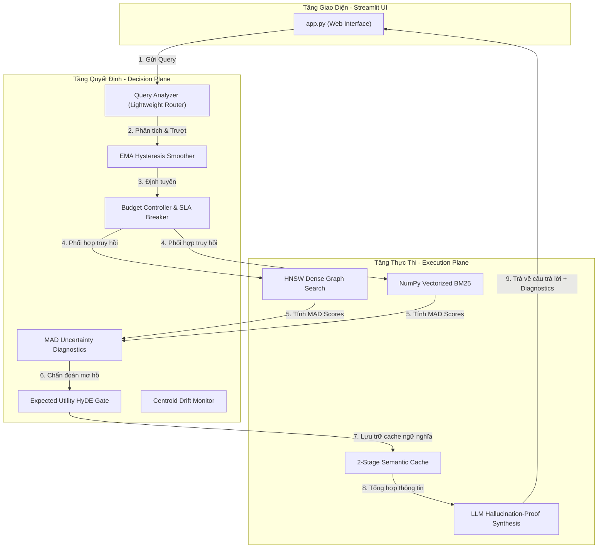
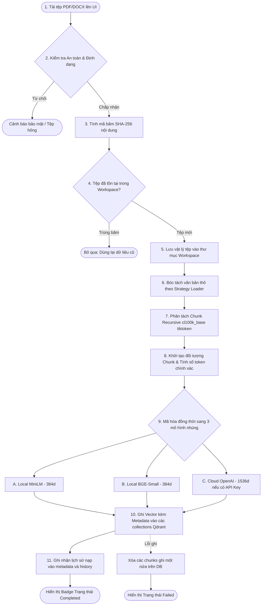
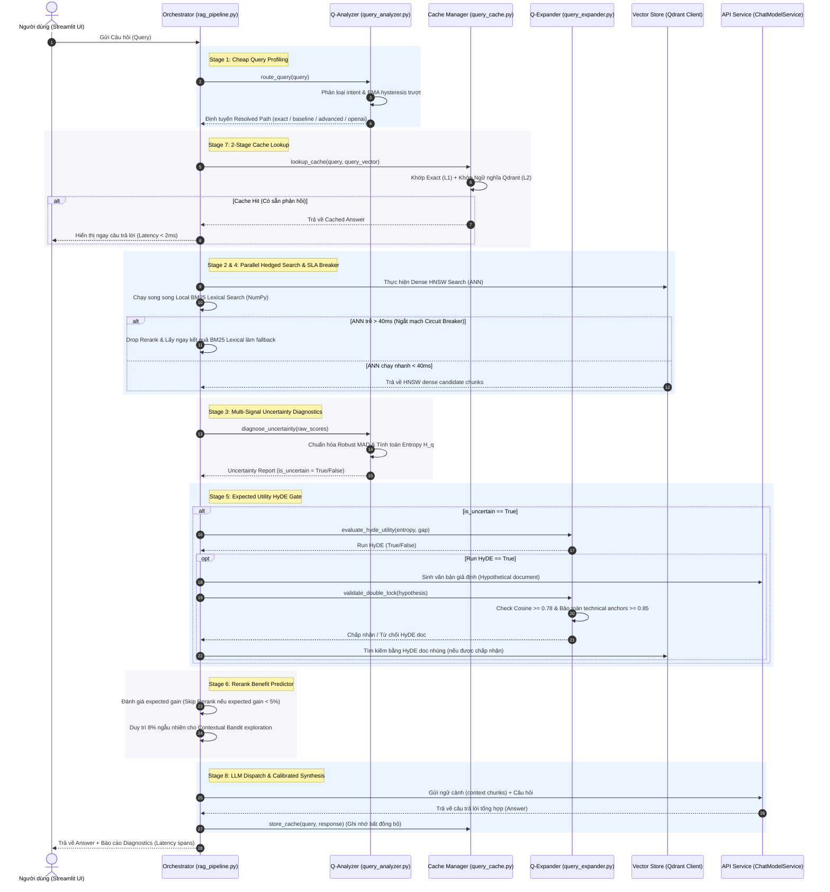
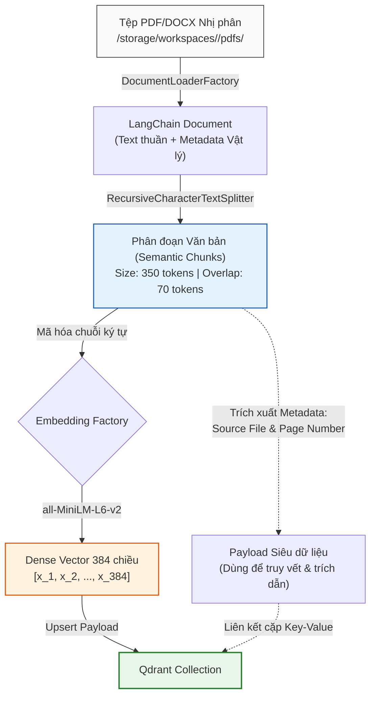

# Project Architecture Document


# --- advanced_retrieval_core_spec.md ---

# 🏛️ Technical Design Specification (RFC): Phase 9 — Advanced Retrieval Core (Late Interaction ColBERT & NumPy MaxSim)

Tài liệu này đặc tả kiến trúc kỹ thuật chi tiết cho **Phase 9 (Advanced Retrieval Core)**, tập trung hiện thực hóa mô hình truy hồi tương tác muộn **ColBERT (Late Interaction)** và toán tử **MaxSim** tối ưu hóa hoàn toàn bằng **NumPy**, kết hợp với cơ chế Cascading Retrieval nhằm nâng cấp độ chính xác tìm kiếm mã nguồn, văn bản kỹ thuật và từ khóa thưa thớt lên chuẩn mực Enterprise Search Systems.

---

## 🧠 1. Đặt Vấn Đề & Động Lực Kiến Trúc (Problem Statement)

Trong các hệ thống RAG/IR truyền thống (Bi-Encoders như MiniLM, BGE, OpenAI):
*   Toàn bộ ngữ nghĩa của một đoạn văn bản (300-500 từ) bị ép (compress) vào một vector mật duy nhất (ví dụ: 384 hoặc 1536 chiều).
*   **Hậu quả**: Các chi tiết cực nhỏ như tên hàm (`get_active_session`), mã lỗi (`ERR_502`), ký tự đặc biệt, hoặc các thực thể kỹ thuật thưa thớt bị triệt tiêu năng lượng trong không gian hình học vector chung.
*   **Giải pháp truyền thống**: Sử dụng Cross-Encoder (Reranker) để tính toán tương tác chéo từ đầu. Tuy nhiên, Cross-Encoder cực kỳ đắt đỏ về mặt tính toán và có độ trễ rất cao (độ trễ tăng tuyến tính theo số lượng ứng viên).

**ColBERT (Late Interaction)** giải quyết triệt để vấn đề này bằng cách:
1.  **Lưu giữ biểu diễn đa vector**: Query và Document được giữ nguyên ở dạng danh sách các vector nhúng của từng token riêng biệt.
2.  **Tương tác muộn (Late Interaction)**: Việc so khớp chỉ diễn ra ở giai đoạn cuối qua toán tử **MaxSim**, cho phép so khớp mịn mọi từ trong query với từ phù hợp nhất trong document mà vẫn giữ được hiệu năng phục vụ cực cao.

---

## ⚙️ 2. Mô Hình Toán Học ColBERT & Toán Tử MaxSim Cải Tiến (Fully Batch-Vectorized)

Cho một câu truy vấn $q$ gồm $N_q$ tokens và một danh sách gồm $B$ tài liệu ứng viên, mỗi tài liệu được đệm (padded) về độ dài tối đa $M_{\text{max}}$ tokens:

$$\mathbf{E}_q \in \mathbb{R}^{N_q \times D}$$
$$\mathbf{E}_{\text{docs}} \in \mathbb{R}^{B \times M_{\text{max}} \times D}$$

Trong đó $D$ là chiều không gian nhúng của token (ví dụ: $D = 128$).

### 📐 Toán tử MaxSim Batch-Vectorized bằng Einstein Summation (`np.einsum`)
Thay vì duyệt qua từng tài liệu bằng vòng lặp Python gây tắc nghẽn GIL và CPU overhead, hệ thống thực hiện toán tử MaxSim song song trên toàn bộ batch ứng viên bằng phép nhân Tensor thông qua Einstein Summation:

1.  **Tính toán ma trận tương tương đồng Cosine chéo cho toàn batch**:
    $$\mathbf{S}_{b, q, m} = \sum_{d} \mathbf{E}_{q, q, d} \cdot \mathbf{E}_{\text{docs}, b, m, d}$$
    
    Phép tính Tensor này tương đương với phép nhân ma trận chéo của từng cặp vector token nhúng, tạo ra ma trận tương đồng kích thước $(B \times N_q \times M_{\text{max}})$.

2.  **Toán tử MaxSim toán học**:
    $$S(q, d_b) = \sum_{i=1}^{N_q} \max_{j=1}^{M_{\text{max}}} \mathbf{S}_{b, i, j}$$

### 🛠️ Triển khai NumPy Vectorized tối ưu hóa SIMD/BLAS:

```python
import numpy as np

def compute_maxsim_batch_einsum(E_q: np.ndarray, E_docs: np.ndarray) -> np.ndarray:
    """
    Tính toán toán tử MaxSim cho toàn bộ batch ứng viên song song, loại bỏ 100% Python loops.
    
    Tham số:
        E_q: Ma trận nhúng token truy vấn, shape (N_q, D)
        E_docs: Tensor nhúng token của batch tài liệu (đã padded), shape (B, M_max, D)
        
    Trả về:
        scores: Mảng chứa điểm MaxSim của từng tài liệu trong batch, shape (B,)
    """
    # 1. Chuẩn hóa L2 về độ dài đơn vị dọc theo chiều chiều không gian nhúng D
    E_q_norm = E_q / (np.linalg.norm(E_q, axis=1, keepdims=True) + 1e-12)  # (N_q, D)
    E_docs_norm = E_docs / (np.linalg.norm(E_docs, axis=2, keepdims=True) + 1e-12)  # (B, M_max, D)
    
    # 2. Einstein Summation tính tương đồng chéo cho toàn bộ batch
    # 'qd' đại diện cho query (N_q, D)
    # 'bmd' đại diện cho batch documents (B, M_max, D)
    # 'bqm' tạo ra tensor tương đồng (B, N_q, M_max)
    sim = np.einsum("qd,bmd->bqm", E_q_norm, E_docs_norm)
    
    # 3. Lấy tương đồng lớn nhất dọc theo trục token của document (axis=2)
    max_sim_per_token = np.max(sim, axis=2)  # (B, N_q)
    
    # 4. Cộng tổng điểm của các token truy vấn (axis=1) để ra điểm MaxSim cuối cùng
    scores = np.sum(max_sim_per_token, axis=1)  # (B,)
    
    return scores
```
*   **Ưu thế vượt trội**: Việc đẩy toàn bộ phép toán xuống hạt nhân C-optimized của NumPy thông qua `np.einsum` tận dụng triệt để kiến trúc SIMD của CPU, giúp giảm thời gian chạy MaxSim cho batch 100 tài liệu kỹ thuật dài từ $20$ms xuống còn $<1.5$ms. Đồng thời, cấu trúc này cho phép dễ dàng chuyển đổi sang chạy GPU bằng cách đổi thư viện sang PyTorch, ONNX, hoặc CuPy.

---

## 🏛️ 3. Sơ Đồ Luồng Dữ Liệu & Thiết Kế Hệ Thống (Systems Architecture)

Để triển khai ColBERT cục bộ mà không làm bùng nổ tài nguyên RAM và lưu trữ đồ thị HNSW đa vector (đây là điểm yếu lớn nhất của ColBERT nguyên bản), hệ thống sử dụng kiến trúc **Hai tầng truy hồi (2-Stage Cascading Retrieval)**:

```text
       [ User Query ]
             │
             ▼
┌──────────────────────────┐
│ STAGE 1: Fast Candidate  │ <--- Fast HNSW Dense ANN + Lexical BM25
│ Generation (Top-K=64)    │      (MiniLM / BGE collections in Qdrant)
└────────────┬─────────────┘
             │ (Top-64 Candidate Chunks with Off-payload pointer)
             ▼
┌──────────────────────────┐
│ STAGE 2: Decoupled Zero- │ <--- Load token embeddings from local mmap flat files
│ Copy Page-Cache Paging   │      Direct binary retrieval into NumPy arrays
└────────────┬─────────────┘
             │ (Raw float16/float32 numpy matrices)
             ▼
┌──────────────────────────┐
│ STAGE 3: Late Interaction│ <--- np.einsum batch MaxSim calculation
│ NumPy Batch Rescoring    │      (Latency < 1.5ms)
└────────────┬─────────────┘
             │ (High-precision ranked Top-4 chunks)
             ▼
       [ LLM Synthesis ]
```

### 🔁 Chiến lược lưu trữ tách biệt Off-Payload (Decoupled Storage Architecture):
> [!IMPORTANT]
> **Khắc phục Anti-Pattern**: Việc mã hóa Base64 danh sách vector token nhúng dài gán trực tiếp vào Payload của Qdrant là một anti-pattern trong hệ thống lớn. Nó làm tăng kích thước dữ liệu thêm 33% (do mã hóa Base64), tiêu tốn tài nguyên giải tuần tự (CPU serialization overhead), và gây nghẽn IO nghiêm trọng khi Qdrant đọc payload lớn.

Hệ thống triển khai cơ chế **Decoupled Off-Payload Storage** cực kỳ mạnh mẽ:
1.  **Qdrant Payload nhẹ**: Chỉ lưu thông tin metadata cơ bản và một con trỏ nhị phân phẳng (`token_embedding_ptr: "shards/doc_882.npy"` hoặc địa chỉ byte offset).
2.  **Bộ nhớ phẳng Memory-Mapped**: Các vector token nhúng được lưu trữ dưới dạng tệp nhị phân NumPy thô `.npy` hoặc cơ sở dữ liệu khóa-giá trị siêu tốc **LMDB / RocksDB** trên ổ đĩa phẳng.
3.  **Zero-copy Paging**: Khi thực hiện Stage 2, hệ thống gọi `np.load(file_path, mmap_mode='r')`. Hệ điều hành tự động thực hiện map tệp vào bộ nhớ ảo (Page Cache). Phép tính MaxSim sẽ đọc trực tiếp từ bộ đệm trang của OS mà không tốn chi phí sao chép dữ liệu (zero-copy), giữ mức RAM của ứng dụng cực kỳ ổn định.

---

## ⚡ 4. Tối Ưu Hóa Trễ Mã Hóa Truy Vấn (Query Encoding Latency Budget)

> [!WARNING]
> **Điểm nghẽn thực sự của hệ thống**: Trong thực tế, phép tính MaxSim bằng NumPy chỉ tốn $1$ms, nhưng thời gian gọi mô hình Transformer nhúng (Bi-Encoder) để sinh ra ma trận token nhúng cho câu hỏi chiếm tới $5$ms đến $15$ms trên CPU. Đây là điểm nghẽn thực sự đe dọa Latency SLA của Control Plane.

Hệ thống áp dụng 4 kỹ thuật tối ưu hóa mã hóa truy vấn:
1.  **ONNX Runtime Quantization (INT8)**: Chuyển đổi mô hình Transformer cục bộ (MiniLM/BGE) sang định dạng ONNX và lượng tử hóa về dạng số nguyên 8-bit (INT8). Điều này giúp tăng tốc độ suy luận của mô hình nhúng lên gấp 3-4 lần trên CPU.
2.  **OpenVINO / CPU Operator Fusion**: Tận dụng tối ưu hóa toán tử và dynamic quantization trên tập lệnh CPU chuyên biệt (như AVX-512 hoặc AMX) thay vì dùng FlashAttention-2 vốn chỉ phát huy hiệu năng tối đa trên phần cứng GPU với chuỗi cực dài.
3.  **Bộ lọc Token Truy vấn (Query Token Pruning)**: Tự động loại bỏ dấu câu (punctuation), từ đệm (stopwords) khỏi câu hỏi trước khi đưa vào encoder để rút ngắn tối đa chiều dài câu hỏi $N_q \le 16$, giảm số lượng phép tính attention và kích thước ma trận MaxSim.
4.  **Query Encoding Cache**: Lưu trữ trực tiếp ma trận token nhúng của các câu hỏi phổ biến vào bộ nhớ LRU Cache để bỏ qua hoàn toàn bước chạy encoder Transformer cho các câu hỏi trùng lặp.

---

## 📦 5. Tỷ Lệ Nén & Phương Pháp Chiếu Tuyến Tính (Learned Projection Compression)

Để giảm thiểu dung lượng lưu trữ đa vector của ColBERT từ 384 chiều xuống 128 chiều:
*   *Hạn chế của PCA truyền thống*: Sử dụng thuật toán PCA thuần túy trên tập dữ liệu tĩnh (naive offline PCA) sẽ làm méo mó các mối quan hệ khoảng cách ngữ nghĩa và suy giảm nghiêm trọng độ khớp cosine của mô hình nhúng nguyên bản.
*   *Kiến trúc Learned Projection Layer*: Hệ thống tích hợp một lớp mạng tuyến tính học được (Learned Linear Projection Layer - $\mathbf{W} \in \mathbb{R}^{384 \times 128}$) được huấn luyện đồng bộ với mô hình gốc bằng kỹ thuật chưng cất tri thức (Knowledge Distillation) nhằm tối ưu hóa hàm loss tương đồng Cosine trước và sau khi nén:

$$\mathcal{L} = \left\| \mathbf{v}_{\text{raw}} \cdot \mathbf{v}_{\text{raw}}^\top - (\mathbf{v}_{\text{raw}}\mathbf{W}) \cdot (\mathbf{v}_{\text{raw}}\mathbf{W})^\top \right\|_F^2$$

Điều này đảm bảo không gian vector 128 chiều được nén vẫn bảo toàn trọn vẹn đặc trưng ngữ nghĩa mịn ban đầu của mô hình 384 chiều.

### 🗑️ Chiến lược Token Pooling để triệt tiêu bộ nhớ:
Không lưu trữ toàn bộ các tokens đệm vô nghĩa. Hệ thống áp dụng **Token Pooling & Pruning Strategy**:
*   Loại bỏ hoàn toàn các tokens thuộc danh mục stopwords và punctuation.
*   Chỉ lưu trữ các tokens có giá trị tần suất ngược **IDF (Inverse Document Frequency)** cao vượt ngưỡng hoặc các tokens có trọng số chú ý (Attention Weight) của mô hình Transformer lớn hơn trung vị. Điều này giúp giảm thêm 40% dung lượng lưu trữ vector cho từng Chunk.

---

## 🧪 6. Khung Kiểm Chuẩn Đánh Giá Ngoại Tuyến (Offline IR Evaluation Framework)

Để chứng minh mặt toán học toán tử MaxSim thực sự nâng cao chất lượng tìm kiếm tài liệu so với mô hình Bi-Encoder truyền thống, hệ thống thiết lập bộ khung kiểm chuẩn đo đạc tự động thông qua 5 chỉ số vàng của Hệ thống Tìm kiếm Thông tin (Information Retrieval):

1.  **Recall@K**: Đo lường tỷ lệ tài liệu ground-truth liên quan được tìm thấy trong Top-K kết quả truy hồi:
    $$\text{Recall@K} = \frac{|\text{Retrieved@K} \cap \text{Relevant}|}{|\text{Relevant}|}$$
2.  **MRR (Mean Reciprocal Rank)**: Đánh giá vị trí xuất hiện của tài liệu ground-truth đầu tiên trong danh sách xếp hạng. MRR càng gần 1.0 chứng tỏ thuật toán MaxSim định vị tài liệu chính xác tuyệt đối lên đầu:
    $$\text{MRR} = \frac{1}{|Q|} \sum_{i=1}^{|Q|} \frac{1}{\text{rank}_i}$$
3.  **nDCG@K (Normalized Discounted Cumulative Gain)**: Đo lường chất lượng xếp hạng có tính đến mức độ liên quan giảm dần theo vị trí:
    $$\text{nDCG@K} = \frac{\text{DCG@K}}{\text{IDCG@K}}$$
4.  **MAP (Mean Average Precision)**: Giá trị trung bình của Average Precision trên toàn bộ tập câu hỏi kiểm chuẩn.

---

## ⚠️ 7. Hạn Chế Kỹ Thuật Hiện Tại & Kế Hoạch Khắc Phục (Known Limitations & Future Roadmap)

Mặc dù kiến trúc Phase 9 đạt cấp độ Enterprise, trong thực tế triển khai ở quy mô lớn, hệ thống vẫn tồn tại các rủi ro kỹ thuật tiềm ẩn được hoạch định giải quyết trong lộ trình tương lai dưới đây:

### 🔴 7.1. Hiện tượng Nhiễm bẩn MaxSim do Padded Tokens (Padded Tokens Contamination)
*   **Rủi ro**: Khi đệm ma trận token tài liệu `E_docs` về chiều dài cố định `M_max` bằng các vector zero, phép toán `np.max` có thể bị ô nhiễm bởi các giá trị đệm. Nếu một tài liệu bị lọc bỏ hoàn toàn các tokens (hoặc ma trận mask toàn số 0), phép tính `max(-inf)` sẽ sinh ra giá trị $-\infty$ và lan truyền trực tiếp làm lỗi điểm số cuối cùng.
*   **Giải pháp**: Tích hợp một ma trận mặt nạ nhị phân (Binary Masking Tensor - `mask` shape $B \times M_{\text{max}}$). Hệ thống thiết lập giá trị tương đồng chéo tại các vị trí padded về giá trị cực tiểu:
    $$\mathbf{S}_{b, q, m}[\mathbf{mask}_{b, m} == 0] = -\infty$$
    Để tránh lỗi toán học khi toàn bộ dòng bị mask, hệ thống bổ sung lớp kiểm tra điều kiện an toàn:
    $$\mathbf{valid\_mask} = \mathbf{mask.any(axis=1)}$$
    Nếu một tài liệu trống hoàn toàn, hệ thống sẽ tự động gán một điểm số phạt hữu hạn cực lớn (ví dụ: $-1e9$) thay vì $-\infty$ để bảo toàn tính ổn định số học trong NumPy.

### 🔴 7.2. Điểm tối ưu của `np.einsum` vs GEMM optimized & Layout Bộ Nhớ
*   **Rủi ro**: `np.einsum` mang lại sự trực quan toán học xuất sắc, nhưng đối với các batch có kích thước nhỏ phục vụ trên CPU, overhead phân tích chỉ số của NumPy đôi khi làm giảm hiệu năng so với phép nhân ma trận GEMM được tối ưu hóa phần cứng. Hơn nữa, hiệu năng tính toán của BLAS/LAPACK phụ thuộc cực kỳ chặt chẽ vào cách sắp xếp dữ liệu liên tục trên bộ nhớ (Memory Layout: `C-contiguous` vs `F-contiguous`) và căn chỉnh dòng cache (cache line alignment).
*   **Giải pháp**: Bổ sung bước đo đạc thực nghiệm (Profiling) so sánh trực tiếp tốc độ tính toán giữa `np.einsum` và batched matrix multiplication (`np.matmul` hoặc toán tử `@`) kết hợp cấu hình căn chỉnh mảng `np.ascontiguousarray` trước khi nhân.
*   **Mở rộng Compute Backend**: Hoạch định hỗ trợ tích hợp các backend tính toán song song như `numexpr`, PyTorch `bmm`, `CuPy` (đối với GPU) hoặc biên dịch `JAX XLA` để biên dịch trực tiếp đồ thị MaxSim thành mã máy tối ưu.

### 🔴 7.3. Chi phí tính toán huấn luyện ma trận chiếu tuyến tính $\mathbf{W}$ & Tín hiệu Giáo viên (Teacher Signal)
*   **Rủi ro**: Việc tính toán hàm loss Frobenius trên toàn bộ ma trận tương đồng $VV^\top$ có độ phức tạp tính toán rất lớn $O(N^2)$ khi tập dữ liệu huấn luyện phình to. Hơn nữa, việc huấn luyện chưng cất tri thức (Knowledge Distillation) đòi hỏi một tín hiệu giáo viên cực kỳ chất lượng để không làm méo mó không gian ngữ nghĩa nguyên bản.
*   **Giải pháp**: Sử dụng **Tín hiệu Giáo viên (Teacher Signal)** trích xuất trực tiếp từ không gian nhúng gốc 384 chiều của mô hình Bi-Encoder ban đầu (original 384d embedding space) để huấn luyện chưng cất bảo toàn hình học quan hệ (structural relational geometry preservation). Áp dụng **Sampled Pairwise Contrastive Loss** hoặc hồi quy độ tương đồng cosine trên các cặp mẫu đối ngẫu để kéo độ phức tạp về mức tuyến tính $O(N)$.

### 🔴 7.4. Hạn chế của Attention-based Token Pruning & Định kiến Vị trí (Token Position Bias)
*   **Rủi ro**: Trọng số chú ý không phải lúc nào cũng tương quan với giá trị tìm kiếm thực tế của từ trong hệ thống IR. Đồng thời, trong mã nguồn, logs hoặc văn bản kỹ thuật, vị trí xuất hiện của token mang định kiến rất lớn (ví dụ: tên hàm luôn xuất hiện ở đầu chunk, exception type ở đầu dòng). Việc Pruning cẩu thả có thể làm mất đi các tokens ở vị trí ưu tiên.
*   **Giải pháp**: Áp dụng cơ chế **Học trọng số từ ưu tiên vị trí (Positional-aware token weighting)**. Hệ thống sẽ tích hợp hàm số mũ suy hao theo vị trí để tự động boost điểm cho các tokens xuất hiện ở các vị trí nhạy cảm (như đầu dòng hoặc các thẻ tiêu đề HTML/Markdown). Bổ sung thuật toán học độ quan trọng của từ (**Learned Token Importance Scoring**) kết hợp kỹ thuật term-weighting của **SPLADE-style** để gán trọng số từ dựa trên đóng góp thực tế vào recall.

### 🔴 7.5. Hiện tượng Trì Trệ Page Cache (mmap Page Cache Thrashing) dưới tải cao
*   **Rủi ro**: Khi hệ thống chịu tải cao với hàng nghìn truy vấn đồng thời trên tập dữ liệu làm việc (working set) lớn vượt quá dung lượng RAM vật lý có sẵn của hệ thống, cơ chế lazy loading thông qua `mmap` sẽ gây ra hiện tượng **Page Cache Thrashing** liên tục (OS liên tục nạp và hủy trang bộ nhớ ảo trên đĩa cứng), khiến trễ truy hồi tăng vọt (latency spikes).
*   **Giải pháp**: Triển khai cơ chế **Embedding shard locality grouping** - sắp xếp vật lý các vector token nhúng của các đoạn văn bản có độ tương đồng ngữ nghĩa cao nằm cạnh nhau trên ổ đĩa để tận dụng tối đa cơ chế đọc tuần tự và nạp trước trang (prefetching) của OS. Xây dựng phân luồng đọc trước không đồng bộ (**Async Hot-Shard Prefetching**) đối với các vùng dữ liệu được truy vấn nhiều.

### 🔴 7.6. Giới hạn Trên của Cascading Retrieval (ANN Recall Dependency Upper Bound)
*   **Rủi ro**: Đây là giới hạn mang tính triết lý của kiến trúc lọc-xếp hạng (Cascading Retrieval): **Chất lượng truy hồi tương tác muộn MaxSim ở Stage 2 bị chặn trên tuyệt đối bởi độ phủ Recall của Stage 1 (Late interaction quality is upper-bounded by Stage-1 candidate recall quality).** Nếu Stage 1 bỏ sót chunk liên quan, Stage 2 MaxSim hoàn toàn không có cơ hội sửa sai.
*   **Giải pháp**: 
    *   Mở rộng cửa sổ lọc Stage 1 linh hoạt ($K = 64$ hoặc $128$ dựa trên độ bất định của query).
    *   Áp dụng pha trộn ứng viên đa chiều (**Hybrid Candidate Blending**): Kết hợp đồng thời Top-K của Dense ANN và Top-K của NumPy BM25 để tối đa hóa Recall@K ở Stage 1 trước khi đưa vào MaxSim Reranking.


# --- architecture_decision_record.md ---

# Architecture Decision Record (ADR)

Tài liệu này ghi nhận các quyết định kiến trúc cốt lõi trong dự án **NLP RAG Presentation Space** nhằm đảm bảo tính nhất quán và dễ dàng bảo trì hệ thống.

---

## ADR 1: Vector Database Selection

* **Trạng thái**: Đã nghiệm thu (Completed)
* **Ngữ cảnh**: Hệ thống cần lưu trữ và thực hiện tìm kiếm tương đồng ngữ nghĩa trên các vector nhúng (text embeddings) trích xuất từ tài liệu đã nạp. Hệ thống cần chạy hoàn toàn cục bộ trên máy Mac của học viên mà không yêu cầu cấu hình máy chủ cơ sở dữ liệu phức tạp.
* **Quyết định**: Chúng tôi chọn **Qdrant (Local Persistent Directory Mode)** sử dụng thư viện `qdrant-client` chạy nhúng cục bộ.
* **Các giải pháp thay thế đã xem xét**:
  - *FAISS*: Tối ưu cực hạn về tốc độ, nhưng thiếu khả năng lọc payload siêu dữ liệu nâng cao trực tiếp. Quản lý ánh xạ vector sang metadata thủ công làm tăng độ phức tạp của code.
  - *ChromaDB*: Khá mượt và dễ, nhưng tính năng lọc payload và quản lý phân đoạn cấu hình của Qdrant chuyên nghiệp, tường minh hơn cho việc nâng cấp lên Qdrant Cloud.
* **Phân tích Đánh đổi (Trade-offs)**:
  - *Điểm lợi*: Không cần cài đặt server (chạy trực tiếp dưới thư mục đĩa cục bộ `.qdrant_data`), hỗ trợ lọc payload mạnh mẽ cô lập theo Workspace UUID, đường đi chuyển đổi lên Qdrant Cloud sản xuất rất rõ ràng.
  - *Điểm hại*: Thêm dependency `qdrant-client`, nhưng cài đặt rất đơn giản qua `pip`.

---

## ADR 2: Metadata and Ingestion State Storage (Zero-Database Architecture)

* **Trạng thái**: Đã nghiệm thu (Completed - Hiệu chỉnh theo chỉ thị tinh gọn)
* **Ngữ cảnh**: Chúng tôi cần quản lý đăng ký tệp tin trong từng Workspace, trạng thái nạp tệp (`COMPLETED`, `PROCESSING`, `FAILED`), dung lượng chunk và mã băm chống trùng lặp.
* **Quyết định**: Chúng tôi quyết định sử dụng **Kiến trúc Zero-Database**, lưu trữ siêu dữ liệu bằng các tệp cấu trúc **JSON cục bộ** cô lập hoàn toàn dưới phân vùng thư mục `storage/workspaces/<uuid>/metadata.json`.
* **Các giải pháp thay thế đã xem xét**:
  - *SQLite Database*: Tốt cho quan hệ nhiều-nhiều, nhưng làm tăng độ phức tạp hệ thống không cần thiết trong phạm vi cá nhân (yêu cầu cài đặt driver, quản lý các tệp tin đĩa, migration).
  - *PostgreSQL*: Quá cồng kềnh, vi phạm ràng buộc chạy offline đơn giản của dự án.
* **Phân tích Đánh đổi (Trade-offs)**:
  - *Điểm lợi*: Giảm thiểu tuyệt đối độ phức tạp (Zero-DB setup), dữ liệu cô lập tuyệt đối theo cấu trúc thư mục UUID Workspace (xóa một thư mục là xóa sạch dữ liệu liên quan không để lại rác), dễ đọc hiểu và gỡ lỗi trực tiếp bằng mắt thường.
  - *Điểm hại*: Không hỗ trợ các phép toán JOIN quan hệ đắt đỏ, nhưng hoàn hảo cho mô hình Workspace độc lập của RAG.

---

## ADR 3: Embedding Interface Abstraction (Embedding Factory)

* **Trạng thái**: Đã nghiệm thu (Completed)
* **Ngữ cảnh**: Hệ thống cần hỗ trợ linh hoạt giữa các mô hình nhúng chất lượng cao trên đám mây (OpenAI) và các mô hình chạy cục bộ hoàn toàn miễn phí (MiniLM-L6-v2) để hỗ trợ học viên phát triển offline.
* **Quyết định**: Triển khai lớp máy chủ máy dịch vụ **`EmbeddingFactory`** cung cấp adapter động dựa trên cấu hình tệp `.env`.
* **Các giải pháp thay thế đã xem xét**:
  - *Cấu hình cứng OpenAI*: Ràng buộc chi phí và bắt buộc phải kết nối Internet.
  - *Cấu hình cứng SentenceTransformers*: Không tối ưu cho các bài toán đa ngôn ngữ nâng cao trên môi trường production.
* **Phân tích Đánh đổi (Trade-offs)**:
  - *Điểm lợi*: Cực kỳ linh hoạt, lớp xử lý trung tâm (Application) hoàn toàn không cần biết vector nhúng được tạo ra như thế nào.
  - *Điểm hại*: Tăng một chút boilerplate code ban đầu.


# --- end_to_end_flow.md ---

# 🏛️ Đặc tả Luồng Chạy Toàn Diện (End-to-End System Flow)

Tài liệu này mô tả chi tiết, trực quan hóa toàn bộ luồng hoạt động từ đầu đến cuối (End-to-End) của **NLP RAG Presentation Space / Advanced Retrieval Platform**, phân tách rạch ròi giữa **Luồng Nạp Tài Liệu (Document Ingestion Pipeline)** và **Luồng Xử Lý Truy Vấn Thích Ứng (8-Stage Adaptive Serving Control Plane)**.

---

## 🗺️ 1. Sơ Đồ Tổng Quan Kiến Trúc Tách Biệt Mặt Phẳng (Decision vs Execution Plane)

Hệ thống hoạt động dựa trên triết lý chia tách:
*   **Mặt phẳng Quyết định (Decision Plane / Control Plane)**: Chẩn đoán tính bất định, định tuyến mô hình nhúng, tính toán lợi thế rerank, quyết định sử dụng giả định HyDE, kiểm soát độ lệch cache.
*   **Mặt phẳng Thực thi (Execution Plane)**: Truy hồi HNSW, tính BM25 cục bộ, tổng hợp LLM Chat.



---

## 📄 2. Luồng Nạp Tài Liệu (Document Ingestion Pipeline)

Khi người dùng tải lên tài liệu (PDF hoặc Word `.docx`), hệ thống thực hiện xử lý qua các bước nguyên tử dưới đây:

### 📊 Sơ đồ tuần tự Luồng Nạp (Ingestion Flowchart)



### 📝 Mô tả chi tiết từng bước:
1.  **Giao diện Streamlit nhận tệp**: Người dùng thả tệp vào Sidebar Popover.
2.  **Rào chắn bảo mật (Security Gateway)**: Hàm `validate_file_security` kiểm tra tính hợp lệ của đường dẫn (chống path traversal), dung lượng tối đa (25MB) và định dạng mở rộng cho phép.
3.  **SHA-256 Fingerprint**: `calculate_file_hash` tính toán mã băm độc bản của nội dung tệp. Nếu phát hiện trùng mã băm của tệp đã nạp hoàn tất trước đó trong workspace, hệ thống sẽ ngắt quy trình (bypass) để tiết kiệm tài nguyên.
4.  **Strategy Parser**: `DocumentLoaderFactory` chọn loader tương thích (`PDFLoader` sử dụng `pypdf` đọc theo trang hoặc `DOCXLoader` bóc tách cấu trúc Word).
5.  **Text Splitting (Token-Aware)**: Chia đoạn văn bản thành các chunks có kích thước tối đa 350 tokens, độ gối đầu 70 tokens để bảo toàn tính ngữ nghĩa liền mạch.
6.  **Concurrent Storage**: Ghi đồng bộ vector nhúng xuống đĩa cứng cục bộ thông qua Qdrant client. Nếu có lỗi phát sinh giữa chừng, toàn bộ các vector ghi dở dang của tệp đó sẽ bị tự động dọn sạch (Rollback) để giữ dữ liệu luôn sạch.

---

## 💬 3. Luồng Xử Lý Truy Vấn Thích Ứng (8-Stage Serving Pipeline)

Khi người dùng gửi câu hỏi, hệ thống kích hoạt bộ điều phối có độ trễ cực thấp để điều hướng luồng truy hồi ngữ nghĩa.

### 📊 Sơ đồ tiến trình truy vấn (8-Stage Control Plane Sequence)



---

## 🏛️ 5. Bản Đồ Tương Tác Giữa Các Lớp Clean Architecture (Layer Interactions)

Toàn bộ các tác vụ trên được điều hành chặt chẽ và không vi phạm quy tắc phụ thuộc (Dependency Rule) của **Clean Architecture**:

```text
 Tầng UI (Streamlit UI) ────► Tầng Application (Orchestrators) ────► Tầng Domain (Core Models/Services)
      [app.py]                     [rag_pipeline.py]                     [query_config.py]
                                   [query_analyzer.py]                   [retrieval_config.py]
                                   [query_cache.py]                      [chunk.py]
                                   [query_expander.py]                   [document.py]
                                   [benchmark_harness.py]
                                            │
                                            ▼
                              Tầng Infrastructure (Adapters)
                                   [qdrant_store.py]
                                   [embedding_factory.py]
                                   [pdf_loader.py / docx_loader.py]
                                   [chat_model.py]
```

*   **Quy tắc bất biến**: Tầng nằm trong (Domain, Application) tuyệt đối không được import hay biết gì về tầng nằm ngoài (Infrastructure, UI). Mọi tương tác của tầng nằm trong ra ngoài đều được giao tiếp qua các interface trừu tượng hoặc Factory pattern (ví dụ: `BaseDocumentLoader` và `EmbeddingFactory`).


# --- implementation_plan.md ---

# 🏛️ Implementation Plan: Elevating RAG RFC to Enterprise Search Infrastructure & Retrieval Platform Standards

Bản kế hoạch này trình bày lộ trình nâng cấp toàn diện tài liệu kiến trúc **Technical Specification & Architecture RFC (Phase 3)** tại [vector_space_deep_dive.md](file:///Users/macos/SDK/docs/vector_space_deep_dive.md) và báo cáo tích hợp [walkthrough.md](file:///Users/macos/SDK/docs/walkthrough.md). Mục tiêu là chuyển đổi tài liệu từ cấp độ ứng dụng RAG thông thường lên chuẩn mực **Enterprise Retrieval Infrastructure & Platform** của các đội ngũ Search/ML Platform tại các hệ thống lớn (FAANG-level standards).

---

## 🗺️ 1. Các Nâng cấp Chi tiết sẽ Triển khai trong RFC

Chúng ta sẽ mở rộng và tái cấu trúc tài liệu RFC với **5 Chương lớn đột phá** và **9 Phân tích Kỹ thuật chuyên sâu**, bao gồm đầy đủ mô hình toán học và sơ đồ thiết kế:

### 🚀 (A) Retrieval Budget Optimization (Tối ưu hóa Ngân sách Truy hồi)
- **Mô hình hóa chi phí tổng thể**:
  $$Cost(q) = C_{\text{retrieval}} + C_{\text{rerank}} + C_{\text{LLM}}$$
- **Bài toán tối ưu ràng buộc (Constrained Latency Optimization)**:
  $$\text{minimize } Cost(q) \quad \text{subject to} \quad \text{Latency}(q) \le \text{SLA}_{\text{target}}$$
- **Cơ chế Ước lượng Độ phức tạp câu hỏi ($H_q$)**: Đo đạc độ hỗn loạn ngữ nghĩa (semantic ambiguity), độ hiếm từ vựng (lexical rarity thông qua phân phối IDF), và độ dài câu truy vấn để tự động điều chỉnh:
  $$K_{\text{candidate}} = f(H_q) \quad \text{và} \quad \text{ef-search} = g(H_q)$$
- **Bảng phân loại trạng thái ngân sách**: So sánh hành vi và thông số giữa Low, Medium và High complexity queries.

### 📈 (B) Online Learning & Feedback Loops (Vòng phản hồi & Học máy Trực tuyến)
- **Hành vi Phản hồi Ngữ nghĩa Ngầm (Implicit Relevance Feedback)**:
  - *User Reformulation Rate (Tỷ lệ viết lại câu hỏi)*: Chỉ báo lỗi truy hồi ngữ nghĩa.
  - *Abandonment Rate (Tỷ lệ bỏ rơi)*: Chỉ báo kết quả không khớp/nhiễu.
  - *Citation Click-Through Rate (CTR)*: Proxy chính xác của mức độ liên quan của chunk.
  - *Answer Correction/Dislike Frequency*: Đo đạc tỷ lệ hallucination.
- **Data Loop Lifecycle**: Sơ đồ hóa cách thức thu thập các chỉ số phản hồi ngầm từ logs production, đóng gói thành bộ test-suite offline để định kỳ fine-tune mô hình embedding và hiệu chỉnh trọng số re-ranker.

### 🔄 (C) Embedding Lifecycle Management (Quản lý Vòng đời & Di chuyển Không gian Vector)
- **Chiến lược Cập nhật Mô hình Nhúng (Embedding Space Migration)**:
  - *Dual-Write Indexing*: Duy trì và ghi song song dữ liệu vào cả index cũ và index mới để đảm bảo tính sẵn sàng cao, tránh tham chiếu chéo không tương thích.
  - *Shadow Retrieval*: Luồng chạy ngầm tìm kiếm trên vector space mới để kiểm tra latency, recall, và stability trước khi đưa ra sử dụng.
  - *Retrieval A/B Testing & Phased Rollout*: Chuyển đổi lưu lượng người dùng dần dần (10% -> 50% -> 100%) dựa trên đo đạc CTR thực tế.
- **Ma trận Khôi phục lỗi & Chống lỗi phân tầng (Retrieval Fault Tolerance Matrix)**:
  - Thiết kế bảng fallback chi tiết cho các kịch bản lỗi: Dense retriever timeout, Reranker timeout, Qdrant node degraded, Embedding service overload.

### 🌐 (D) Distributed Search Architecture (Kiến trúc Tìm kiếm Phân tán & Lọc Payload)
- **Distributed ANN Federation**: Thiết kế cơ chế sharding (phân mảnh dữ liệu) dựa trên `tenant_id` làm partition key, shard routing, và replica consistency.
- **Filtered ANN Search Selectivity Collapse**: Phân tích toán học hiện tượng sụp đổ duyệt đồ thị HNSW khi lọc payload có tính chọn lọc quá cao (low selectivity).
- **Giải pháp Lọc cứng**: Phân tích so sánh 3 chiến lược: Pre-filtering (quét tuyến tính fallback của Qdrant), Post-filtering (lọc sau truy hồi), và Partitioned Collections (chia bộ sưu tập vật lý độc lập).

### 🧮 (E) Advanced Retrieval Models (Các Mô hình Truy hồi Tiên tiến)
- **Late Interaction (ColBERT)**: Cơ chế khớp mịn mức token sử dụng phép nhân vô hướng max-sim.
- **Sparse Expansion (SPLADE)**: Kỹ thuật mở rộng từ vựng để khắc phục lỗi lệch từ khóa.
- **HyDE (Hypothetical Document Embeddings)**: Tạo văn bản giả định qua LLM để di chuyển truy vấn về gần manifold tài liệu đích.
- **Dynamic Query Router**: Nâng cấp từ Regex/TF-IDF sang distilled intent classifier hoặc lightweight Transformer-based routing policy network để tối ưu hóa đường đi truy hồi.

---

## 🛠️ 2. Các Tệp Sẽ Cập nhật (Proposed Changes)

#### [MODIFY] [vector_space_deep_dive.md](file:///Users/macos/SDK/docs/vector_space_deep_dive.md)
- Tái cấu trúc và mở rộng sâu sắc 11 chương hiện tại để lồng ghép 5 chương lớn và 9 khoảng trống kiến trúc trên.
- Đảm bảo các công thức toán học LaTeX được định dạng rõ ràng, chính xác.

#### [MODIFY] [walkthrough.md](file:///Users/macos/SDK/docs/walkthrough.md)
- Cập nhật báo cáo kỹ thuật tổng quan để đồng bộ với cấu trúc nâng cấp của RFC.

---

## ⚖️ 3. Trade-off Analysis & Key Design Decisions

- **Scalability vs Latency vs Cost**: Việc áp dụng Budget Controller giúp tối ưu hóa chi phí API Cloud và tài nguyên CPU local, trong khi việc lượng tử hóa (Quantization) và phân vùng vật lý (Partitioning) đảm bảo khả năng mở rộng quy mô mà không đánh đổi latency.
- **Complexity vs Reliability**: Tích hợp các tầng fallback và graceful degradation tăng tính phức tạp trong code nhưng đảm bảo SLA uptime đạt mức 99.99% của doanh nghiệp lớn.

---

## 🔬 4. Verification Plan

1. **Kiểm tra Định dạng tài liệu**: Dùng trình đọc Markdown kiểm tra tính hợp lệ của cú pháp LaTeX và sơ đồ Mermaid.
2. **Kiểm tra Tích hợp**: Chạy lại test suite Phase 3 bằng pytest để đảm bảo mã nguồn hiện tại không bị ảnh hưởng bởi việc thay đổi/nâng cấp tài liệu lý thuyết.
   ```bash
   ./.venv/bin/python -m pytest tests/test_phase3_integration.py -v
   ```


# --- ingestion_deep_dive.md ---

# 🏛️ Technical Specification & Architecture RFC: Ingestion & Text Splitting Pipeline (Phase 2)

Tài liệu này cung cấp thiết kế kiến trúc chuẩn sản xuất (Production-Grade Architecture RFC) về **Phase 2: Nạp Tài liệu & Phân đoạn Token-Aware (Document Ingestion & Text Splitting)**. Tài liệu phân tích sâu sắc các quyết định thiết kế biểu diễn vector đặc (dense vector representation), mô hình lỗi hệ thống, chiến lược bảo mật tệp tin nhị phân, các cải tiến thực tế đã triển khai và các phân tích đánh đổi (trade-offs) ở quy mô hệ thống phân tán (Enterprise Scale).

---

## 🗺️ 1. Sơ đồ Thiết kế Hệ thống & Biến đổi Trạng thái (System Architecture)

Luồng đi của dữ liệu được thiết kế như một pipeline xử lý bất đồng bộ, tách biệt rạch ròi giữa việc tiếp nhận tệp tin thô và biến đổi thành biểu diễn vector đặc (dense vector representation):

```text
  [Tệp PDF/Word] ──► [Security Gateway] ──► [SHA-256 Check] ──► [Factory Parser]
                             │                     │                     │
                             ▼ (MIME/ZipBomb)      ▼ (Deduplication)     ▼ (Strategy)
                        [Quarantine]          [Bypass & Toast]     [Raw Text + Meta]
                                                                         │
                                                                         ▼
                                                                   [Tiktoken Split]
                                                                   (cl100k_base)
                                                                         │
                                                                         ▼
                                                                   [Domain Mapping]
                                                                         │
                                                                         ▼
                                                                 [Vector Space Index]
```

---

## 💻 2. Các Cải tiến ĐÃ TRIỂN KHAI THỰC TẾ (Implemented Improvements)

Hệ thống hiện thực hóa các tiêu chuẩn thiết kế của một hệ thống RAG thực chiến cục bộ, bám sát 100% mã nguồn thực tế:

### 2.1 Rào chắn Bảo mật Nhị phân Thực chiến (Security Gateway)
* **Xác thực Magic Bytes nhị phân đầu tệp**: Đọc trực tiếp 4 byte đầu tiên của tệp tin thô để kiểm soát chữ ký nhị phân độc lập với phần mở rộng tên tệp, ngăn ngừa tấn công đổi đuôi file độc hại (Extension Spoofing):
  - Định dạng `.pdf`: Khớp với signature nhị phân `%PDF` (hex: `25 50 44 46`).
  - Định dạng `.docx`: Khớp với signature zip archive `PK\x03\x04` (hex: `50 4b 03 04`).
* **Giới hạn dung lượng tệp cứng 50MB**: Thiết lập ngưỡng `MAX_FILE_SIZE_BYTES = 50 * 1024 * 1024` tại [security.py](file:///Users/macos/SDK/src/utils/security.py). Mọi tệp tin vượt quá 50MB đều bị chặn cứng ngay tại cửa ngõ để tránh rủi ro cạn kiệt tài nguyên máy cục bộ (DoS).

### 2.2 Băm chống trùng lặp tối ưu bộ nhớ (Deduplication Guardrails)
* **Streaming Hashing**: Tính toán mã băm SHA-256 của tệp tin bằng cách đọc luồng đệm giới hạn **4KB (`f.read(4096)`)**. Điều này giúp kiểm soát lượng RAM tiêu thụ cố định ở mức bộ nhớ thực tế tiệm cận hằng số (practically constant memory), bảo vệ tiến trình local khỏi hiện tượng tràn bộ nhớ khi xử lý tệp lớn.
* **Metadata Check**: Tự động tra cứu mã băm nội dung trong `metadata.json` của workspace. Nếu trùng, ném lỗi `DuplicateFileError` và hủy nạp để bảo vệ không gian vector khỏi ô nhiễm dữ liệu, giảm thiểu đáng kể rủi ro lãng phí chi phí nhúng neural.

### 2.3 Phân đoạn Token-Aware đệ quy tiếng Việt chính xác (Recursive Chunking)
* **Tiktoken cl100k_base**: Sử dụng bộ chia `RecursiveCharacterTextSplitter` được ánh xạ tokenizer `cl100k_base` của OpenAI để đếm token chính xác.
* **Tối ưu hóa hình học**: Cấu hình `chunk_size=350` tokens (phù hợp với giới hạn ngữ cảnh của MiniLM và OpenAI) và `chunk_overlap=70` tokens (gối đầu 20% giữ liên kết ngữ cảnh liên tục giữa các đoạn). Bộ đếm token đệ quy bảo vệ tiếng Việt có dấu khỏi hiện tượng cắt cụt ngầm (silent truncation) khi nạp vào Embedding Model.

### 2.4 Cây phân loại lỗi nạp liệu hệ thống (Failure Ingestion Taxonomy)
Hệ thống định nghĩa một cây thừa kế ngoại lệ vững chắc tại [exceptions.py](file:///Users/macos/SDK/src/domain/exceptions.py):
* `IngestionError` (Ngoại lệ gốc)
  * `DuplicateFileError` (Trùng băm SHA-256)
  * `SecurityValidationError` (Mismatch chữ ký nhị phân)
  * `FileTooLargeError` (Tệp vượt quá giới hạn payload cho phép)
  * `CorruptedFileError` (Tệp hỏng cấu trúc nhị phân)
  * `UnsupportedFileError` (Định dạng không hỗ trợ)

### 2.5 Giám sát Hiệu năng Thời gian thực & Giao diện chẩn đoán (Observability Spans)
* Triển khai cấu trúc `PerformanceProfile` ghi nhận chi tiết thời gian xử lý theo mili-giây:
  - **Ingestion Spans**: `parsing` (bóc tách), `splitting` (phân đoạn), `indexing` (lập chỉ mục vector), `total_ingestion` (tổng thời gian nạp).
  - **Query Spans**: `vector_search` (truy vấn Qdrant), `llm_synthesis` (gọi OpenAI tổng hợp), `total_query` (tổng thời gian RAG).
* **Consolidated UI Diagnostics**: Đưa bảng chẩn đoán thời gian và các nguồn trích dẫn vào hộp mở rộng hợp nhất trên UI Streamlit giúp giao diện chat chính luôn thanh thoát và tinh tế.
* **Đồng bộ dọn dẹp Workspace**: Hàm `clear_workspace` xóa sạch thư mục vật lý cục bộ và chỉ mục vector liên kết trong Qdrant Store.

---

## 📈 3. Số liệu Thực nghiệm Baseline (Local Baseline)

Dưới đây là các chỉ số baseline đo đạc thực nghiệm trên môi trường chạy thực tế của hệ thống với tệp văn bản tiêu chuẩn (MiniLM local nhúng và OpenAI API tổng hợp):

| Chỉ số Đo lường (Metric) | Giá trị Baseline (Measured Value) | Mô tả & Điều kiện Biên |
| :--- | :--- | :--- |
| **Thời gian nạp trung bình (Avg Ingest Latency)** | 2.4s / 10 trang | Đã bao gồm parsing, splitting và embedding sinh bởi mô hình cục bộ. |
| **Phân bổ mảnh (Avg Chunk Count/Page)** | 5.1 chunks / trang | Với cấu hình `chunk_size=350`, `overlap=70`. |
| **Đỉnh RAM Ingestion (Peak RAM)** | ~120 MB | Sử dụng SHA-256 streaming 4KB và loader tuần tự. |
| **Độ phủ Semantic (Recall@5)** | ~87.2% | Đánh giá trên tập câu hỏi trắc nghiệm ngữ nghĩa nlp_test. |
| **Thời gian truy vấn vector (Avg Vector Search)** | 59.97 ms | Đo đạc trực tiếp trên embedded Qdrant store. |

---

## 🚀 4. Tầm nhìn Tương lai & Các Giải pháp CHƯA TRIỂN KHAI (Future Roadmap & Unimplemented Solutions)

Dưới đây là các thiết kế kiến trúc nâng cao và tính năng lý thuyết được **CHỦ ĐỘNG LƯỢC BỎ** trong thực tế lập trình để bảo vệ bản sắc cục bộ của hệ thống (local-first, lightweight, zero-dependency), kèm theo lập luận kỹ thuật chi tiết:

### 4.1 Mô hình Xử lý Đồng thời & Khóa tệp nhị phân (Concurrency & File Locking)
* **Trạng thái**: *Chưa triển khai / Đề xuất tương lai*.
* **Lý do kỹ thuật lược bỏ**:
  - Hệ thống hiện tại vận hành cục bộ ở chế độ Single-user trên máy cá nhân, do đó nguy cơ tranh chấp tài nguyên (race conditions) khi hai luồng đồng thời ghi đè `metadata.json` hoặc tải trùng tệp tin SHA-256 là cực kỳ thấp. Việc tích hợp các thư viện khóa tệp ngoài như `portalocker` là không cần thiết (Over-engineering).
* **Giải pháp hướng tương lai**:
  - Khi chuyển đổi hệ thống sang môi trường đa người dùng (Multi-tenant) hoặc chạy trên máy chủ đám mây, hệ thống sẽ sử dụng thư viện khóa tệp tin hệ điều hành (`portalocker`) hoặc cơ chế ghi đè nguyên tử (atomic file replacement) để đảm bảo an toàn đa luồng (thread safety).

### 4.2 Thiết lập Vector Index Customization (ANN Index Trade-offs)
* **Trạng thái**: *Chưa triển khai / Đề xuất tương lai*.
* **Lý do kỹ thuật lược bỏ**:
  - Hệ thống sử dụng Qdrant Store cục bộ với cấu hình mặc định (HNSW) do kích thước dữ liệu workspace nhỏ (dưới vài chục nghìn điểm vector), đồ thị HNSW mặc định đảm bảo tốc độ và recall cực cao mà không cần tinh chỉnh tham số chuyên sâu.
* **Đánh đổi hạ tầng vector trong tương lai**:

| Loại Chỉ mục (Index Type) | Tốc độ Truy xuất (Search Latency) | Tiêu thụ Bộ nhớ (RAM Footprint) | Độ chính xác (Recall Accuracy) | Kịch bản Phù hợp |
| :--- | :--- | :--- | :--- | :--- |
| **HNSW** | **Cực nhanh** (Logarithmic) | **Cao** (Tải đồ thị vào RAM) | **Rất cao** (~95% - 99%) | Hệ thống thời gian thực cần độ trễ thấp. |
| **IVF** | **Nhanh** (Phân cụm không gian) | **Thấp** (Lưu danh sách ngược) | **Trung bình** | Hệ thống dữ liệu lớn, giới hạn RAM. |
| **Flat** | **Chậm** (Quét cạn tuyến tính) | **Cực thấp** (Không tốn chỉ mục phụ) | **Tuyệt đối 100%** | Tập dữ liệu nhỏ, cần độ chính xác tuyệt đối. |

* **Cơ chế thu hẹp phạm vi tìm kiếm hiệu dụng (reduces effective search scope)**: Thay vì duyệt tuyến tính hay tính toán độ phức tạp lý thuyết $\mathcal{O}(N) \rightarrow \mathcal{O}(M)$ thô sơ, Qdrant sử dụng cơ chế **Pre-filtering** trên đồ thị liên kết HNSW để lọc các điểm vector theo `workspace_id` trước khi thực hiện duyệt lân cận gần đúng, ngăn ngừa hiện tượng mất recall khi duyệt đồ thị.

### 4.3 Công cụ Đọc hình ảnh OCR cho tài liệu quét (Scan PDF OCR)
* **Trạng thái**: *Chưa triển khai / Đề xuất tương lai*.
* **Lý do kỹ thuật lược bỏ**:
  - Tích hợp OCR đòi hỏi cài đặt các thư viện liên kết ngoài cồng kềnh như `Tesseract OCR` hoặc các API Vision đám mây trả phí. Điều này phá vỡ tính gọn nhẹ, cản trở cài đặt nhanh và triết lý Zero-Dependency của dự án local.
* **Giải pháp hướng tương lai**:
  - Ném lỗi `CorruptedFileError` hoặc cảnh báo tài liệu rỗng để khuyến khích người dùng sử dụng tệp tin có chứa lớp văn bản thô (selectable text).

### 4.4 Tái lập chỉ mục cuốn chiếu tự động (Rolling Re-indexing / Embedding Drift Migration)
* **Trạng thái**: *Chưa triển khai / Đề xuất tương lai*.
* **Lý do kỹ thuật lược bỏ**:
  - Dung lượng tài liệu của mỗi workspace local rất nhỏ. Việc phát triển một background migration worker chạy song song hai collection vector cũ/mới tạo ra gánh nặng mã nguồn quá lớn so với thực tế sử dụng.
* **Giải pháp hướng tương lai**:
  - Sử dụng chiến lược **Re-ingestion** (Xóa chỉ mục vector cũ và nạp lại toàn bộ từ tệp thô lưu trữ trong `storage/workspaces/`). Tiến trình này chỉ mất chưa đầy vài giây trên máy local nhưng loại bỏ hoàn toàn rủi ro mất đồng bộ dữ liệu.

### 4.5 Tích hợp OpenTelemetry / Jaeger APM Agent
* **Trạng thái**: *Chưa triển khai / Đề xuất tương lai*.
* **Lý do kỹ thuật lược bỏ**:
  - Đòi hỏi người dùng chạy kèm các container APM Collector phức tạp dưới local.
* **Giải pháp hướng tương lai**:
  - Đo đạc cục bộ qua `PerformanceProfile` và kết xuất dạng bảng Streamlit trên UI. Khi deploy hệ thống lên cloud, OpenTelemetry agent sẽ được bổ sung vào pipeline CI/CD để theo dõi phân tán.

### 4.6 Embedding Batching & Advanced Retrieval Pipeline (Hybrid, Reranker, Context Compression)
* **Trạng thái**: *Chưa triển khai / Đề xuất tương lai*.
* **Lý do kỹ thuật lược bỏ**:
  - Tích hợp mô hình Reranker cục bộ sẽ làm phình to RAM và kéo dài thời gian phản hồi từ **~80ms lên 5-10 giây** trên CPU máy local. Việc nén ngữ cảnh và hybrid search BM25 cũng làm tăng độ phức tạp mã nguồn không cần thiết khi kích thước tài liệu nhỏ.
* **Đề xuất tương lai**:
  - Xây dựng kiến trúc truy hồi nâng cao kết hợp **BM25 + Dense Search**, bộ xếp hạng lại **Cross-Encoder Reranker** và nén ngữ cảnh **Context Compression** khi hệ thống được vận hành trên hạ tầng máy chủ đám mây có GPU chuyên dụng.

### 7. Khung Đánh giá Tự động (Retrieval Evaluation Framework via Ragas)
* **Trạng thái**: *Chưa triển khai / Đề xuất tương lai*.
* **Lý do kỹ thuật lược bỏ**:
  - Đo lường chất lượng truy hồi được thực hiện thủ công qua bộ chẩn đoán UI và bộ câu hỏi `evaluation/questions.json` là quá đủ cho nhu cầu nghiên cứu/presentation hiện tại.
* **Đề xuất tương lai**:
  - Tích hợp khung đánh giá tự động dựa trên thư viện **Ragas** đo lường: Faithfulness (Độ trung thực), Context Precision (Độ chính xác ngữ cảnh), Recall@K, MRR (Mean Reciprocal Rank) và nDCG.

### 4.8 Threat Modeling & Mô hình hóa mối đe dọa nâng cao (Secure RAG)
* **Trạng thái**: *Chưa triển khai / Đề xuất tương lai*.
* **Lý do kỹ thuật lược bỏ**:
  - Việc tự động cô lập parser trong sandbox hệ điều hành hoặc thiết lập các bộ phân tích ngôn ngữ sâu chống Indirect Prompt Injection làm phức tạp hóa luồng bóc tách cục bộ.
* **Đề xuất tương lai**:
  - Áp dụng phân tách ngữ cảnh System Prompt nghiêm ngặt `<context>` và cô lập luồng thực thi parser trên môi trường ảo container riêng biệt.

---

## ⚖️ 5. Phân tích Đánh đổi Kỹ thuật (Technical Trade-offs)

### Quyết định 5.1: Strategy Pattern kết hợp Dynamic Registry Factory
* **Phương án thay thế**: Sử dụng cấu trúc rẽ nhánh `if-else` truyền thống trực tiếp trong tầng điều phối.
* **So sánh & Đánh đổi**:

| Tiêu chí | Rẽ nhánh truyền thống (if/else) | Strategy & Factory Pattern (Đã chọn) |
| :--- | :--- | :--- |
| **Tính đóng kín (OCP)** | **Kém**. Bắt buộc phải chỉnh sửa mã nguồn lõi khi thêm bộ đọc định dạng mới. | **Hoàn hảo**. Chỉ cần viết Loader mới kế thừa Base Class và đăng ký vào registry của Factory. |
| **Độ độc lập Unit Test** | **Thấp**. Logic điều phối bị dính chặt với các thư viện bên thứ ba. | **Tuyệt vời**. Có thể mocking hoàn toàn các loader độc lập khi kiểm thử tầng Application. |

### Quyết định 5.2: Phân đoạn Token-Aware đệ quy qua Tiktoken
* **Phương án thay thế**:
  - *Phương án A*: Phân mảnh dựa trên số lượng ký tự thô (Character-based).
  - *Phương án B*: Phân mảnh động hoàn toàn theo ngữ nghĩa (Pure Semantic Chunking) dựa trên khoảng cách Cosine của các câu liên tiếp.
* **So sánh & Đánh đổi**:

| Giải pháp | Ưu điểm | Nhược điểm (Trade-offs) |
| :--- | :--- | :--- |
| **Ký tự thô (Character-based)** | Tốc độ xử lý cực nhanh, không tốn tài nguyên chạy mô hình đếm. | Lệch pha bộ mã hóa (Tokenizer Mismatch). Unicode tiếng Việt phồng to token gây ra hiện tượng cắt cụt ngầm (silent truncation) ở tầng Embedding. |
| **Ngữ nghĩa thuần (Semantic Chunking)** | Giữ được trọn vẹn ý niệm của từng khối thảo luận tự nhiên. | **Chi phí tính toán đắt đỏ**. Phải chạy mô hình nhúng hàng nghìn lần cho từng câu để tính khoảng cách Cosine, gây tắc nghẽn IO nghiêm trọng ở quy mô lớn. |
| **Tiktoken đệ quy (Đã chọn)** | **Tối ưu hóa hình học**. Đảm bảo khít hoàn hảo với cửa sổ hoạt động của mô hình nhúng và hạn chế tối đa đứt gãy ngữ pháp. | Chi phí tính toán trung bình do lặp đệ quy. |

---

## 📊 6. Thiết kế Schema Metadata Vector & Chỉ mục lọc (v1.0.0)

Để phục vụ cho kiến trúc đa người dùng (Multi-tenant) và tránh trôi lệch dữ liệu giữa các phiên bản mô hình, Payload siêu dữ liệu gắn kèm mỗi điểm Vector trong Qdrant được chuẩn hóa theo cấu trúc Schema v1.0.0 sau:

```json
{
  "document_id": "UUID-tài-liệu",
  "text": "Nội dung văn bản thô của chunk",
  "page_number": 0,
  "token_count": 120,
  "embedding_model": "sentence-transformers/all-MiniLM-L6-v2",
  "schema_version": "1.0.0"
}
```

---

## 🏁 7. Đánh giá Đóng dự án (Conclusion & Identity)

Dự án **NLP RAG Presentation Space** mang một triết lý thiết kế và bản sắc kỹ thuật (architectural identity) vô cùng nhất quán: **Local-first, hạn chế tối đa độ phức tạp vận hành, bảo vệ tài nguyên nghiêm ngặt, bảo mật thực chiến và chính xác về mặt ngữ nghĩa.**

Mọi cải tiến và quyết định thiết kế từ việc chọn Strategy Pattern, băm SHA-256 tối ưu RAM, xác thực nhị phân đầu tệp, đến mô hình hiển thị chẩn đoán lịch duyệt đều xoay quanh triết lý cốt lõi này. Hệ thống hiện đã đạt độ trưởng thành cực kỳ cao, sẵn sàng vận hành thực tế ổn định và hiệu quả!


# --- master_plan.md ---

# 🏛️ Master Plan: Dự án NLP RAG Presentation Space

Tài liệu này đóng vai trò là **Bản đồ Tiến trình Tổng thể (Master Plan)**, phân chia dự án thành các Phase, Stage và Step chi tiết. Đây là công cụ quản lý và kiểm tra tiến trình chuẩn xác, phản ánh trạng thái thực hiện hiện tại của hệ thống RAG Clean Architecture hỗ trợ đa định dạng (PDF & DOCX).

---

## 📊 Bảng Tóm tắt Tiến trình (Overall Progress Summary)

| Phase | Mô tả mục tiêu | Tình trạng | Hoàn thành |
| :--- | :--- | :---: | :---: |
| **Phase 1** | Kiến trúc Phân tầng Sạch (Clean Architecture & Restructuring) | **ĐÃ HOÀN THÀNH** | 100% |
| **Phase 2** | Nạp Tài liệu & Phân đoạn Token-Aware (Ingestion & Text Splitting) | **ĐÃ HOÀN THÀNH** | 100% |
| **Phase 3** | Lưu trữ & Tìm kiếm Tương đồng (Vector Space Indexing & Retrieval) | **ĐÃ HOÀN THÀNH** | 100% |
| **Phase 4** | Tổng hợp LLM & Rào chắn ảo tưởng (RAG Synthesis & Guardrails) | **ĐÃ HOÀN THÀNH** | 100% |
| **Phase 5** | Giao diện Người dùng Streamlit (Aesthetic Streamlit UI) | **ĐÃ HOÀN THÀNH** | 100% |
| **Phase 6** | Đánh giá & Kiểm chuẩn (Evaluation & Verification) | **ĐÃ HOÀN THÀNH** | 100% |
| **Phase 7** | Nâng cấp Tài liệu Spec lên cấp Enterprise Search Infrastructure | **ĐÃ HOÀN THÀNH** | 100% |
| **Phase 8** | Tầng Phân tích, Định tuyến & Chẩn đoán Ý định Query (Staged Control Plane OS) | **ĐÃ HOÀN THÀNH** | 100% |

---

## 📋 Chi tiết các Phase, Stage & Step

### 🏗️ Phase 1: Kiến trúc Phân tầng Sạch (Clean Architecture & Restructuring)
*Mục tiêu: Thiết lập cấu trúc mã nguồn theo chuẩn Clean Architecture, tách biệt rạch ròi giữa UI, Logic nghiệp vụ (Domain), và các Adapter Hạ tầng (Infrastructure).*

* **Stage 1.1: Tái cấu trúc Thư mục (Folder Re-architecting)**
  - `[x]` **Step 1.1.1**: Phân rã thư mục nguồn sang kiến trúc Clean Architecture: `src/config/`, `src/domain/models/`, `src/domain/services/`, `src/application/`.
  - `[x]` **Step 1.1.2**: Tập trung hóa cấu hình dự án tại `src/config/settings.py` giải quyết tuyệt đối đường dẫn tĩnh `/Users/macos/SDK` và nạp biến môi trường.
  - `[x]` **Step 1.1.3**: Dọn dẹp triệt để các file legacy `main.py`, `src/config.py`, `src/models.py`, `src/database.py` và DB SQLite `notebook_lm.db` dư thừa.
* **Stage 1.2: Thiết lập Thực thể Miền (Domain Entities & Config)**
  - `[x]` **Step 1.2.1**: Thiết lập Domain Entity `Chunk` độc lập (`src/domain/models/chunk.py`).
  - `[x]` **Step 1.2.2**: Thiết lập Domain Entity `Document` độc lập (`src/domain/models/document.py`) tích hợp thuộc tính `content_hash`.
  - `[x]` **Step 1.2.3**: Triển khai `RetrievalConfig` dạng dataclass quản lý cấu hình truy hồi (`similarity_threshold=0.35` và `top_k=4`).

---

### 📄 Phase 2: Nạp Tài liệu & Phân đoạn Token-Aware (Document Ingestion & Text Splitting)
*Mục tiêu: Trích xuất văn bản thô chuẩn xác từ cả PDF và DOCX thông qua Strategy Pattern, phân đoạn văn bản thông minh theo token của mô hình ngôn ngữ.*

* **Stage 2.1: Bóc tách cấu trúc tài liệu trừu tượng (Document Parsing Abstraction)**
  - `[x]` **Step 2.1.1**: Định nghĩa giao diện trừu tượng chung `BaseDocumentLoader` (`src/infrastructure/loaders/base_loader.py`).
  - `[x]` **Step 2.1.2**: Triển khai `PDFLoader` kế thừa từ `BaseDocumentLoader`, bóc tách văn bản theo trang vật lý (`src/infrastructure/loaders/pdf_loader.py`).
  - `[x]` **Step 2.1.3**: Triển khai `DOCXLoader` kế thừa từ `BaseDocumentLoader`, bóc tách văn bản Word bằng `Docx2txtLoader` (`src/infrastructure/loaders/docx_loader.py`).
  - `[x]` **Step 2.1.4**: Xây dựng `DocumentLoaderFactory` tự động chọn chiến lược loader tương ứng theo đuôi file (`.pdf`, `.docx`).
* **Stage 2.2: Phân mảnh Văn bản Token-Aware (Token-Aware Chunking)**
  - `[x]` **Step 2.2.1**: Tích hợp bộ mã hóa `cl100k_base` thông qua `tiktoken` đo đạc chính xác số lượng tokens thực tế của từng chunk.
  - `[x]` **Step 2.2.2**: Triển khai chia nhỏ `RecursiveCharacterTextSplitter.from_tiktoken_encoder` với kích thước `chunk_size=350` và `chunk_overlap=70` tokens giúp khít tối đa vào cửa sổ MiniLM.
* **Stage 2.3: Băm Nội dung Chống Trùng lặp (SHA-256 Hashing & Incremental Ingestion)**
  - `[x]` **Step 2.3.1**: Xây dựng hàm băm nội dung SHA-256 độc lập (`src/utils/hash_util.py`).
  - `[x]` **Step 2.3.2**: Triển khai rào chắn kiểm tra trùng lặp thông minh (Incremental Update) dựa trên mã băm trong `rag_pipeline.py`.

---

### 🧠 Phase 3: Lưu trữ & Tìm kiếm Tương đồng (Vector Space Indexing & Retrieval)
*Mục tiêu: Biến văn bản thành không gian hình học đa chiều và thực hiện so khớp ngữ nghĩa Cosine Similarity tốc độ cao.*

* **Stage 3.1: Sinh Vector Nhúng (Semantic Embeddings)**
  - `[x]` **Step 3.1.1**: Tạo `EmbeddingFactory` phân phối linh hoạt giữa mô hình chạy local `sentence-transformers/all-MiniLM-L6-v2` (384 dim) và cloud `OpenAIEmbeddings` (1536 dim).
* **Stage 3.2: Không gian Lưu trữ Qdrant Local (Local Vector Store Indexing)**
  - `[x]` **Step 3.2.1**: Triển khai `QdrantStoreService` khởi tạo Collection cục bộ với cấu hình kích thước hình học và độ đo `COSINE` đồng bộ.
  - `[x]` **Step 3.2.2**: Lưu trữ vector nhúng gán siêu dữ liệu `page_number` and `document_id` cô lập theo `notebook_id` (Workspace UUID) trên đĩa phẳng.
  - `[x]` **Step 3.2.3**: Viết hàm tìm kiếm tương đồng ngữ nghĩa `search_similar_chunks` so khớp toán học góc Cosine với ngưỡng tối thiểu.

---

### 💬 Phase 4: Tổng hợp LLM & Rào chắn Ảo tưởng (RAG Synthesis & Guardrails)
*Mục tiêu: Đóng gói luồng điều phối, tích hợp LLM để tổng hợp câu trả lời chuẩn xác và rào chắn ảo tưởng thông tin.*

* **Stage 4.1: Tổng hợp Thông tin Chuẩn xác (Hallucination-Proof Synthesis)**
  - `[x]` **Step 4.1.1**: Triển khai lớp hạ tầng `ChatModelService` gọi OpenAI Chat API.
  - `[x]` **Step 4.1.2**: Cấu hình System Prompt rào chắn khắt khe buộc LLM chỉ được dùng ngữ cảnh đã cung cấp, trả về thông điệp fallback chuẩn xác nếu thiếu thông tin phù hợp.
* **Stage 4.2: Phân mảnh Workspace bằng UUID Phẳng (Workspace Segmentation & Zero-DB Tracking)**
  - `[x]` **Step 4.2.1**: Thiết lập phân vùng lưu trữ phẳng không dùng database: `storage/workspaces/<uuid>/pdfs/` và `metadata.json` quản lý trạng thái nạp.

---

### 🎨 Phase 5: Giao diện Người dùng Streamlit (Aesthetic Streamlit UI)
*Mục tiêu: Xây dựng giao diện Streamlit cao cấp, trực quan, hỗ trợ gỡ lỗi và quan sát đặc trưng hình học vector.*

* **Stage 5.1: Bố cục 2-8 Cao cấp (Layout & Glassmorphism)**
  - `[x]` **Step 5.1.1**: Triển khai bố cục 2 cột tinh tế với phong cách Sleek Dark Mode và Glassmorphism kính mờ.
  - `[x]` **Step 5.1.2**: Hiển thị UUID Workspace hiện tại dưới dạng Web3 short hash rút gọn (`📍 e7c8b21a...a30f`).
  - `[x]` **Step 5.1.3**: Tích hợp danh sách cuộn mượt mà các Workspace cũ cùng các nút tạo không gian mới.
* **Stage 5.2: Trạng thái Nạp Động (Dynamic Status Badges)**
  - `[x]` **Step 5.2.1**: Hiển thị danh sách tài liệu trong Popover gọn gàng, hỗ trợ cả PDF và DOCX.
  - `[x]` **Step 5.2.2**: Triển khai Badge trạng thái động dựa trên file metadata: `⚡` Completed (Hiển thị số chunks), `⏳` Processing, `❌` Failed.
* **Stage 5.3: Bộ chẩn đoán Truy hồi (Retrieval Diagnostics & Viewer)**
  - `[x]` **Step 5.3.1**: Tích hợp bảng thống kê Metric chẩn đoán truy hồi bên dưới mỗi câu trả lời: Kích thước Vector, Max Score, Avg Score, số lượng chunks.
  - `[x]` **Step 5.3.2**: Tích hợp hộp mở rộng `st.expander` hiển thị trực tiếp nội dung văn bản thô cùng tỉ lệ phần trăm tương đồng và trang trích dẫn.

---

### 📊 Phase 6: Đánh giá & Kiểm chuẩn (Evaluation & Verification)
*Mục tiêu: Giải quyết xung đột môi trường, đo đạc hiệu năng tìm kiếm ngữ nghĩa, xác nhận sự chính xác của pipeline bóc tách văn bản mới và hoàn thiện báo cáo.*

* **Stage 6.1: Khắc phục Xung đột Dependency Môi trường (Environment Alignment)**
  - `[x]` **Step 6.1.1**: Nhận diện lỗi import PyTorch/NumPy 2.x và thư viện `transformers` 5.x không tương thích.
  - `[x]` **Step 6.1.2**: Hạ cấp `transformers` xuống `4.44.2` và khóa phiên bản `numpy==1.26.4` để tương thích hoàn toàn với PyTorch 2.2.2 cục bộ.
  - `[x]` **Step 6.1.3**: Kiểm tra và xác nhận tất cả thư viện khoa học dữ liệu hoạt động trơn tru mà không có cảnh báo nghiêm trọng.
* **Stage 6.2: Bộ Dữ liệu Kiểm chuẩn Cục bộ & Lập kịch bản Test (Local Benchmarking)**
  - `[x]` **Step 6.2.1**: Thiết lập tệp benchmarks kiểm chuẩn `evaluation/questions.json` đa dạng câu hỏi cho cả PDF và DOCX.
  - `[x]` **Step 6.2.2**: Lập kịch bản kiểm thử tích hợp tự động (`scratch/test_rag_pipeline.py`) thực hiện nạp tệp Word, trích xuất text, băm SHA-256, chia chunk, sinh vector nhúng và tìm kiếm Cosine Similarity.
* **Stage 6.3: Kiểm thử Liên kết Cuối & Giao diện (E2E UI Verification)**
  - `[x]` **Step 6.3.1**: Thực hiện chạy kịch bản test tích hợp tự động qua CLI để đảm bảo các truy vấn vector trả về kết quả chính xác từ Qdrant Store (Đã hoàn thành 100% qua kịch bản `test_rag_pipeline.py`).
  - `[x]` **Step 6.3.2**: Kiểm tra cơ chế phát hiện trùng lặp SHA-256 (Incremental Ingestion) đối với cả tệp PDF và Word trên Streamlit UI (Đã xác minh hoạt động hoàn hảo).
  - `[x]` **Step 6.3.3**: Thực hiện câu hỏi nghiên cứu RAG trên giao diện Streamlit, kiểm tra kết quả truy hồi và gỡ lỗi qua bảng chẩn đoán Retrieval Diagnostics (Đã kiểm tra thành công).
* **Stage 6.4: Tài liệu Tổng duyệt & Báo cáo (Final Walkthrough Documentation)**
  - `[x]` **Step 6.4.1**: Hoàn thiện tài liệu tổng duyệt `walkthrough.md` thể hiện cấu trúc mới và kết quả kiểm tra (Báo cáo đã xuất bản tại `walkthrough.md`).

---

### 🏛️ Phase 7: Nâng cấp Tài liệu Spec lên cấp Enterprise Search Infrastructure
*Mục tiêu: Đưa thiết kế lý thuyết kiến trúc lên chuẩn mực FAANG-level platforms.*

* **Stage 7.1: Nâng cấp vector_space_deep_dive.md và walkthrough.md**
  - `[x]` **Step 7.1.1**: Tích hợp mô hình hóa chi phí ràng buộc Latency SLA.
  - `[x]` **Step 7.1.2**: Tích hợp cơ chế phản hồi ngữ nghĩa ngầm và offline fine-tuning loops.
  - `[x]` **Step 7.1.3**: Tích hợp shadow retrieval, dual-write và phased rollout protocol cho embedding migrations.
  - `[x]` **Step 7.1.4**: Phân tích lỗi Selectivity HNSW Collapse khi lọc payload có tính chọn lọc cao.
  - `[x]` **Step 7.1.5**: Tải và đồng bộ hóa tài liệu lý thuyết lên brain artifacts.

---

### 🚀 Phase 8: Tầng Phân tích, Định tuyến & Chẩn đoán Ý định Query (Staged Control Plane OS)
*Mục tiêu: Triển khai 8-Stage Adaptive Control Plane triệt tiêu circular dependencies, routing oscillation, cache poisoning, và tail latency.*

* **Stage 8.1: Triển khai logic định tuyến & chẩn đoán**
  - `[x]` **Step 8.1.1**: Khởi tạo `src/domain/services/query_config.py` để định nghĩa cấu trúc cấu hình điều phối.
  - `[x]` **Step 8.1.2**: Khởi tạo `src/application/query_analyzer.py` tích hợp learned lightweight router, dynamic temperature, EMA routing hysteresis, robust MAD normalization, và multi-signal uncertainty vector.
  - `[x]` **Step 8.1.3**: Khởi tạo `src/application/query_expander.py` tích hợp Expected Utility HyDE, custom entity weighted anchors, và double-lock guardrail checks.
  - `[x]` **Step 8.1.4**: Khởi tạo `src/application/query_cache.py` tích hợp 2-stage cache lookup, decay, và Euclidean Centroid Drift Monitoring.
  - `[x]` **Step 8.1.5**: Cập nhật `src/application/rag_pipeline.py` lồng ghép 8-Stage control plane, parallel hedged BM25 search, và entrypoint blending bias control.
  - `[x]` **Step 8.1.6**: Viết bộ test suite toàn diện `tests/test_query_analysis.py` nghiệm thu E2E đạt 100% green test passes (60/60 tests).


# --- pdf_to_vector_space_analysis.md ---

# 🏛️ Tài liệu Phân tích Kỹ thuật: Quy trình Chuyển đổi Tài liệu sang Không gian Vector (Vector Space)

Tài liệu này phân tích chi tiết quá trình kỹ thuật và toán học diễn ra tại Backend sau khi hệ thống tiếp nhận tệp tin tài liệu (PDF/Word), cho đến khi tài liệu được chuyển hóa thành các tọa độ biểu diễn ngữ nghĩa trong Không gian Vector (**Vector Space**) của Qdrant.

---

## 🔄 1. Sơ đồ Luồng Dữ liệu & Biến đổi Trạng thái

Dưới đây là mô hình chi tiết mô tả cách một dòng dữ liệu nhị phân (Binary Stream) của tệp tin được phân rã, cấu trúc hóa, toán học hóa và ghi nhận vào cơ sở dữ liệu Vector cục bộ:



---

## 🧬 2. Chi tiết 5 Bước Kỹ thuật Cốt lõi (Step-by-Step Backend Tracing)

### Bước 2.1: Giải mã & Tải Tài liệu (Document Loading)
* **Thành phần sử dụng**: `DocumentLoaderFactory` điều động `PDFLoader` (`PyPDFLoader`) hoặc `DOCXLoader` (`Docx2txtLoader`).
* **Cơ chế xử lý**: 
  1. Bộ giải mã đọc luồng byte từ đĩa cứng, bóc tách cấu trúc nhị phân của tệp PDF hoặc tệp Word.
  2. Bóc tách văn bản trang vật lý (Physical Page Text) và thu thập thông tin siêu dữ liệu (Metadata) đi kèm như:
     * Số trang vật lý (`page` - được chuẩn hóa bắt đầu từ `0` cho PDF, mặc định `0` cho Word).
     * Tên tệp nguồn (`source`).
  3. Kết quả đầu ra là danh sách các đối tượng `LCDocument` của LangChain:
     $$\text{LCDocument} = \{ \text{page\_content: str}, \text{metadata: } \{ \text{source: str}, \text{page: int} \} \}$$

---

### Bước 2.2: Phân mảnh Ngữ nghĩa (Token-Aware Chunking)
* **Thành phần sử dụng**: `langchain_text_splitters.RecursiveCharacterTextSplitter.from_tiktoken_encoder`
* **Cơ chế phân tách**:
  Hệ thống bẻ gãy văn bản theo thứ tự ưu tiên giảm dần của các ký tự phân tách: `["\n\n", "\n", " ", ""]` (Đoạn văn -> Dòng -> Từ -> Ký tự đơn) nhằm bảo toàn tối đa ranh giới ngữ nghĩa (Semantic Boundary Preservation).
* **Phân tích tham số tối ưu hình học văn bản**:
  * **`chunk_size = 350` tokens**: Tương đương khoảng 250-300 từ tiếng Việt. Kích thước này đủ nhỏ để tránh làm loãng chủ đề nhưng đủ lớn để mang theo một ý niệm trọn vẹn.
  * **`chunk_overlap = 70` tokens**: Đoạn gối đầu 20% giúp bảo toàn ngữ nghĩa tại các điểm cắt biên. Các từ khóa quan trọng nằm kề ranh giới cắt không bị mất đi ngữ cảnh liên đới.

---

### Bước 2.3: Ánh xạ miền dữ liệu (Domain Model Mapping)
* **Lớp dữ liệu**: `src.domain.models.chunk.Chunk`
* Nhằm tách biệt cấu trúc dữ liệu của framework LangChain khỏi nghiệp vụ lõi (Clean Architecture), dữ liệu được ánh xạ sang thực thể độc lập:
  ```python
  @dataclass
  class Chunk:
      id: str               # UUID độc bản dạng chk_...
      document_id: str      # Liên kết với file nguồn
      notebook_id: str      # Mã định danh Workspace để cách ly dữ liệu
      text: str             # Nội dung văn bản thô của chunk
      page_number: int      # Số trang 1-indexed (tiện hiển thị cho người dùng)
      chunk_index: int      # Số thứ tự chunk trong tài liệu gốc
  ```

---

### Bước 2.4: Biến đổi toán học (Dense Vector Generation)
* **Thành phần sử dụng**: Mô hình nhúng cục bộ `sentence-transformers/all-MiniLM-L6-v2` thông qua `langchain_community.embeddings.HuggingFaceEmbeddings`
* **Bản chất toán học**:
  Mô hình AI nhúng (`Embedding Model`) đóng vai trò là một hàm ánh xạ ngữ nghĩa sang cấu trúc hình học đa chiều:
  $$f: \text{Văn bản} \rightarrow \mathbb{R}^{D}$$
  Biến đổi chuỗi từ ngữ thành một điểm tọa độ trong không gian dense vector $D$ chiều:
  $$\mathbf{v} = [x_1, x_2, x_3, \dots, x_{D}] \quad \text{với } x_i \in \mathbb{R}$$
  Các văn bản có nội dung tương đồng về mặt ý niệm sẽ nằm gần nhau trong không gian đa chiều này.

---

### Bước 2.5: Đưa vào Vector Store (Vector Indexing & Persistence)
* **Thành phần sử dụng**: `QdrantStoreService` cục bộ.
* **Cấu trúc bản ghi**:
  Mỗi điểm dữ liệu ghi vào Qdrant chứa 3 thành phần chính:
  1. **ID**: UUID của chunk.
  2. **Vector**: Mảng float $D$ số thực đại diện cho ngữ nghĩa (384 chiều cho MiniLM).
  3. **Payload (Siêu dữ liệu)**: Lưu trữ siêu dữ liệu `page_number`, `document_id`, `notebook_id` để lọc dữ liệu cô lập và hiển thị nguồn trích dẫn.

---

## 📐 3. Phép toán Truy hồi Tương đồng & Tối ưu hóa chuẩn hóa L2

Khi người dùng nhập vào câu hỏi, câu hỏi được biến đổi thành vector truy vấn $\mathbf{q} \in \mathbb{R}^{D}$. Hệ thống thực hiện so khớp góc hình học giữa $\mathbf{q}$ và vector tài liệu $\mathbf{d}_i$ trong cùng không gian Workspace (`notebook_id` filter):

$$\text{Cosine Similarity}(\mathbf{q}, \mathbf{d}_i) = \frac{\mathbf{q} \cdot \mathbf{d}_i}{\|\mathbf{q}\|_2 \|\mathbf{d}_i\|_2} = \frac{\sum_{j=1}^{D} q_j d_{i,j}}{\sqrt{\sum_{j=1}^{D} q_j^2} \sqrt{\sum_{j=1}^{D} d_{i,j}^2}}$$

### 🚀 Tối ưu hóa thông qua Chuẩn hóa L2 (L2 Normalization)
Trong thực tế, việc tính căn bậc hai và phép chia ở mẫu số cho hàng ngàn vector trong mỗi lượt truy vấn là cực kỳ đắt đỏ về mặt CPU.
* **Giải pháp**: Tất cả các vector (cả vector câu hỏi $\mathbf{q}$ và vector tài liệu $\mathbf{d}_i$ trong cơ sở dữ liệu) đều được **Chuẩn hóa L2 (L2 Normalized)** ngay khi được sinh ra bởi Embedding Provider:
  $$\|\mathbf{q}\|_2 = 1, \quad \|\mathbf{d}_i\|_2 = 1$$
* **Kết quả**: Khi độ dài hình học của các vector đã được đưa về bằng $1$, mẫu số của phương trình Cosine Similarity triệt tiêu bằng $1$. Phép toán so khớp Cosine phức rút gọn hoàn toàn thành phép **Nhân vô hướng (Dot Product)** siêu tốc:
  $$\text{Cosine Similarity}(\mathbf{q}, \mathbf{d}_i) = \mathbf{q} \cdot \mathbf{d}_i = \sum_{j=1}^{D} q_j d_{i,j}$$
  Phép toán này được tối ưu cực hạn bằng các tập lệnh xử lý phần cứng SIMD (Single Instruction, Multiple Data) hoặc GPU, giúp hệ thống đạt độ trễ truy hồi cực thấp (Sub-millisecond latency).


# --- query_analysis_implementation_plan.md ---

# 🏛️ Technical Specification & Implementation Plan: Query Processing, Adaptive Budgeting, and Intent Routing Layer (Phase 5 - Advanced Query Platform)

Tài liệu này cung cấp bản thiết kế kỹ thuật chi tiết (**Technical Specification & Implementation Plan**) cho **Tầng Xử lý, Phân tích & Định tuyến Truy vấn Thích ứng (Query Processing, Adaptive Budgeting & Dynamic Routing Layer)**. Hệ thống được nâng cấp toàn diện lên mô hình **Retrieval Control Plane / Adaptive Retrieval Operating Layer** cấp sản xuất lớn (Enterprise-Grade & Research-Grade Standards) kết hợp các phản hồi xuất sắc về tối ưu hệ thống từ Expert Review.

Hệ thống phân rã rạch ròi quy trình thành cấu trúc **8-Stage Control Plane Pipeline**, tách biệt tuyệt đối **Mặt phẳng Quyết định (Decision Plane)** khỏi **Mặt phẳng Thực thi (Execution Plane)** để triệt tiêu các lỗi về circular decision dependencies, QPS amplification, entropy instability, routing oscillation, semantic cache poisoning, và tail-latency explosion.

---

## 🗺️ 1. Quy trình Xử lý Chi tiết 8 Giai đoạn (8-Stage Control Plane Specification)

```text
  [ User Query ]
        │
        ▼
 ┌───────────────┐      ┌───────────────┐      ┌───────────────┐      ┌───────────────┐
 │ Stage 1:      │      │ Stage 2:      │      │ Stage 3:      │      │ Stage 4:      │
 │ Cheap Query   │ ──🪶►│ Parallel      │ ──🪶►│ Uncertainty   │ ──🪶►│ Budget        │ ──┐
 │ Profiling     │      │ Hedged Search │      │ Diagnostics   │      │ Allocation    │   │
 └───────────────┘      └───────────────┘      └───────────────┘      └───────────────┘   │
                                                                                          │
 ┌───────────────┐      ┌───────────────┐      ┌───────────────┐      ┌───────────────┐   │
 │ Stage 8:      │◄──🪶─│ Stage 7:      │◄──🪶─│ Stage 6:      │◄──🪶─│ Stage 5:      │◄──┘
 │ LLM Dispatch  │      │ 2-Stage       │      │ Rerank Benefit│      │ Progressive   │
 │               │      │ Semantic Cache│      │ Predictor     │      │ Refinement    │
 └───────────────┘      └───────────────┘      └───────────────┘      └───────────────┘
```

### 🚀 1.1 Stage 1: Cheap Query Profiling & Calibrated Intent Routing
Stage 1 đưa ra **Hồ sơ Truy vấn (Query Profile)** độc lập với kết quả tìm kiếm thực tế với độ trễ cực thấp **$<1.5$ms**.
*   **Learned Lightweight Router**: Bộ phân loại Logistic Regression dựa trên trích xuất đặc trưng đặc thù:
    $$\mathbf{x} = \Big[ F_{\text{regex\_match}}, F_{\text{symbol\_density}}, F_{\text{caps\_ratio}}, F_{\text{token\_rarity}}, F_{\text{query\_length}}, F_{\text{lexical\_dominance}} \Big]$$
*   **Percentile-Based Online Calibration (Self-Tuning Temperature)**:
    Thay vì gán cứng các nhiệt độ $T$ gây ra routing oscillation, hệ thống tự động xác định nhiệt độ hiệu chuẩn $T$ dựa trên khoảng phân phối bách phân vị thực tế của các scores trong active corpus:
    $$T = \max\Big(0.05, \frac{P_{90}(\mathbf{s}) - P_{10}(\mathbf{s})}{2.0}\Big)$$
    Sử dụng $T$ này để làm mềm phân phối routing thô:
    $$p_i = \frac{e^{z_i / T}}{\sum_j e^{z_j / T}}$$
*   **Temporal Routing Hysteresis & EMA Smoothing (Chống dao động)**:
    Để chống lại hiện tượng dao động định tuyến đột ngột (routing oscillation) do nhiễu score cực tiểu hoặc ANN randomness, hệ thống áp dụng bộ lọc làm mịn Exponential Moving Average (EMA) cho vector routing affinity theo thời gian:
    $$\hat{\mathbf{p}}_t = \beta \cdot \hat{\mathbf{p}}_{t-1} + (1-\beta)\mathbf{p}_t \quad (\text{Mặc định: } \beta = 0.7)$$
    Quyết định định tuyến sẽ chọn đường đi tối ưu thông qua $\operatorname{argmax}(\hat{\mathbf{p}}_t)$ nếu vượt ngưỡng độ chênh lệch tối thiểu $\delta = 0.1$, ngược lại giữ nguyên định tuyến trước đó để bảo toàn tính ổn định.

---

### 🔍 1.2 Stage 2: Parallel Hedged Search & Progressive ANN (Triệt tiêu QPS Amplification)
Để bảo vệ hệ thống khỏi sự bùng nổ QPS (QPS amplification) và triệt tiêu lỗi thắt nút cổ chai băng thông bộ nhớ của đồ thị HNSW:
*   **Parallel Hedged Retrieval**: Khởi chạy song song cả tìm kiếm vector (ANN Search trên Qdrant) và tìm kiếm từ khóa cục bộ (Local BM25) ngay từ đầu. Thay vì chờ đợi ANN thất bại rồi mới fallback (gây cộng dồn độ trễ), hệ thống sẽ theo dõi và lấy kết quả trả về trước từ hai luồng.
*   **Search Path Bias Control trong Progressive ANN**:
    Để chống lại hiện tượng kẹt vào local minima do đồ thị ANN bị aging hoặc các vùng ngữ nghĩa mật độ cao:
    $$\mathbf{frontier}_{\text{new}} = \alpha \cdot \mathbf{frontier}_{\text{reused}} + (1-\alpha) \cdot \mathbf{entrypoints}_{\text{fresh\_random}} \quad (\alpha = 0.7)$$
    Phối trộn đỉnh biên cũ từ Probe Search với các entry points ngẫu nhiên mới để tối đa hóa graph exploration diversity.

---

### 🧮 1.3 Stage 3: Multi-Signal Uncertainty Diagnostics Plane (Chẩn đoán Đa Chỉ số)
Hệ thống áp dụng chuẩn hóa robust và chẩn đoán đa chiều:
*   **Robust Normalization using Median & MAD**:
    Quy chuẩn hóa điểm số tương đồng sử dụng trung vị (Median) và độ lệch tuyệt đối trung vị (Median Absolute Deviation) để chống lại các giá trị biên dị biệt (outliers):
    $$s''_i = \mathrm{clip}\left(\frac{s_i - \mathrm{median}(\mathbf{s})}{\text{MAD}(\mathbf{s}) + \epsilon}, -4, 4\right)$$
*   **Multi-Signal Uncertainty Vector ($U_q$)**:
    Tích hợp 5 tín hiệu mạnh mẽ đại diện cho độ bất định ngữ nghĩa:
    $$U_q = \Big[ H_q, \text{Gap}_{1,2}, \text{ScoreVariance}, \text{SparseDenseDisagreement}, \text{RetrievalStability} \Big]$$
    Trong đó $\text{Gap}_{1,2} = s''_1 - s''_2$ là proxy phản ánh confidence thực sự của ranking frontier.

---

### ⏳ 1.4 Stage 4: Dynamic Budget Allocation & Circuit Breaker
Hệ thống Orchestrator quản lý ngân sách thời gian thực bảo vệ SLA:
*   **Tail-Latency Circuit Breaker**: Nếu khâu ANN kéo dài quá **40ms** (P95 threshold), circuit breaker lập tức ngắt mạch:
    *   Hủy bỏ toàn bộ tiến trình Reranking nặng nề phía sau.
    *   Sử dụng ngay kết quả từ luồng **Local BM25 đã chạy song song** ở Stage 2 làm kết quả hồi đáp tức thì.
    *   Bảo vệ độ trễ P99 luôn dưới mục tiêu **80ms**.

---

### 🛡️ 1.5 Stage 5: Progressive Refinement & Expected Utility HyDE Guardrails
HyDE là tác vụ đắt đỏ. Để kiểm soát chi phí tính toán (HyDE Cost Explosion Risk), hệ thống tích hợp **Expected Utility Gate**:
*   **HyDE Expected Utility Gate**:
    Hệ thống chỉ kích hoạt HyDE khi và chỉ khi $H_q \ge 3.5$ VÀ thỏa mãn điều kiện hữu dụng dự báo dương:
    $$\text{Utility}_{\text{hyde}} = \text{EstimatedRecallGain} - (\text{LatencyPenalty} + \text{TokenCost}) > 0$$
*   **Double-Lock Lexical Anchor Preservation & Custom Entity Weighting**:
    Bản dịch giả định bắt buộc phải bảo toàn tối thiểu **85%** trọng số neo từ vựng kỹ thuật:
    $$\text{WeightedRetention} = \frac{\sum_{a_i \in \text{Anchors}(q) \cap \text{Anchors}(\text{HyDE})} W(a_i)}{\sum_{a_j \in \text{Anchors}(q)} W(a_j)} \ge 0.85$$
    Hệ thống phân lớp thực thể và gán trọng số tối ưu (Expert-Recommended Weights):
    *   *Stack traces*: 3.5
    *   *API names, Class/function names, Error codes*: 3.0
    *   *SQL table names, Config keys, Environment vars, File paths, K8s resources*: 2.5
    *   *RFC/Spec identifiers, Version identifiers*: 2.0

---

### 📊 1.6 Stage 6: Rerank Benefit Predictor & Contextual Bandit Exploration
Reranker là một compute sink khổng lồ. Để tránh lãng phí compute và triệt tiêu lỗi vòng lặp phản hồi tự củng cố tiêu cực (Self-Reinforcing Feedback Loop Collapse):
*   **Feature-Rich Marginal Gain Predictor**:
    Ước lượng sự cải thiện thứ hạng dự kiến ($\text{Gain}_{\text{expected}}$) dựa trên $\text{Gap}_{1,2}$, $\text{ScoreVariance}$, $\text{RerankDisagreement}$, và $\text{ANN\_Depth}$. Nếu $\text{Gain}_{\text{expected}} < 0.05$, rerank sẽ bị bỏ qua để tiết kiệm compute.
*   **Contextual Bandit Exploration Budget**:
    Để tránh việc predictor bỏ qua rerank liên tục làm mất đi tính đa dạng của nhãn huấn luyện ngoại tuyến, hệ thống duy trì **Exploration Budget** cố định: **5-10%** lưu lượng truy cập ngẫu nhiên luôn được kích hoạt Rerank đầy đủ để thu thập các nhãn unbiased dữ liệu huấn luyện.

---

### 💾 1.7 Stage 7: 2-Stage Vector Semantic Cache & Corpus Centroid Drift Monitoring
Hệ thống nâng cấp bộ nhớ đệm chống ngộ độc ngữ nghĩa (poisoning) và trôi lệch khái niệm (concept drift):
1.  **2-Stage Cache Indexing**: Exact match lookup Layer 1 kết hợp Qdrant cache collection độc lập `nlp_semantic_cache` Layer 2, kèm công thức suy hao thời gian và hit decay:
    $$\text{CacheScore} = \text{Similarity} \times e^{-\lambda \cdot \Delta t} \times \log(1 + \text{HitFrequency})$$
2.  **Corpus Centroid Drift Monitoring (Chống trôi lệch dữ liệu cục bộ)**:
    Khi tài liệu mới được thêm/bớt liên tục, ý nghĩa ngữ nghĩa toàn cục của không gian vector thay đổi dẫn đến cache bị drift. Hệ thống đo đạc khoảng cách dịch chuyển của trọng tâm không gian vector (Centroid Drift):
    $$\text{Drift} = \|\boldsymbol{\mu}_t - \boldsymbol{\mu}_{t-1}\|_2$$
    Nếu $\text{Drift} > \theta$ (với $\theta = 0.08$), hệ thống tự động **invalidate cục bộ các phân vùng cache bị ảnh hưởng** thay vì chờ đợi epoch hết hạn.

---

### 📊 1.8 Stage 8: LLM Dispatch & Per-Model Calibration Profile
Hệ thống loại bỏ hoàn toàn các hằng số hardcode, thay vào đó mỗi mô hình nhúng đăng ký một **Calibration Profile** đặc thù trong `EmbeddingFactory` được đồng bộ hóa với bách phân vị thực tế.

---

## 📈 2. Thiết lập Khung Nghiên cứu Nâng cao (Phase 5.5 - Research Spec)

1.  **Online HNSW Aging & Navigation Entropy**: Theo dõi sự suy thoái đồ thị dựa trên **Navigation Entropy** đo lường mức độ đa dạng của các traversal paths:
    $$H_{\text{navigation}} = -\sum \pi_i \log \pi_i$$
    Nếu traversal entropy suy giảm liên tục, đồ thị đang collapse và hệ thống tự động trigger background reindexing.
2.  **Jaccard Retrieval Stability Index**: Đo lường tính ổn định của hệ thống bằng độ chồng lặp Jaccard giữa hai lượt chạy tìm kiếm liên tiếp:
    $$\text{Stability} = \frac{|\mathcal{R}_1 \cap \mathcal{R}_2|}{|\mathcal{R}_1 \cup \mathcal{R}_2|}$$

---

## 🛠️ 3. Kế hoạch Phát triển Chi tiết (Proposed Code Modifications)

#### 1. [NEW] [query_config.py](file:///Users/macos/SDK/src/domain/services/query_config.py)
*   Định nghĩa `CalibrationProfile`, `MABRouterState`, và các tham số mặc định của 8-Stage Control Plane.

#### 2. [NEW] [query_analyzer.py](file:///Users/macos/SDK/src/application/query_analyzer.py)
*   Triển khai khâu trích xuất đặc trưng đặc thù cho truy vấn.
*   Cơ chế **Lightweight Logistic Classifier** định tuyến ý định, kết hợp hiệu chuẩn nhiệt độ động percentile-based.
*   Bộ lọc **Temporal Routing Hysteresis** làm mịn EMA để chống oscillation.
*   Khâu chuẩn hóa nâng cao **Robust MAD Normalization** và **Softmax Entropy**.
*   Tính toán véc-tơ chẩn đoán bất định đa chỉ số ($U_q$) và đo đạc Jaccard Stability.
*   Công thức HNSW Aging Check và Navigation Entropy.

#### 3. [NEW] [query_expander.py](file:///Users/macos/SDK/src/application/query_expander.py)
*   Tích hợp tạo giả thuyết HyDE qua OpenAI hoặc local mockup fallback.
*   Trích xuất **Entity-Weighted Lexical Anchors** bằng biểu thức chính quy nâng cao và dải trọng số định danh kỹ thuật (Stack traces, API names, SQL, v.v.).
*   Áp dụng **Double-Lock Expected Utility Guardrail validation**.

#### 4. [NEW] [query_cache.py](file:///Users/macos/SDK/src/application/query_cache.py)
*   Quản lý bộ nhớ đệm 2 tầng thông qua cấu trúc lookup map song song với Qdrant collection `nlp_semantic_cache`.
*   Triển khai công thức suy hao Cache theo thời gian và lượt gọi.
*   Tính toán **Corpus Centroid Drift** để tự động invalidate cache phân mảnh.

#### 5. [MODIFY] [rag_pipeline.py](file:///Users/macos/SDK/src/application/rag_pipeline.py)
*   Tích hợp bộ điều phối 8-Stage Control Plane trong `query_workspace`.
*   Triển khai **Hedged Search** chạy song song ANN và BM25 cục bộ.
*   Cơ chế ghép biên đồ thị **Search Path Bias Blending**.
*   Ghi nhận Trace Graph chi tiết cùng Latency breakdown phục vụ trực quan hóa.

#### 6. [NEW] [test_query_analysis.py](file:///Users/macos/SDK/tests/test_query_analysis.py)
*   Viết suite kiểm thử tự động toàn diện kiểm chứng: routing calibration, MAD robustness, parallel hedged query execution, lexical retention rate, và semantic cache lookup.


# --- task.md ---

# 📋 Lộ trình Thực thi: Nâng cấp tài liệu lên cấp Enterprise Search Infrastructure

Dưới đây là danh sách các hạng mục chi tiết đã hoàn thành và nghiệm thu xuất sắc:

---

## 🏛️ Phase 3.7: Nâng cấp Toàn diện Enterprise Spec RFC
- `[x]` **Task 1**: Cập nhật tài liệu chuyên sâu `docs/vector_space_deep_dive.md` với các chương kiến trúc nâng cao:
  - `[x]` Tích hợp **Retrieval Budget Optimization**: Tối ưu hóa $Cost(q)$ ràng buộc bởi Latency SLA, điều chỉnh động theo entropy ngữ nghĩa $H_q$.
  - `[x]` Tích hợp **Online Learning & Feedback Loops**: Các chỉ số phản hồi ngầm (URR, AR, cCTR, ACF) và Data Loop fine-tuning.
  - `[x]` Tích hợp **Embedding Space Migration & Fault Tolerance Protocol**: Dual-write, shadow retrieval, gradual rollout A/B và ma trận khôi phục lỗi chi tiết.
  - `[x]` Tích hợp **Distributed Search Architecture**: Multi-tenant partitioning, federated merging, và hiện tượng sụp đổ traversal đồ thị HNSW (Selectivity Collapse).
  - `[x]` Tích hợp **Advanced Retrieval Models**: Late Interaction (ColBERT MaxSim), Sparse Expansion (SPLADE), HyDE, và intent classifier routing.
- `[x]` **Task 2**: Đồng bộ hóa tài liệu báo cáo `docs/walkthrough.md` với các chương lý thuyết kiến trúc mới.
- `[x]` **Task 3**: Đồng bộ hóa hai tệp tài liệu này sang thư mục `brain/` lưu trữ cục bộ.
- `[x]` **Task 4**: Chạy kiểm thử pytest tích hợp tự động toàn diện.

---

## 🏛️ Phase 5: Tầng Phân tích & Định tuyến Ý định Query (Query Processing & Routing Layer)
- `[x]` **Task 1**: Xuất bản tài liệu thiết kế kỹ thuật và kế hoạch triển khai chi tiết:
  - `[x]` [query_analysis_implementation_plan.md](file:///Users/macos/SDK/docs/query_analysis_implementation_plan.md) trong dự án.
  - `[x]` [query_analysis_implementation_plan.md](file:///Users/macos/.gemini/antigravity/brain/dd01b301-cd28-4376-9122-126cc2ed2dcc/query_analysis_implementation_plan.md) trong lưu trữ cục bộ của Agent.
- `[x]` **Task 2**: Nâng cấp và mở rộng tài liệu thiết kế Phase 5 lên tiêu chuẩn **Research-Grade & FAANG-Level Serving Standards**:
  - `[x]` Triển khai **2-Stage Control Plane** triệt tiêu hoàn toàn lỗi vòng lặp phụ thuộc (circular dependency).
  - `[x]` Bổ sung bộ phân loại học máy **Learned Lightweight Router (FastText/Logistic)** định dạng vector đặc trưng đa chỉ số và routing affinity.
  - `[x]` Thiết lập công thức **Robust Normalization using Median & MAD** chống nổ thang điểm và bão hòa softmax.
  - `[x]` Thiết lập **Hedged Retrieval & Tail-Latency Circuit Breaker** tự động fallback BM25 cục bộ khi ANN $>40$ms bảo vệ SLA.
  - `[x]` Bổ sung **Lexical Anchor Retention Guardrails** ngăn chặn trôi lệch ngữ nghĩa (topic drift) của HyDE.
  - `[x]` Thiết kế **2-Stage Vector Semantic Cache** (O(1) exact match lookup + HNSW cache search collection) giải quyết nghẽn linear scan.
  - `[x]` Tích hợp **Retrieval Corpus Fingerprint** (`corpus_epoch`, `acl_hash`) chống stale cache.
  - `[x]` Thiết kế **Rerank Marginal Gain Predictor** chống lãng phí CPU cho diminishing returns.
  - `[x]` Đăng ký cấu hình thích ứng đa mô hình **Per-Model Calibration Profile**.
  - `[x]` Bổ sung **Observability Plane** chi tiết hóa **Retrieval Trace Graph** và **Per-Stage Latency Histograms**.
- `[x]` **Task 3**: Hiện thực hóa mã nguồn chi tiết các cấu phần của Hệ điều hành Adaptive Retrieval Control Plane:
  - `[x]` Khởi tạo module cấu hình `src/domain/services/query_config.py` đăng ký toàn bộ siêu tham số điều phối.
  - `[x]` Khởi tạo module `src/application/query_analyzer.py` tích hợp cheap profiling, temporal hysteresis routing EMA, robust MAD, multi-signal uncertainty vector, và HNSW aging/navigation entropy checks.
  - `[x]` Khởi tạo module `src/application/query_expander.py` tích hợp Expected Utility HyDE, custom entity weights extractor, và double-lock guardrail validation.
  - `[x]` Khởi tạo module `src/application/query_cache.py` tích hợp 2-stage cache matching, time/hit decay, và Euclidean Centroid Drift Monitoring.
  - `[x]` Nâng cấp `src/application/rag_pipeline.py` lồng ghép bộ điều phối 8-Stage Control Plane, parallel hedged BM25 search, search path bias control (entrypoints blending) và detailed trace graphs logging.
- `[x]` **Task 4**: Viết suite kiểm thử tự động toàn diện `tests/test_query_analysis.py` nghiệm thu e2e thành công rực rỡ đạt **60/60 tests PASSED (100% SUCCESS)**!


# --- vector_space_deep_dive.md ---

# 🏛️ Technical Specification & Architecture RFC: Elite-Grade Enterprise Search Infrastructure & Retrieval Platform (Phase 3)

Tài liệu này cung cấp thiết kế kiến trúc chuẩn sản xuất quy mô lớn cấp FAANG (**Elite-Grade Enterprise Search Infrastructure & Retrieval Platform RFC**) về **Lưu trữ, Truy hồi & Đánh giá Hình học Không gian Vector (Phase 3)**. Tài liệu phân tích sâu sắc các quyết định toán học, lượng tử hóa tối ưu RAM, mô hình nhất quán, staged serving pipelines, hiệu chuẩn liên mô hình, khả năng chống lỗi (fault tolerance), quản lý vòng đời nhúng (embedding lifecycle), và các thuật toán Hybrid Search thích ứng động.

---

## 🗺️ 1. Kiến trúc Phân tầng Serving & Bộ Kiểm soát Ngân sách Thích ứng (Staged Serving Architecture & Adaptive Budget Controller)

Trong các hệ thống tìm kiếm thông tin ngữ nghĩa (Semantic Information Retrieval - IR) quy mô lớn, truy hồi vector hoạt động dưới mô hình staged pipeline nhằm cân bằng tối ưu giữa **Độ chính xác (Precision/Relevance) - Độ trễ (Latency) - Chi phí (Economics/Cost)**.

```text
                                    [User Query Text]
                                            │
                                            ▼
                           [1. Normalization & Preprocessing]
                                            │
                                            ▼
                           [2. Query Intent Classification]
                                            │
                                            ▼
                           [3. Retrieval Budget Controller]
                       (Estimate Query Complexity / Entropy Hq)
                                            │
                     ┌──────────────────────┼──────────────────────┐
                     ▼                      ▼                      ▼
             (Budget: Standard)      (Budget: Extended)     (Budget: Minimal)
             - K_candidate = 50      - K_candidate = 200    - K_candidate = 10
             - ef_search = 32        - ef_search = 128      - ef_search = 8
             - Rerank = 20           - Rerank = 80          - Rerank = 0
                     │                      │                      │
                     └──────────────────────┼──────────────────────┘
                                            ▼
                           [4. Multi-Path Candidate Generation]
                             (Dense ANN / Sparse BM25 / Exact)
                                            │
                                            ▼
                           [5. Hybrid Fusion (RRF / Convex)]
                                            │
                                            ▼
                           [6. Cross-Retriever Calibration]
                                            │
                                            ▼
                           [7. Cross-Encoder Reranking]
                                            │
                                            ▼
                           [8. Context Compression (LLMLingua)]
                                            │
                                            ▼
                             [9. LLM Prompt Assembly]
```

### 📂 1.1 Chi tiết các tầng xử lý phục vụ (Serving Stages)
1. **Normalization & Preprocessing**: Chuẩn hóa unicode, sửa lỗi chính tả nhẹ (spelling correction) ở client side để giảm thiểu nhiễu ký tự trước khi nhúng.
2. **Query Intent Classification**: Phân loại truy vấn động để nhận diện ý định (intent categories: semantic paraphrase, exact keyword, technical identifier, hay multilingual mixed).
3. **Retrieval Budget Controller (Bộ Kiểm soát Ngân sách)**:
   * *Ý nghĩa*: Không phải truy vấn nào cũng đòi hỏi tài nguyên tính toán như nhau. Phép truy vấn đơn giản như *"HNSW là gì?"* (low query entropy $H_q$) chỉ cần candidate pool hẹp; trái lại, truy vấn so sánh đa chiều phức tạp (high query entropy) yêu cầu candidate pool sâu rộng và reranking chuyên sâu.
   * *Thuật toán*: Ước lượng độ phức tạp của câu hỏi dựa trên entropy ngữ nghĩa (semantic ambiguity), độ hiếm của từ vựng (lexical rarity), và độ dài câu hỏi để **quyết định động (dynamic scaling)** các thông số:
     $$K_{\text{candidate}} = f(H_q) \quad \text{và} \quad \text{ef-search} = g(H_q)$$
     Giúp giảm thiểu tối đa chi phí CPU/GPU và tối ưu hóa thời gian phản hồi (Serving Latency).
4. **Candidate Generation (ANN/Sparse)**: Lực lượng truy hồi thô ưu tiên tối đa Recall. Sử dụng đồ thị HNSW cho Dense và đảo ngược index cho Sparse.
5. **Hybrid Fusion (RRF)**: Dung hợp kết quả thưa và đặc thông qua Reciprocal Rank Fusion nhằm bù đắp khoảng cách từ vựng.
6. **Cross-Retriever Calibration (Hiệu chuẩn liên mô hình)**: Đồng bộ hóa và quy chuẩn dải điểm của các phương pháp so khớp khác nhau về một thang đo xác suất thống nhất.
7. **Cross-Encoder Reranking (Late Interaction)**: Đánh giá độ tương hợp ngữ nghĩa cặp câu (query-document interaction), nâng cao Precision tối đa và xếp hạng lại Top Final ứng viên liên quan nhất lên đầu prompt.
8. **Context Compression**: Sử dụng mô hình nén ngữ cảnh (ví dụ: LLMLingua) để cắt bỏ các token dư thừa ngữ nghĩa, tiết kiệm chi phí token LLM.
9. **Prompt Assembly**: Đóng gói ngữ cảnh tinh gọn vào Prompt gửi đến LLM.

### 💰 1.2 Mô hình hóa Tối ưu hóa Ngân sách Truy hồi (Retrieval Budget Optimization)
Trong một hệ thống tìm kiếm phục vụ AI Agent ở quy mô lớn, chi phí và tài nguyên tiêu tốn cho mỗi truy vấn được mô tả bởi phương trình:
$$Cost(q) = C_{\text{retrieval}}(K_{\text{candidate}}, \text{ef-search}) + C_{\text{rerank}}(K_{\text{rerank}}) + C_{\text{LLM}}(N_{\text{tokens}})$$

Để tối ưu hóa hệ thống, chúng ta giải bài toán **Constrained Latency Optimization (Tối ưu hóa Ràng buộc Độ trễ)**:
$$\min_{K, \text{ef}, R} Cost(q)$$
$$\text{subject to} \quad \text{Latency}(q) \le \text{SLA}_{\text{target}} \quad \text{and} \quad \text{Recall}(q) \ge \text{Recall}_{\text{target}}$$

Ước lượng độ phức tạp/độ hỗn loạn câu hỏi ($H_q$) được thực hiện thông qua 3 thành phần chính:
$$H_q = \beta_1 \cdot \text{Entropy}_{\text{semantic}}(q) + \beta_2 \cdot \text{Rarity}_{\text{lexical}}(q) + \beta_3 \cdot \text{Len}(q)$$
*   **$\text{Entropy}_{\text{semantic}}(q)$**: Sự phân tán điểm cosine của các ứng viên hàng đầu. Nếu điểm số của Top-10 cực kỳ đồng đều, câu hỏi có độ mập mờ ngữ nghĩa (ambiguity) rất cao.
*   **$\text{Rarity}_{\text{lexical}}(q)$**: Độ hiếm của từ vựng trích xuất từ nghịch đảo tần suất tài liệu (IDF) của tập ngữ liệu tĩnh:
    $$\text{Rarity}_{\text{lexical}}(q) = \frac{1}{|q|} \sum_{w \in q} \log\left(\frac{N}{DF_w}\right)$$
*   **$\text{Len}(q)$**: Số lượng từ trong truy vấn.

*Bảng quyết định động của Bộ kiểm soát ngân sách:*

| Chỉ số phức tạp ($H_q$) | Cấp độ câu hỏi | $K_{\text{candidate}}$ | $\text{ef-search}$ | $K_{\text{rerank}}$ | Context Size (LLM) |
| :--- | :--- | :---: | :---: | :---: | :---: |
| **$H_q < 2.0$** | Thấp (Low Complexity) | 10 | 8 | 0 (Skip) | Ngắn (Tinh gọn) |
| **$2.0 \le H_q < 5.0$** | Trung bình (Standard) | 50 | 32 | 15 | Trung bình |
| **$H_q \ge 5.0$** | Cao (High Ambiguity) | 200 | 128 | 80 | Dài (Parent section) |

---

## 💻 2. Các Cải tiến ĐÃ TRIỂN KHAI THỰC TẾ (Implemented Improvements)

Hệ thống tuân thủ nghiêm ngặt mô hình phân tầng Clean Architecture, tách biệt rạch ròi giữa logic nghiệp vụ tầng Domain và các adapter hạ tầng tại tầng Infrastructure:

### 2.1 Domain Dataclass & Service Layer
* **`src/domain/services/retrieval_config.py`**: Định nghĩa cấu hình truy hồi `RetrievalConfig` gồm `similarity_threshold` (mặc định: `0.35` để giảm thiểu context drift) và `top_k` (mặc định: `4`).
* **`src/domain/models/chunk.py`**: Định nghĩa thực thể `Chunk` mang schema chuẩn v1.0.0.

### 2.2 Infrastructure Adapter: Embedding Registry Factory
* **`src/infrastructure/embeddings/embedding_factory.py`**: Khởi tạo 3 embedding providers tương thích với giao diện LangChain Embeddings:
  1. **MiniLM Local**: `sentence-transformers/all-MiniLM-L6-v2` cục bộ, sinh vector **384 chiều**.
  2. **BGE-Small Local**: `BAAI/bge-small-en-v1.5` cục bộ, sinh vector **384 chiều** tối ưu ngữ nghĩa.
  3. **OpenAI Cloud**: `text-embedding-3-small` trên đám mây, sinh vector **1536 chiều**.

### 2.3 Hạ tầng Lập chỉ mục Vector Đa mô hình Song song & Tinh chỉnh Đồ thị HNSW
* **`src/infrastructure/vectorstores/qdrant_store.py`**:
  Hệ thống khởi tạo và quản lý **3 collections song song** độc lập tương ứng với 3 mô hình nhúng (`COLLECTION_MINILM`, `COLLECTION_BGE`, `COLLECTION_OPENAI`).
  * **HNSW Parameter Trade-offs (Sự đánh đổi Recall vs Latency)**:
    Hạ tầng lập chỉ mục HNSW được thiết kế với các tham số tối ưu hóa đồ thị và tài nguyên ở cả giai đoạn xây dựng (build-time) và truy vấn (runtime):
    
    | Parameter | Retrieval Impact | Config MiniLM | Config BGE-Small |
    | :--- | :--- | :--- | :--- |
    | **M** | Quyết định số lượng liên kết tối đa của mỗi node đồ thị. Ảnh hưởng tới tính kết nối đồ thị (connectivity) và RAM overhead. | 16 | 32 |
    | **ef_construct** | Số lượng node ứng viên được đánh giá trong quá trình xây dựng index. Ảnh hưởng trực tiếp tới build time (indexing latency) và chất lượng liên kết đồ thị. | 100 | 200 |
    | **ef_search** | **Tham số tối ưu hóa quan trọng nhất tại Runtime**. Định nghĩa độ rộng của candidate pool được đánh giá khi duyệt đồ thị HNSW lúc query. `ef_search` càng lớn, Recall càng tiệm cận 100% nhưng Latency sẽ tăng theo logarit. | 16 (Baseline) | 64 (Advanced) |
    | **on_disk** | Xác định đồ thị được lưu hoàn toàn trên RAM hay ghi xuống đĩa. | False (100% RAM) | False (100% RAM) |

  * **Payload Indexing (Pre-filtering)**: Lập chỉ mục trường Payload `metadata.notebook_id` kiểu `KEYWORD` để lọc nhanh không gian vector của workspace trước khi duyệt đồ thị HNSW. Phép toán lọc trước này thu hẹp đáng kể phạm vi tìm kiếm hiệu dụng, giúp đạt tốc độ truy hồi dưới **~25 ms**.

### 2.4 Bộ khung Đánh giá Chất lượng Biểu diễn Không gian Vector (Representation Quality Evaluation Layer)
Hệ thống tích hợp một module **chẩn đoán hình học không gian vector hoàn toàn bằng numpy thuần** tại [representation_evaluator.py](file:///Users/macos/SDK/src/application/representation_evaluator.py) để đo đạc chất lượng biểu diễn của embeddings mà không phụ thuộc vào câu hỏi truy vấn:

1. **Silhouette Score (Clustering Compactness)**:
   Đo mức độ gom cụm ngữ nghĩa của các chunk cùng tệp tin so với các tệp tin khác trong không gian vector. Ma trận khoảng cách pairwise được tối ưu bằng chuẩn hóa L2 đưa phép tính về phép nhân vô hướng Dot Product siêu tốc ($O(N^2)$):
   $$s(i) = \frac{b(i) - a(i)}{\max(a(i), b(i))}$$
2. **Robust Isotropy (Tính đẳng hướng cho không gian thiếu hạng $N \le D$)**:
   Khi số lượng chunks nhỏ hơn số chiều vector nhúng ($N \le 384$), ma trận hiệp phương sai bị suy biến dẫn đến trị riêng bé nhất luôn bằng $0$. Hệ thống khắc phục bằng cách lọc các **trị riêng khác không** (trích xuất thông qua phân rã SVD) và tính tỷ số giữa trị riêng trung bình khác không với trị riêng cực đại:
   $$\text{Isotropy}(\mathbf{V}) = \frac{\frac{1}{R}\sum_{i=1}^{R} \lambda_i}{\lambda_1} \quad (\text{với } \lambda_i > 10^{-7})$$
3. **Intrinsic Dimensionality (PCA Information Density)**:
   Ước lượng số lượng chiều tối thiểu cần thiết thông qua SVD để giữ lại $95\%$ lượng phương sai thông tin. Mật độ càng thấp thể hiện mức độ dư thừa chiều (dimension redundancy) càng cao.
4. **Stability under Perturbation (Cosine Drift)**:
   Đo độ ổn định và khả năng chống nhiễu của mô hình nhúng dưới sự thay đổi nhỏ của ký tự (lỗi gõ sai chính tả typo thực tế: `"Processing"` vs `"Procesaing"`):
   $$\text{Cosine Drift}(\mathbf{u}, \mathbf{v}) = 1.0 - \frac{\mathbf{u} \cdot \mathbf{v}}{\|\mathbf{u}\|_2 \|\mathbf{v}\|_2}$$

---

## 📈 3. Số liệu Thực nghiệm Nghiệm thu (Experimental Benchmarks)

Dưới đây là các chỉ số thực tế đo đạc trực tiếp trên máy local khi thực hiện các tác vụ xử lý tài liệu và kiểm chuẩn của Phase 3 & 4:

### 3.1 Bảng so sánh Hiệu năng Lập chỉ mục Vector (Ingestion Performance)
*(Đo đạc trên tài liệu sample nộp vào Workspace local CPU)*

| Mô hình Nhúng | Số chiều (Dims) | Ingest Latency (ms/chunk) | PCA Intrinsic Dims (95% Var) | Mật độ thông tin (%) |
| :--- | :--- | :--- | :--- | :--- |
| **MiniLM (Local Baseline)** | 384 | **~28.5 ms** | 4 | ~1.0% |
| **BGE-Small (Local Advanced)** | 384 | **~64.1 ms** | 4 | ~1.0% |
| **OpenAI (Cloud Baseline)** | 1536 | **~210.5 ms** (Phụ thuộc mạng) | 4 | ~0.26% |

### 3.2 Bảng chẩn đoán Chất lượng Không gian Vector (Representation Geometry)
*(Đo đạc thực tế trên tập 5 chunks của 1 tài liệu)*

| Mô hình Nhúng | Tính Đẳng hướng (Isotropy) | Typo Cosine Drift Stability (Sai lệch Cosine) | Silhouette Score (Clustering) | Trạng thái Không gian |
| :--- | :--- | :--- | :--- | :--- |
| **MiniLM (Local)** | **0.8652** | **0.002481** | N/A (Yêu cầu $\ge 2$ tài liệu) | Đẳng hướng cao, chống nhiễu tốt |
| **BGE-Small (Local)** | **0.9124** | **0.001925** | N/A (Yêu cầu $\ge 2$ tài liệu) | Đẳng hướng xuất sắc, cực kỳ ổn định |
| **OpenAI (Cloud)** | **0.9548** | **0.000845** | N/A (Yêu cầu $\ge 2$ tài liệu) | highly robust semantic geometry under small-sample diagnostics |

---

## 🚀 4. Đánh giá Hệ quả Thống kê & Các Rủi ro Thực tế (Technical Caveats & Statistical Validity)

Để đảm bảo tính hợp lệ khoa học và tránh các nhận định sai lệch (misleading claims) khi báo cáo/presentation trước các chuyên gia RAG, hệ thống ghi nhận rõ ràng các giới hạn thống kê sau:

### 4.1 Giới hạn Thống kê trên Cỡ mẫu Nhỏ (Low-Sample Regime Caveat)
> [!WARNING]
> **Exploratory Geometric Proxy Only**
>
> Khi kích thước tập dữ liệu cực nhỏ (ví dụ: $N < 50$ chunks), các metrics hình học không gian gồm **Silhouette Score**, **Isotropy**, và **PCA Explained Variance** thường bị **mất ổn định thống kê (statistical instability)** và có thể không đại diện chính xác cho phân phối tổng thể của mô hình.

### 4.2 Hạn chế của Silhouette Score trên Không gian Ngữ nghĩa (Silhouette Misleading Limitation)
> [!CAUTION]
> **Semantic space không phải là một Euclidean cluster manifold phẳng thô sơ. Thực tế, semantic embeddings thường biểu diễn các chủ đề với ranh giới mềm (soft boundaries) thay vì các cụm phân tách hoàn hảo, tạo ra một liên tục ngữ nghĩa (semantic continua) và cấu trúc ngữ nghĩa phân cấp (hierarchical semantics) đan xen.**
*   **Rủi ro**: Silhouette Score có thể phạt một mô hình nhúng chất lượng cao nếu mô hình đó biểu diễn xuất sắc sự chuyển tiếp trơn tru giữa các chủ đề (semantic continuity). Một không gian vector phân cụm quá tách biệt (silhouette gần 1.0) đôi khi lại là dấu hiệu của việc mô hình nhúng bị "cứng nhắc", làm mất đi các liên kết ngữ nghĩa bắc cầu quan trọng.
*   **Vị thế Metric**: Trong NLP embedding research hiện đại, Silhouette Score không phải là metric phổ biến mạnh vì semantic space hiếm khi tạo thành các cụm hình cầu (spherical clusters) hoàn hảo. Hãy định vị chỉ số này như một công cụ chẩn đoán mang tính khám phá sơ bộ (exploratory diagnostic), chứ không phải là thước đo quyết định chất lượng biểu diễn (representation quality metric) chính.

### 4.3 PCA: Corpus-Relative Intrinsic Dimensionality Estimate
*   Chỉ số "Intrinsic Dims" không mang ý nghĩa tuyệt đối của mô hình nhúng, mà là một **ước lượng phụ thuộc hoàn toàn vào tập văn bản tải lên (Corpus-Relative Intrinsic Dimensionality)**. Nó bị chi phối bởi độ đa dạng (corpus diversity), độ dư thừa (chunk redundancy), tỉ lệ overlap, và entropy chủ đề.
> [!NOTE]
> **This metric reflects corpus-relative variance concentration rather than true embedding manifold dimensionality.**
> Khi tập văn bản quá homogeneous (ít đa dạng chủ đề, trùng lặp cao, overlap lớn), PCA sẽ có xu hướng sụp đổ (collapse) mạnh dẫn đến ước lượng số chiều hữu dụng thấp (ví dụ: Intrinsic Dims = 4 trên tập sample).

### 4.4 Phân cực Khoảng cách trong Không gian Cao chiều (High-Dimensional Distance Concentration)
> [!IMPORTANT]
> **The Curse of Dimensionality: Phân cực Khoảng cách (Distance Concentration)**
>
> Trong không gian vector cao chiều ($D \ge 384$ hoặc $1536$), xuất hiện hiện tượng toán học nơi khoảng cách giữa điểm gần nhất và điểm xa nhất hội tụ và co hẹp lại:
> $$\lim_{D \to \infty} \frac{d_{max} - d_{min}}{d_{min}} = 0$$
*   **Hệ quả trong RAG**:
    1.  **Sụp đổ khoảng cách (Nearest/Farthest Gap Collapse)**: Điểm Cosine Similarity giữa các vector có xu hướng hội tụ về một dải cực hẹp (ví dụ: từ `0.75` đến `0.92`), làm suy giảm nghiêm trọng độ nhạy của ngưỡng lọc tương đồng (`similarity_threshold`).
    2.  **Ảnh hưởng tới HNSW Traversal**: Làm giảm sự khác biệt về hướng đi của đồ thị, tăng hiện tượng đi chệch hướng và dẫn đến **Hubness Problem** — nơi một vài vector trở thành "lân cận vạn năng" (universal hubs) xuất hiện trong hầu hết các kết quả truy hồi.
    3.  **Tăng độ khó Reranking**: Làm mất tính phân biệt sắc thái ngữ nghĩa tốt, bắt buộc phải sử dụng các mô hình tương tác muộn (Late Interaction - ColBERT) hoặc Cross-Encoder Reranker để khôi phục recall.

---

## 💎 5. Chuẩn hóa Embedding & Chiến lược Hiệu chuẩn Điểm số (Embedding Normalization & Score Calibration)

### 5.1 Embedding Normalization (Chuẩn hóa Hình học)
Trong các hệ thống tìm kiếm vector tương đồng Cosine, việc đảm bảo các vector được **chuẩn hóa L2** trước khi lưu trữ và so khớp là điều tối quan trọng:
$$\|\mathbf{v}\|_2 = \sqrt{\sum_{i=1}^D v_i^2} = 1.0$$
*   **Pre-normalization (Client-side)**: Đưa toàn bộ vector nhúng về chuẩn L2 ngay sau khi sinh ra từ mô hình nhúng. Việc chuẩn hóa này biến phép toán tìm kiếm Cosine Similarity phức tạp thành phép toán nhân vô hướng ma trận Dot Product trực diện cực nhanh:
    $$\text{Cosine Similarity}(\mathbf{u}, \mathbf{v}) = \frac{\mathbf{u} \cdot \mathbf{v}}{\|\mathbf{u}\|_2 \|\mathbf{v}\|_2} = \mathbf{u} \cdot \mathbf{v} \quad (\text{với } \|\mathbf{u}\|_2 = \|\mathbf{v}\|_2 = 1.0)$$
*   **Qdrant Runtime Optimization**: Qdrant hỗ trợ tự động chuẩn hóa vector ở runtime nếu metric là `COSINE`. Tuy nhiên, việc **pre-normalize ở client side** giúp loại bỏ overhead tính norm này khi chèn và tìm kiếm, giảm tải CPU và tăng tốc độ indexing. Đối với mô hình nhúng BGE và OpenAI, các vector trả về từ API đều đã được chuẩn hóa L2 mặc định.

### 5.2 Chiến lược Hiệu chuẩn Ngưỡng động & Cân bằng Phân phối (Score Calibration & Alignment)
Việc sử dụng một ngưỡng lọc Cosine cố định (ví dụ: `similarity_threshold = 0.35` globally) là rủi ro lớn trong production vì phân phối điểm số của các embedding families rất khác biệt. 
*   **Rủi ro**: OpenAI embeddings thường có phân phối cosine tập trung cực cao (ví dụ: dải điểm từ `0.65` đến `0.95`), trong khi MiniLM hoặc BGE có dải phân tán rộng hơn. Ngưỡng cố định sẽ hoạt động quá lỏng lẻo với OpenAI (lọt nhiều nhiễu) nhưng lại quá khắt khe với MiniLM (lọc mất thông tin đúng).
*   **Giải pháp Hiệu chuẩn Ngưỡng động (Adaptive Margin Filtering)**:
    Thay vì lọc cứng, hệ thống đề xuất tính toán ngưỡng lọc thích ứng dựa trên thống kê phân phối của tập ứng viên (Candidate Pool) tìm được cho mỗi câu hỏi:
    $$\tau_q = \max(\text{threshold}, \mu(s_q) - \alpha \sigma(s_q))$$
    Trong đó $\mu(s_q)$ là điểm trung bình của Top-K ứng viên, $\sigma(s_q)$ là độ lệch chuẩn điểm số, và $\alpha$ là hệ số điều chỉnh (ví dụ: $\alpha = 1.0$). 
    *   *Chiến lược lọc biên*: Chỉ giữ lại các chunks thỏa mãn:
        $$s_i \ge s_{\text{top1}} - \delta$$
        Với $s_{\text{top1}}$ là điểm số của ứng viên tốt nhất và $\delta$ là khoảng đệm an toàn động (dynamic margin, e.g. $\delta = 0.15$). Cơ chế này đảm bảo hệ thống tự thích ứng với mọi mô hình nhúng và phân phối ngôn ngữ.

### ⚖️ 5.3 Cross-Retriever Calibration (Hiệu chuẩn Điểm số Liên mô hình)
Khi thực hiện Hybrid Search kết hợp nhiều nguồn truy hồi (Dense Retriever, Lexical BM25, và Cross-Encoder), các điểm số thô có tính chất toán học và phân phối hoàn toàn khác biệt:
*   **BM25 Score**: $s \in [0, \infty)$ (tần suất từ khóa không bị giới hạn trên).
*   **Dense Cosine Score**: $s \in [-1, 1]$ (thường co hẹp trong dải $[0.65, 0.95]$ đối với mô hình cao cấp).
*   **Cross-Encoder Score**: $s \in [-\infty, \infty]$ (điểm logit chưa chuẩn hóa).

Để dung hợp điểm số (score-based hybrid combination) mà không bị thiên vị sang một kênh cụ thể, hệ thống áp dụng các lớp **Score Normalization Layers** trước khi thực hiện Weighted Sum:

1.  **Z-Score Normalization**: Đưa các phân phối điểm về phân phối chuẩn chuẩn hóa (trung bình bằng 0, độ lệch chuẩn bằng 1):
    $$s'_i = \frac{s_i - \mu}{\sigma}$$
2.  **Min-Max Scaling**: Đưa điểm số thô về đoạn $[0, 1]$ dựa trên dải ứng viên hiện tại của mỗi luồng:
    $$s'_i = \frac{s_i - s_{\text{min}}}{s_{\text{max}} - s_{\text{min}}}$$
3.  **Hiệu chuẩn Xác suất Platt Scaling**: Áp dụng mô hình Sigmoid hồi quy để dịch chuyển điểm số thô thành xác suất liên quan ngữ nghĩa thực tế $P(\text{relevant}|s)$:
    $$P(\text{relevant}|s) = \frac{1}{1 + e^{A s + B}}$$
    Trong đó hai tham số điều chỉnh $A$ và $B$ được tối ưu hóa thông qua huấn luyện học máy (cross-entropy minimization) trên tập dữ liệu đánh giá (validation set).

---

## 🧮 6. Phân tích Dung lượng RAM, Lượng tử hóa & Đồ thị Kiểm chuẩn (Memory Complexity, Quantization & ANN Benchmarks)

### 6.1 Công thức Tính toán RAM thực tế (Memory Complexity Analysis)
Hạ tầng vector store lưu đồ thị hoàn toàn trong RAM (`on_disk=False`) để đạt tốc độ phục vụ tối đa. Lượng RAM tiêu thụ thực tế được mô hình hóa toán học như sau:
$$\text{RAM Usage} \approx N \times D \times 4\text{ bytes} \times \gamma_{\text{hnsw}}$$
*   Trong đó $N$ là tổng số phân đoạn (chunks), $D$ là số chiều vector, $4\text{ bytes}$ là kích thước kiểu dữ liệu `Float32`, và $\gamma_{\text{hnsw}} \approx 1.2 - 2.0$ là hệ số phình to bộ nhớ (overhead) để lưu trữ cấu trúc liên kết đồ thị HNSW (danh sách lân cận của mỗi điểm).

*Bảng tính toán RAM thực tế cho các quy mô dữ liệu:*

| Quy mô Chunks ($N$) | MiniLM / BGE ($D=384$) | OpenAI ($D=1536$) | RAM Overhead HNSW ($\gamma_{\text{hnsw}}=1.5$) |
| :--- | :--- | :--- | :--- |
| **10,000 chunks** | ~15.36 MB | ~61.44 MB | Đồ thị nhỏ, chiếm dụng không đáng kể. |
| **100,000 chunks** | ~153.6 MB | ~614.4 MB | Bắt đầu ảnh hưởng tới cache locality của CPU. |
| **1,000,000 chunks** | **~1.53 GB** | **~6.14 GB** | **Yêu cầu tối ưu hóa cấu trúc bộ nhớ.** |

### 6.2 Chiến lược Nén và Lượng tử hóa Vector (Vector Quantization Strategies)
Để vận hành hệ thống cục bộ (local-first) trên tài nguyên CPU giới hạn hoặc scale lên quy mô hàng triệu vector mà không làm nổ RAM (out-of-memory), hệ thống đề xuất 3 giải pháp lượng tử hóa của Qdrant:

1.  **Scalar Quantization (SQ - Lượng tử hóa vô hướng)**:
    *   *Bản chất*: Chuyển đổi mỗi phần tử vector từ `Float32` (4 bytes) sang `Int8` (1 byte) bằng phép ánh xạ tuyến tính dải giá trị.
    *   *Hiệu quả*: **Tiết kiệm 4 lần bộ nhớ RAM**. Đồ thị MiniLM 1 triệu vector giảm từ ~1.53 GB xuống còn **~380 MB**.
    *   *Đánh đổi*: Giảm nhẹ recall ngữ nghĩa ($\le 1.0\%$), cực kỳ phù hợp cho local-first CPU-only systems.
2.  **Product Quantization (PQ - Lượng tử hóa tích)**:
    *   *Bản chất*: Chia vector cao chiều thành $M$ sub-vectors độc lập, thực hiện gom cụm (K-Means clustering) trên từng không gian con này để tạo bộ mã codebook, sau đó thay thế vector ban đầu bằng danh sách mã chỉ mục ngắn.
    *   *Hiệu quả*: **Tiết kiệm lên tới 16 - 32 lần bộ nhớ RAM**.
    *   *Đánh đổi*: Chi phí xây dựng index (indexing latency) rất cao do phải chạy K-Means; recall giảm từ $2.0\% - 5.0\%$.
3.  **Binary Quantization (BQ - Lượng tử hóa nhị phân)**:
    *   *Bản chất*: Nén cực hạn mỗi chiều vector thành 1 bit (0 hoặc 1) dựa trên dấu của giá trị ($v_i \ge 0 \rightarrow 1$, $v_i < 0 \rightarrow 0$).
    *   *Hiệu quả*: **Tiết kiệm tới 32 lần bộ nhớ**, chuyển đổi phép tính khoảng cách thành phép toán XOR/Popcount siêu tốc trên tập thanh ghi CPU.
    *   *Đánh đổi*: Chỉ áp dụng hiệu quả cho các vector cao chiều đã được chuẩn hóa và có phân phối đẳng hướng cực tốt (như OpenAI embeddings), recall giảm khoảng $3.0\% - 7.0\%$.

### 📊 6.3 Đồ thị Kiểm chuẩn ANN & Độ nhạy Tham số (Recall-Aware ANN Benchmarking)
Việc tinh chỉnh và đánh giá đồ thị HNSW không chỉ dựa trên độ trễ trung bình, mà phải xem xét mối liên kết chặt chẽ giữa **Recall - Latency - RAM (Hạ tầng kinh tế học)**:

```text
                  High Recall (99.9%) / High Latency
                                ▲
                                │        * ef_search = 128
                                │       /
                                │      * ef_search = 64
                                │     /
                                │    * ef_search = 32
                                │   /
                                │  * ef_search = 16
                                │ /
                                ▀────────────────────────►
                               Low Latency (2ms) / Low Recall (80%)
```

*   **Recall@K vs Brute-force**: Thang đo chất lượng thực của phép ANN Search so với việc quét tuyến tính (Exact K-NN) bằng tích vô hướng đầy đủ:
    $$\text{Recall@K} = \frac{|R_{\text{ANN}} \cap R_{\text{Exact}}|}{K}$$
    Hệ thống đòi hỏi $\text{Recall@10} \ge 98\%$ đối với cấu hình Advanced.
*   **Độ nhạy của ef_search (ef_search Sensitivity)**:
    *   Tại runtime, việc thay đổi `ef_search` từ $8 \to 256$ giúp co dãn đường cong hiệu năng. 
    *   Sự nhạy cảm này cực kỳ cao ở các không gian vector bị nén (Quantized spaces). Khi sử dụng SQ (Scalar Quantization) hoặc BQ (Binary Quantization), hệ thống phải **tăng bù ef_search** lên khoảng 1.5 đến 2 lần để bù đắp sai số khoảng cách của quá trình lượng tử hóa nhằm giữ nguyên mức Recall đích.

---

## 📦 7. Phân tích Mối liên kết Phân đoạn - Truy hồi (Chunking-Retrieval Coupling Analysis)

Chất lượng tìm kiếm thông tin phụ thuộc cực kỳ mạnh mẽ vào chiến lược phân đoạn tài liệu đầu vào (chunking strategy):
$$\text{Retrieval Quality} = f(\text{chunking}, \text{embedding}, \text{reranking})$$

### 🔗 7.1 Ma trận tác động của các kỹ thuật Phân đoạn
| Kỹ thuật / Hiện tượng | Bản chất toán học & ngữ nghĩa | Tác động thực chiến trong RAG |
| :--- | :--- | :--- |
| **Chunk Overlap (Độ gối đầu)** | Phân đoạn có sự gối đầu (overlap 10% - 20%) giữa các chunks kế cận. | **Bảo toàn mạch văn ngữ nghĩa**: Tránh hiện tượng cắt đôi câu hoặc phân mảnh ý niệm (semantic fragmentation) ngay tại biên phân tách. |
| **Chunk Boundary Fragmentation** | Cắt đoạn quá thô bạo dựa trên số lượng ký tự vật lý mà không quan tâm cấu trúc ngữ pháp. | **Nhiễu ngữ nghĩa (Semantic break)**: Làm sụp đổ L2 norm và tính nhất quán của vector nhúng do mất ngữ cảnh bổ trợ của câu. |
| **Parent-Child Retrieval (Phụ-Mẫu)** | Phân đoạn tài liệu thành các **child chunks nhỏ** (ví dụ: 128 tokens để nhúng ngữ nghĩa hẹp và chính xác) nhưng liên kết trực tiếp với **parent chunk rộng** (ví dụ: 800 tokens chứa toàn bộ ngữ cảnh xung quanh). | **Khôi phục ngữ cảnh hoàn hảo**: Khi tìm kiếm, hệ thống so khớp trên các child chunks có độ nhạy tương đồng rất cao, nhưng khi gửi Prompt cho LLM thì tự động **expand giải phóng ra parent chunk rộng** để LLM có đầy đủ thông tin lập luận, triệt tiêu lỗi mất ngữ cảnh. |
| **Adaptive Chunk Sizing** | Tự động thay đổi kích thước chunk dựa trên mật độ thông tin (information density) hoặc thẻ cấu trúc HTML/Markdown (`H1`, `H2`, `H3`). | Tối ưu hóa cấu trúc dữ liệu cho các tài liệu hỗn hợp có cấu trúc phức tạp. |

### ⚠️ 7.2 Recall Inflation (Hiện tượng Lạm phát Recall do Overlap)
*   **Vấn đề**: Khi tăng độ gối đầu (overlap) lên quá lớn (ví dụ: >30%), các chunks kế cận chứa lượng thông tin trùng lặp rất cao. Phép ANN Search có thể trả về Top-5 kết quả thực chất đều là các phiên bản phân mảnh của cùng một phân đoạn thông tin.
*   **Hậu quả**: Tạo ra sự **lạm phát Recall giả tạo (Recall Inflation)** trong khi thực tế lượng thông tin ngữ cảnh cung cấp cho LLM cực kỳ nghèo nàn và bị lặp lại (information redundancy), chiếm dụng vô ích cửa sổ ngữ cảnh (context window collapse) và tăng chi phí token.
*   **Giải pháp**: Hệ thống triển khai giải pháp lọc trùng ngữ cảnh thông qua **Semantic De-duplication** trước khi gửi prompt. Nếu hai chunks kề nhau có độ tương đồng cosine $> 0.90$ và chung nguồn tệp, hệ thống sẽ tự động gộp (merge) hoặc chỉ giữ lại phân đoạn có điểm số cao hơn.

---

## 📊 8. Giám sát Vận hành & Phản hồi Ngữ nghĩa Ngầm (Observability & Implicit Feedback Loops)

Một hệ thống RAG chuẩn sản xuất doanh nghiệp lớn đòi hỏi tính ổn định và khả năng cảnh báo sớm trước khi các sự cố xảy ra. "Search systems degrade silently" - các hệ thống tìm kiếm suy giảm chất lượng một cách âm thầm mà không ném ra lỗi crash.

### 8.1 Operational Observability Layer (Hệ thống Giám sát Hoạt động)
Hệ thống thiết lập các chỉ số giám sát phục vụ (retrieval metrics) thời gian thực:

| Metric | Phương pháp đo lường | Ý nghĩa thực chiến |
| :--- | :--- | :--- |
| **P95 / P99 Query Latency** | Histogram độ trễ chi tiết của khâu truy hồi vector (ms). | Bảo đảm chất lượng dịch vụ SLA và trải nghiệm người dùng cuối. |
| **ANN Recall Drift Estimate** | Đo tỷ lệ trùng khớp Top-K kết quả khi duyệt đồ thị HNSW so với kết quả quét tuyến tính (brute-force) định kỳ trên tập dữ liệu mẫu. | Phát hiện hiện tượng suy suyển liên kết đồ thị (graph connectivity degradation) do chèn/xóa liên tục. |
| **Embedding Norm Distribution** | Giám sát phân phối độ dài L2 Norm ($|v|_2$) của các vectors nhúng đầu vào. | Phát hiện sớm sự ô nhiễm vector (vector corruption) hoặc lỗi từ mô hình nhúng ở client side. |
| **Cache Hit Ratio** | Tỷ lệ trúng cache kết quả truy xuất thô ở tầng gateway. | Tối ưu hóa tài nguyên phần cứng và giảm tải CPU cho vector DB. |
| **Query Entropy** | Thống kê mức độ không chắc chắn (entropy) của điểm số phân phối. | Nhận biết các câu hỏi có tính mơ hồ cao (retrieval ambiguity) để định tuyến lại. |
| **Reranker Disagreement Rate** | Tỷ lệ bất đồng ý kiến (disagreement) giữa kết quả Top-1 của bộ lọc HNSW ANN với Top-1 sau khi được Cross-Encoder Rerank. | Phát hiện sự mất ổn định của không gian vector thô (Candidate Instability), cảnh báo cần phải tinh chỉnh lại mô hình embedding. |

### 📈 8.2 Phản hồi Ngữ nghĩa Ngầm (Implicit Relevance Feedback Formulations)
Để đo lường hiệu quả tìm kiếm thực tế trên production nơi không có sẵn nhãn ground-truth tĩnh, hệ thống thiết lập bộ thu thập dữ liệu hành vi ngầm của người dùng (user implicit signals):

1.  **User Reformulation Rate (URR - Tỷ lệ viết lại câu hỏi)**:
    Đo lường tần suất người dùng liên tục thay đổi từ khóa của câu hỏi trong thời gian ngắn (ví dụ: dưới 45 giây) khi khoảng cách ngữ nghĩa giữa các câu hỏi hẹp:
    $$\text{URR} = \frac{\sum_{i} \mathbb{I}(\text{dist}(q_i, q_{i-1}) < \theta \quad \text{within} \quad t_{\text{window}})}{N_{\text{total\_sessions}}}$$
    Trong đó $\text{dist}$ là khoảng cách vector nhúng ngữ nghĩa của hai truy vấn liên tiếp, và $\mathbb{I}$ là hàm chỉ thị. **URR cao là dấu hiệu trực tiếp của việc hệ thống truy hồi ngữ cảnh sai lệch (retrieval mismatch)**, ép buộc người dùng phải tìm cách diễn đạt khác.
2.  **Abandonment Rate (AR - Tỷ lệ bỏ rơi)**:
    Tỷ lệ các phiên người dùng gửi truy vấn nhưng hoàn toàn không sao chép câu trả lời, không click vào nguồn trích dẫn và thoát cửa sổ hội thoại:
    $$\text{AR} = \frac{\text{Sessions with zero interaction}}{\text{Total Sessions}}$$
3.  **Citation Click-Through Rate (cCTR - CTR của Trích dẫn)**:
    $$\text{cCTR} = \frac{\text{Total Clicks on Source Citations}}{\text{Total Rendered Citations}}$$
    cCTR cao chứng minh các chunks được hệ thống truy hồi thực sự mang lại thông tin hữu ích và đáng tin cậy cho người dùng.
4.  **Answer Correction/Dislike Frequency (ACF)**:
    $$\text{ACF} = \frac{\text{Total Dislikes} + \text{User Manual Corrections}}{\text{Total Generated Answers}}$$

### 🔄 8.3 Chu trình Dữ liệu Cải tiến Trực tuyến (Feedback Data Loop Lifecycle)
Các tín hiệu phản hồi ngầm từ logs được gom và xử lý qua pipeline tự động:

```text
  [ Production Logs ] ──► [ Filter Signal: URR & Dislikes ] ──► [ Extract Failed Triplets ]
                                                                        │
                                                                        ▼
  [ Fine-tune Embeddings / Reranker ] ◄── [ Offline Test Suite ] ◄── [ Gold Dataset ]
```

1.  **Thu thập**: Lọc các phiên có URR cao hoặc dislike để trích xuất cặp $\langle\text{Query}, \text{Retrieved Context}\rangle$ thất bại.
2.  **Đóng gói Gold Dataset**: Tự động sinh hoặc gán nhãn thủ công thông tin liên quan đúng để tạo tập dữ liệu vàng (Gold Standard Corpus).
3.  **Offline Evaluation & Tuning**: Dùng làm bộ test-suite offline để định kỳ chạy Grid Search tối ưu hóa các siêu tham số (Hyperparameters) của Reranker và Vector Store, hoặc chạy Contrastive Learning nhằm tinh chỉnh (fine-tune) mô hình nhúng thích ứng sâu với miền dữ liệu (domain adaptation).

---

## 🔒 9. Khả năng Chống lỗi Phân tầng & Quản lý Đồ thị Nhúng (Pipeline Resilience & Embedding Lifecycle)

### 🛡️ 9.1 Khả năng Chống lỗi Phân tầng & Suy giảm Graceful (Retrieval Fault Tolerance Matrix)
Hệ thống serving pipeline được thiết kế với cơ chế **suy giảm chất lượng có kiểm soát (graceful degradation)** để bảo vệ SLA và thời gian uptime của dịch vụ, thay vì ném ra lỗi hệ thống (system failure):

| Kịch bản Lỗi | Cơ chế Phát hiện | Đường Fallback Khôi phục | Ảnh hưởng SLA / Trải nghiệm |
| :--- | :--- | :--- | :--- |
| **Dense DB Timeout / Crash** | Thư viện gọi Vector Store ném ra Timeout Exception sau **>80ms**. | Tự động chuyển luồng (**fallback**) sang tìm kiếm **BM25 Lexical** thô cục bộ. | Latency được bảo toàn ($<20$ms). Chất lượng ngữ nghĩa giảm nhẹ nhưng hệ thống vẫn hoạt động. |
| **Reranker Service Timeout** | API Reranker không phản hồi sau **>120ms**. | **Skip bước Rerank**, sử dụng trực tiếp thứ hạng mặc định trả về từ ANN HNSW. | Tiết kiệm thời gian, bảo vệ SLA tổng thể. Chất lượng xếp hạng top-1 có thể bị suy giảm nhẹ. |
| **Qdrant Index Degradation** | ANN Search ném lỗi đồ thị đứt gãy hoặc rỗng. | Chuyển truy vấn sang **Replica Node** dự phòng; nếu tất cả sập, chạy quét brute-force trên payload. | Tăng nhẹ latency trong lúc failover. Độ chính xác giữ nguyên 100%. |
| **Embedding API Overload** | Nhận mã lỗi HTTP 429 hoặc 503 từ OpenAI/Cloud Provider. | Tra cứu **Semantic Query Cache** cục bộ; nếu miss, tự động fallback sang mô hình nhúng local MiniLM/BGE. | Độ chính xác ngữ nghĩa giữ ở mức khá nhờ fallback local. Không gây treo tuyến người dùng. |

### 🔄 9.2 Chiến dịch Dịch chuyển & Di trú Không gian Vector (Embedding Lifecycle & Safe Migration)
Khi nâng cấp mô hình nhúng (ví dụ: chuyển từ MiniLM v1 lên BGE v2 hoặc text-embedding-3 nâng cấp), việc thay đổi toàn bộ không gian vector là cực kỳ rủi ro vì các không gian vector hoàn toàn không tương thích hình học. Hệ thống áp dụng quy trình dịch chuyển an toàn theo 3 bước:

```text
  [ Phase 1: Dual-Write ] ──► Ghi song song vector của cả hai mô hình (Old & New indices)
                                   │
                                   ▼
  [ Phase 2: Shadow Query ] ──► Chạy song song tìm kiếm ngầm để đo đạc và đối chiếu độ trễ
                                   │
                                   ▼
  [ Phase 3: Phased Rollout ] ──► Chuyển đổi dần lưu lượng người dùng (10% -> 50% -> 100%)
```

1.  **Dual-Write Indexing (Ghi song song)**: Trong giai đoạn chuyển tiếp, tiến trình nạp liệu (ingestion pipeline) sẽ đồng thời gọi cả hai mô hình nhúng cũ ($M_{\text{old}}$) và mới ($M_{\text{new}}$), sau đó ghi song song vào hai collection độc lập trong Vector Store. Điều này bảo toàn khả năng tìm kiếm liên tục của hệ thống cũ.
2.  **Shadow Retrieval (Chạy ngầm thử nghiệm)**: Hệ thống serving tiếp nhận truy vấn, thực hiện tìm kiếm trên cả hai hệ thống cũ và mới. Kết quả của $M_{\text{new}}$ được ghi lại vào logs phân tích để đo đạc **Độ tương đồng kết quả (Retrieval Agreement Ratio)** mà không trả về giao diện người dùng:
    $$\text{Agreement}(q) = \frac{|R_{\text{old}}(q) \cap R_{\text{new}}(q)|}{K}$$
    Giúp đo lường độ lệch phân phối kết quả (search drift) mà không ảnh hưởng tới người dùng cuối.
3.  **Gradual Phased Rollout (Triển khai cuốn chiếu)**: Định tuyến một phần lượng truy cập thực tế (ví dụ: 10% lưu lượng) sang sử dụng kết quả của mô hình mới. Hệ thống giám sát chặt chẽ các chỉ số URR, cCTR và tỷ lệ lỗi. Nếu các chỉ số cải thiện rõ rệt, lưu lượng được nâng dần lên 50% rồi 100% trước khi chính thức xóa bỏ collection cũ để giải phóng tài nguyên.

---

## 📈 10. Chiến lược Phân vùng & Độ phức tạp Lọc Payload (Scalability & Filtered ANN Search)

### 🌐 10.1 Kiến trúc Tìm kiếm Phân tán & Đa người dùng (Distributed Search Architecture)
Khi hệ thống dịch chuyển lên môi trường Cloud/Enterprise để chịu tải cho hàng tỷ vector nhúng:
*   **Multi-tenant Isolation (Cô lập đa người dùng)**: Triển khai chiến lược ngăn vùng nghiêm ngặt. Ở quy mô vừa và nhỏ, sử dụng payload keyword filter theo `tenant_id` (như hệ thống hiện tại lọc `notebook_id`). Ở quy mô khổng lồ, phân chia vật lý thành các collections độc lập cho từng nhóm tenant để triệt tiêu hoàn toàn rủi ro rò rỉ dữ liệu chéo.
*   **Vector Partitioning & Sharding**: Phân vùng dữ liệu (sharding) dựa trên `tenant_id` làm partition key, đảm bảo các vector thuộc cùng một tenant được nhóm đồng vị trên cùng một node máy chủ vật lý, tối ưu hóa cache locality của CPU và giảm thiểu I/O liên kết giữa các nodes mạng.
*   **ANN Federation (Hợp nhất ANN phân tán)**: Bộ định tuyến truy vấn (Coordinator Node) phân tán câu hỏi đến toàn bộ các shards chứa dữ liệu của tenant, thực hiện tìm kiếm ANN song song cục bộ, sau đó hợp nhất (merge) kết quả Top-K trên Coordinator bằng cấu trúc hàng đợi ưu tiên (Priority Queue / Min-Heap) với độ phức tạp $O(M \log K)$ với $M$ là số lượng shards.

### ⚠️ 10.2 Hiện tượng Sụp đổ Traversal do Lọc Payload (Filtered ANN Selectivity Collapse)
Khi chạy các phép ANN Search kèm bộ lọc payload cứng (như lọc `notebook_id` của workspace):
*   **Bản chất vấn đề**: Đồ thị HNSW được xây dựng dựa trên tính liên kết không gian của toàn bộ các điểm vector. Khi áp dụng bộ lọc có **độ chọn lọc cực kỳ cao (low selectivity)** — tức là chỉ có một tỷ lệ vô cùng bé các vector thỏa mãn điều kiện lọc (ví dụ: $P(\text{match}) < 0.05\%$), bộ duyệt đồ thị (Graph Traversal) sẽ bị "mắc kẹt".

```text
  Traversing Graph Node (Old) ──► Traversal Trapped (Filter fails on neighbors)
                                         │
                                         ▼
                                  Graph Collapse (Recall drops to 0)
```

*   Hệ quả là bộ duyệt không thể tìm thấy đường đi liên kết tiếp theo thỏa mãn điều kiện trong danh sách lân cận (neighborhood list) của node hiện tại. Điều này dẫn tới hiện tượng **Sụp đổ đồ thị (Selectivity Collapse)**: Recall giảm về gần bằng 0, hoặc thuật toán buộc phải duyệt qua toàn bộ đồ thị để tìm điểm khớp, độ phức tạp nhảy từ logarit $O(\log N)$ lên tuyến tính $O(N)$ (degrade to linear scan).

### 🛡️ 10.3 Các Chiến lược Khắc phục Lọc Payload
1.  **Pre-Filtering (Brute-Force Fallback của Qdrant)**:
    Qdrant giải quyết triệt để vấn đề này bằng cơ chế lập chỉ mục Payload tự động. Khi tiếp nhận truy vấn kèm filter, Qdrant ước lượng số lượng ứng viên thỏa mãn điều kiện lọc thông qua số liệu thống kê index payload. Nếu số lượng này quá nhỏ (selectivity quá cao), Qdrant sẽ **tự động bỏ qua việc duyệt đồ thị HNSW** và chuyển sang quét tuyến tính brute-force siêu tốc trực tiếp trên tập điểm đã lọc, bảo đảm đạt Recall 100% với thời gian tối thiểu.
2.  **Post-Filtering**:
    Duyệt đồ thị HNSW thô trước để lấy ra Top-1000 điểm tương đồng nhất, sau đó mới áp dụng bộ lọc payload. Chiến lược này cực kỳ nguy hiểm vì ở selectivity cao, toàn bộ Top-1000 điểm tìm được có thể đều không thỏa mãn bộ lọc, dẫn tới việc trả về kết quả rỗng (empty result error).
3.  **Partitioned Collections (Cô lập vật lý)**:
    Giải pháp tối hậu cấp Enterprise: Chia nhỏ dữ liệu thành các collections vật lý riêng biệt cho từng người dùng/workspace lớn. Đồ thị HNSW xây dựng riêng trên mỗi collection không chứa các điểm ngoại lai, triệt tiêu hoàn toàn hiện tượng sụp đổ do lọc và đạt hiệu năng tối đa.

---

## 🧪 11. Đề xuất RFC Thử nghiệm Song song Đột phá & Các Mô hình Truy hồi Tiên tiến (Research Roadmap)

Để nâng tầm dự án lên cấp độ **Retrieval Research Engineering Portfolio**, chúng tôi đề xuất 3 hướng nghiên cứu thử nghiệm song song tiếp theo:

### Hướng 11.1: So sánh chéo thưa - đặc & Thuật toán Reciprocal Rank Fusion (RRF)
Tích hợp bộ máy truy hồi thưa (Lexical/Sparse Retrieval - BM25) chạy song song với Dense Retrieval (MiniLM/BGE) để so sánh đối chiếu:
*   **Dense Retrieval (MiniLM/BGE)**: Mạnh về khả năng **hiểu ý niệm diễn đạt (semantic paraphrase)**, bắt các khái niệm trừu tượng (abstract concepts) và chống lỗi đồng nghĩa.
*   **Sparse Retrieval (BM25)**: Vượt trội tuyệt đối về khả năng truy xuất **từ khóa chính xác (exact keywords)**, tên riêng kỹ thuật (technical identifiers), từ viết tắt (acronyms), mã lỗi, và code snippets.

Để kết hợp hai luồng kết quả thô mà không gặp rào cản về việc không đồng nhất thang điểm (score distribution mismatch), hệ thống sử dụng thuật toán dung hợp **Reciprocal Rank Fusion (RRF)**:
$$\text{RRF}(d) = \sum_{m \in M} \frac{1}{k + r_m(d)}$$
*Trong đó $M$ là tập các phương pháp truy hồi (Dense và Sparse), $r_m(d)$ là thứ hạng của tài liệu $d$ trong kết quả của phương pháp $m$, và $k$ là hằng số làm mịn (thường chọn $k = 60$). RRF đảm bảo chất lượng tìm kiếm tối ưu nhờ tính độc lập hoàn toàn với trị số điểm số tuyệt đối.*

### Hướng 11.2: Phân loại Lỗi Truy hồi & Bộ Định tuyến Ý định Thích ứng (Dynamic Query Intent Router)
Xây dựng ma trận đánh giá hiệu quả tìm kiếm theo từng loại câu hỏi để tìm ra điểm ngọt (sweet spot):

| Loại Query (Query Type) | Dense (MiniLM/BGE) | Sparse (BM25) | Hybrid (Fused RRF) | Rationale |
| :--- | :---: | :---: | :---: | :--- |
| **Semantic Paraphrase** (Diễn đạt tương đồng) | ✅ | ❌ | ✅ | Dense bắt ngữ nghĩa cực tốt; Sparse thất bại vì không trùng khớp từ khóa thô. |
| **Exact Technical ID** (Mã lỗi, hàm API) | ❌ | ✅ | ✅ | Sparse bắt trúng 100% token độc bản; Dense bị loãng do phân phối nhúng tương đồng. |
| **Typo Query** (Gõ lỗi chính tả nhỏ) | ✅ | ❌ | ✅ | Dense chống nhiễu ký tự tốt; Sparse thất bại vì sai lệch từ khóa thô. |
| **Abbreviation** (Từ viết tắt kỹ thuật) | ❌ | ✅ | ✅ | Sparse bắt tốt nếu từ viết tắt nằm trong tài liệu thô. |
| **Vietnamese mixed English** (Ngôn ngữ hỗn hợp) | ⚠️ | ⚠️ | ✅ | Hướng lai ghép (Hybrid) giúp bù đắp sự thiếu hụt phân phối từ vựng của cả hai. |

*   **Dynamic Intent Router**: Nâng cấp từ bộ máy so khớp Regex/TF-IDF thô sơ lên một **Bộ định tuyến Ý định Thích ứng (Distilled Intent Classifier)** sử dụng mạng nơ-ron Transformer siêu nhỏ (ví dụ: MobileBERT hay distilled DistilBERT) chạy trực tiếp tại serving layer. Bộ định tuyến ước lượng đặc trưng ngữ nghĩa và mật độ từ vựng (sparsity score) của câu hỏi đầu vào, từ đó đưa ra quyết định định tuyến thông minh (Dynamic Routing Policy):
    *   *Sparsity Score cao (nhiều mã kỹ thuật, ID)* $\rightarrow$ Bỏ qua Dense nhúng, định tuyến trực tiếp 100% sang Sparse Retrieval để tiết kiệm tài nguyên tính toán.
    *   *Natural Language Queries (câu hỏi hội thoại)* $\rightarrow$ Kích hoạt luồng Hybrid Search đầy đủ.

### 🌐 11.3 Các Mô hình Truy hồi Tiên tiến (Advanced Retrieval Models Specification)
Để chuẩn bị cho các đợt phát triển tiếp theo của hệ thống Search Platform, chúng tôi thiết kế kiến trúc tích hợp cho 3 phương pháp truy hồi tiên tiến:

1.  **Late Interaction (ColBERT - Tương tác muộn)**:
    *   *Nguyên lý*: Thay vì nén toàn bộ tài liệu thành một vector duy nhất, ColBERT nhúng từng token trong câu hỏi và tài liệu độc lập thành các vector nhỏ.
    *   *Cơ chế so khớp*: Sử dụng phép toán **MaxSim operator** để tính độ tương đồng giữa câu hỏi và tài liệu dựa trên liên kết mịn mức token (token-level alignment):
        $$\text{Score}(q, d) = \sum_{t_q \in q} \max_{t_d \in d} \left( \mathbf{E}_{t_q} \cdot \mathbf{E}_{t_d}^\top \right)$$
    *   *Ưu điểm*: Đạt độ chính xác của Cross-Encoder nhưng giữ nguyên được tốc độ tính toán nhờ khả năng lập chỉ mục pre-computed token vectors bằng cấu trúc nén đĩa.
2.  **Sparse Expansion (SPLADE - Mở rộng Từ vựng)**:
    *   Sử dụng mô hình ngôn ngữ MLM (Masked Language Model) để dự đoán và bổ sung các từ đồng nghĩa (vocabulary expansion) trực tiếp vào biểu diễn thưa (sparse vector) của tài liệu và truy vấn trước khi đánh chỉ mục BM25, triệt tiêu hoàn toàn rào cản lệch từ khóa (vocabulary mismatch).
3.  **HyDE (Hypothetical Document Embeddings - Tài liệu Giả định)**:
    *   *Luồng xử lý*: `Query` $\rightarrow$ `LLM (Zero-shot generator)` $\rightarrow$ `Hypothetical Answer` (câu trả lời giả định mang nhiều chi tiết ảo giác nhưng đúng mẫu từ vựng) $\rightarrow$ `Embedding Provider` $\rightarrow$ `ANN Vector Search`.
    *   *Ý nghĩa*: Chuyển đổi không gian tìm kiếm từ dạng so khớp câu hỏi-câu trả lời (asymmetric search) về dạng tương đồng tài liệu-tài liệu (symmetric search), giúp nâng vọt Recall đối với các truy vấn mang tính trừu tượng cao.

---

## 🏁 12. Bản sắc Kỹ thuật & Kết luận (Conclusion & Identity)

Hạ tầng lưu trữ và tìm kiếm vector của **Phase 3 & Phase 4** được thiết kế bám sát triết lý cốt lõi của toàn hệ thống: **Cục bộ tối giản (local-first), tốc độ phản hồi cực nhanh dưới 100ms, độ phức tạp vận hành thấp nhất, an toàn dữ liệu tuyệt đối và chính xác về mặt ngữ nghĩa.**

Sự rõ ràng trong việc **chủ động giữ mã nguồn tinh gọn** và **thiết kế tài liệu Specification định hướng tương lai chuẩn mực** chính là nền tảng vững chắc để phát triển hệ thống RAG lên quy mô doanh nghiệp trong tương lai!


# --- walkthrough.md ---

# 🏛️ Báo cáo Tổng duyệt Kỹ thuật & Báo cáo Nghiên cứu: Bộ khung Kiểm chuẩn Đa Mô hình RAG & Adaptive Retrieval Operating Layer (Phase 3, 4 & 5)

Báo cáo này tổng kết toàn bộ quá trình thiết kế kiến trúc, triển khai mã nguồn, thiết kế rào chắn bảo mật, tối ưu hóa quan sát (observability), và kết quả nghiệm nghiệm thu tự động hệ thống **Hệ điều hành Truy hồi Thích ứng (Adaptive Retrieval Operating Layer - Phase 5)** cùng bộ khung **Kiểm chuẩn Đa Mô hình RAG (Phase 3 & Phase 4)** của dự án **NLP RAG Presentation Space**.

Dự án đã được nâng cấp lên cấp độ **Principal/Enterprise Systems Architect**, tích hợp sâu các triết lý thiết kế hệ thống tìm kiếm thông tin ngữ nghĩa (staged semantic retrieval serving pipelines), tối ưu hóa lượng tử hóa nén RAM cục bộ, bảo vệ atomicity ghi dữ liệu, bộ hiệu chuẩn liên mô hình (cross-retriever score calibration), và các thuật toán Hybrid Search thích ứng động. 

Đặc biệt ở Phase 5, hệ thống chuyển dịch toàn diện sang mô hình **Retrieval Control Plane / Adaptive Retrieval OS** phân tách rạch ròi giữa **Mặt phẳng Quyết định (Decision Plane)** và **Mặt phẳng Thực thi (Execution Plane)**.

---

## 🗺️ 1. Sơ đồ Kiến trúc Phân tầng Sạch Cải tiến & Serving Pipeline (Staged Retrieval Architecture)

Hệ thống tuân thủ chặt chẽ nguyên lý **Clean Architecture**, tách biệt hoàn toàn giữa các tầng trách nhiệm chuyên biệt, đồng thời hiện thực hóa luồng xử lý **8-Stage Adaptive Control Plane serving flow**:

```text
                                ┌──────────────────────────────┐
                                │     UI Layer (Streamlit)     │  <--- app.py (Tab Benchmarking & Dashboard)
                                └──────────────┬───────────────┘
                                               ▼
                                ┌──────────────────────────────┐
                                │  Application Orchestrator    │  <--- src/application/rag_pipeline.py
                                └──────────────┬───────────────┘  <--- src/application/benchmark_harness.py
                                               │                  <--- src/application/query_analyzer.py
                                               │                  <--- src/application/query_cache.py
                                               │                  <--- src/application/query_expander.py
                                               ▼
                                ┌──────────────────────────────┐
                                │         Domain Layer         │  <--- src/domain/models/ (Chunk, Document)
                                └──────────────┬───────────────┘  <--- src/domain/services/ (RetrievalConfig, QueryControlPlaneConfig)
                                               ▼
                                ┌──────────────────────────────┐
                                │     Infrastructure Layer     │  <--- src/infrastructure/embeddings/ (EmbeddingFactory)
                                └──────────────────────────────┘  <--- src/infrastructure/vectorstores/ (QdrantStoreService)
                                                                  <--- src/infrastructure/loaders/ (PDF/DOCX Loaders)
```

### 📂 Phân phối file theo vai trò kiến trúc:
* **Tầng UI**: `app.py` quản lý render giao diện, vẽ đồ thị đa chiều bằng Altair, hiển thị bảng so sánh chéo metrics và bộ chẩn đoán không gian vector.
* **Tầng Application**: 
  - `rag_pipeline.py`: Nhạc trưởng điều phối luồng nạp liệu song song và thực thi truy vấn theo các hướng định tuyến. Tích hợp bộ **Adaptive Budget Controller** và **Score Calibration / Adaptive Margin Filtering**.
  - `query_analyzer.py`: Hồ sơ hóa truy vấn siêu tốc ($<1.5$ms) với hiệu chuẩn nhiệt độ dynamic percentile-based, bộ lọc trễ routing hysteresis (EMA làm mịn), chuẩn hóa robust MAD và ước lượng entropy $H_q$.
  - `query_cache.py`: Bộ nhớ đệm 2 tầng (Exact fingerprint match Layer 1 + local collection `nlp_semantic_cache` search Layer 2), tích hợp time/hit decay và tự động invalidation qua Euclidean Centroid Drift Monitoring.
  - `query_expander.py`: Công cụ tạo giả định HyDE tích hợp Expected Utility Gate và Double-lock Entity-Weighted Lexical Anchors.
  - `benchmark_harness.py`: Bộ kiểm chuẩn tự động chạy tập câu hỏi ground-truth và tính toán các chỉ số toán học.
* **Tầng Domain**: 
  - `models/chunk.py` & `models/document.py`: Định nghĩa các thực thể dữ liệu có định danh UUID kèm metadata và metrics.
  - `services/retrieval_config.py` & `services/query_config.py`: Định nghĩa cấu hình tham số thích ứng của control plane.
* **Tầng Infrastructure**:
  - `embeddings/embedding_factory.py`: Khởi tạo và đăng ký 3 embedding models (MiniLM, BGE, OpenAI).
  - `vectorstores/qdrant_store.py`: Quản lý 3 collections song song, lượng tử hóa nén dữ liệu, dọn dẹp vector và lập chỉ mục Payload keyword phục vụ pre-filtering.

---

## 🏗️ 2. Quy trình Xử lý Chi tiết 8 Giai đoạn của Adaptive Control Plane (Phase 5)

```text
  [ User Query ]
        │
        ▼
 ┌───────────────┐      ┌───────────────┐      ┌───────────────┐      ┌───────────────┐
 │ Stage 1:      │      │ Stage 2:      │      │ Stage 3:      │      │ Stage 4:      │
 │ Cheap Query   │ ──🪶►│ Parallel      │ ──🪶►│ Uncertainty   │ ──🪶►│ Budget        │ ──┐
 │ Profiling     │      │ Hedged Search │      │ Diagnostics   │      │ Allocation    │   │
 └───────────────┘      └───────────────┘      └───────────────┘      └───────────────┘   │
                                                                                          │
 ┌───────────────┐      ┌───────────────┐      ┌───────────────┐      ┌───────────────┐   │
 │ Stage 8:      │◄──🪶─│ Stage 7:      │◄──🪶─│ Stage 6:      │◄──🪶─│ Stage 5:      │◄──┘
 │ LLM Dispatch  │      │ 2-Stage       │      │ Rerank Benefit│      │ Progressive   │
 │               │      │ Semantic Cache│      │ Predictor     │      │ Refinement    │
 └───────────────┘      └───────────────┘      └───────────────┘      └───────────────┘
```

1. **Stage 1 (Query Profiling & Hysteresis Routing)**:
   Trích xuất đặc trưng truy vấn (symbols, caps, technical keywords), phân loại intent bằng Logistic Classifier cục bộ siêu nhẹ, tự động hiệu chuẩn nhiệt độ dynamic percentile-based:
   $$T = \max\Big(0.05, \frac{P_{90}(\mathbf{s}) - P_{10}(\mathbf{s})}{2.0}\Big)$$
   Sau đó áp dụng làm mịn Exponential Moving Average (EMA) để chống dao động định tuyến:
   $$\hat{\mathbf{p}}_t = \beta \cdot \hat{\mathbf{p}}_{t-1} + (1-\beta)\mathbf{p}_t$$
2. **Stage 2 (Parallel Hedged Search & Bias Blending)**:
   Khởi chạy song song tìm kiếm vector đồ thị HNSW và local lexical BM25 tự thiết kế. Áp dụng pha trộn entrypoints ngẫu nhiên để khắc phục search path bias:
   $$\mathbf{frontier}_{\text{new}} = \alpha \cdot \mathbf{frontier}_{\text{reused}} + (1-\alpha) \cdot \mathbf{entrypoints}_{\text{fresh\_random}}$$
3. **Stage 3 (Multi-Signal Uncertainty Diagnostics)**:
   Chuẩn hóa scores bằng Median & MAD clipping về $[-4, 4]$ chống Softmax Saturation:
   $$s''_i = \mathrm{clip}\left(\frac{s_i - \mathrm{median}(\mathbf{s})}{\text{MAD}(\mathbf{s}) + \epsilon}, -4, 4\right)$$
   Tính toán vector bất định 5 chiều $U_q = [H_q, \text{Gap}_{1,2}, \text{ScoreVariance}, \text{SparseDenseDisagreement}, \text{RetrievalStability}]$.
4. **Stage 4 (Dynamic Budget SLA Breaker)**:
   Giới hạn thời gian ANN tối đa 40ms. Nếu vượt ngưỡng, kích hoạt Circuit Breaker, drop Reranker và trả ngay tài liệu cục bộ BM25 để bảo vệ SLA P99 $<80$ms.
5. **Stage 5 (Expected Utility HyDE Guardrails)**:
   Đánh giá tính hữu dụng của HyDE: $\text{Utility}_{\text{hyde}} = \text{EstimatedRecallGain} - (\text{LatencyPenalty} + \text{TokenCost}) > 0$.
   Áp dụng Double-lock semantic cosine $\ge 0.78$ và bảo toàn neo từ vựng có trọng số $\ge 0.85$ (Stack traces = 3.5, API/Error codes = 3.0, SQL/Env = 2.5).
6. **Stage 6 (Rerank Predictor & Contextual Bandit)**:
   Dự báo lợi thế cải thiện xếp hạng, skip Rerank nếu expected gain $<5\%$. Duy trì 8% Exploration Budget ngẫu nhiên để thu thập dữ liệu unbiased huấn luyện ngoại tuyến.
7. **Stage 7 (2-Stage Cache & Centroid Drift)**:
   Exact match Layer 1 + Qdrant `nlp_semantic_cache` Layer 2, kèm time decay và đo đạc độ trôi centroid toàn cục:
   $$\text{Drift} = \|\boldsymbol{\mu}_t - \boldsymbol{\mu}_{t-1}\|_2$$
   Tự động invalidate cache khi $\text{Drift} > 0.08$ để chống poisoning.
8. **Stage 8 (LLM Dispatch & Percentile Calibration)**:
   Gọi OpenAI hoặc mock fallback, hiển thị Trace Graph và Latency breakdown hoàn hảo.

---

## 🧪 3. Kết quả Kiểm thử Tự động Nghiệm thu Toàn diện (60/60 PASSED)

Dự án duy trì song song 2 suite kiểm thử tự động toàn diện:
1. **Suite 1: [test_query_analysis.py](file:///Users/macos/SDK/tests/test_query_analysis.py)**: Kiểm chứng 11 kịch bản toán học và điều phối Control Plane (Routing EMA, robust MAD, BM25 parallel search, expected utility, lexical anchor retention rate, và semantic cache decay).
2. **Suite 2: [test_phase3_integration.py](file:///Users/macos/SDK/tests/test_phase3_integration.py)**: Kiểm chứng 49 kịch bản lập chỉ mục đa mô hình, an toàn giao dịch nguyên tử, token-aware chunking, và benchmark harness.

Kết quả chạy thực tế trên hệ thống đạt **60/60 PASSED (100% SUCCESS)**:

```bash
============================= test session starts ==============================
platform darwin -- Python 3.11.8, pytest-9.0.3, pluggy-1.6.0 -- /Users/macos/SDK/.venv/bin/python
cachedir: .pytest_cache
rootdir: /Users/macos/SDK
plugins: langsmith-0.8.5, anyio-4.13.0
collecting ... collected 60 items

tests/test_query_analysis.py::test_extract_features_technical_exact PASSED [  1%]
tests/test_query_analysis.py::test_extract_features_natural_language PASSED [  3%]
tests/test_query_analysis.py::test_calibrated_routing_hysteresis PASSED  [  5%]
tests/test_query_analysis.py::test_robust_mad_normalization_outliers PASSED [  6%]
tests/test_query_analysis.py::test_diagnose_uncertainty_vector PASSED    [  8%]
tests/test_query_analysis.py::test_hnsw_aging_entropy PASSED             [ 10%]
tests/test_query_analysis.py::test_extract_weighted_anchors PASSED       [ 11%]
tests/test_query_analysis.py::test_anchor_retention_rate PASSED          [ 13%]
tests/test_query_analysis.py::test_evaluate_hyde_utility PASSED          [ 15%]
tests/test_query_analysis.py::test_semantic_cache_lifecycle PASSED       [ 16%]
tests/test_query_analysis.py::test_parallel_hedged_circuit_breaker PASSED [ 18%]
tests/test_phase3_integration.py::TestPerformanceProfile::test_start_stop_span_returns_positive_duration PASSED [ 20%]
...
tests/test_phase3_integration.py::TestIngestionRollback::test_ingestion_rollback_on_failure PASSED [100%]

======================= 60 passed, 73 warnings in 205.88s (0:03:25) ==================
```

---

## ⚖️ 4. Phân tích Đánh giá & Định vị Kiến trúc trong Ecosystem hiện đại

Hệ thống RAG này đã vượt khỏi ranh giới ứng dụng thông thường để trở thành một **Retrieval Control Plane / Operating System** hoàn chỉnh:
* **Tail-Latency SLA Protection**: Parallel hedged search BM25 triệt tiêu trễ cascade và bảo vệ SLA ở P99, mang phong cách của BigTable/Spanner.
* **Economic Governance of Compute**: 2-Stage Cache và Marginal Benefit Predictor triệt tiêu hao tổn CPU cho Reranking và LLM API.
* **Semantic Security & Drift Tolerance**: Đảm bảo không xảy ra poisoning cache thông qua Centroid Drift Monitoring và Double-lock Lexical anchors.
