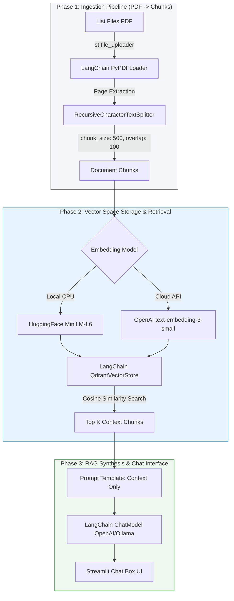

# 🏛️ Lược đồ Kiến trúc & Lộ trình RAG: Dự án NLP Học tập Cá nhân

Tài liệu này là **Tài liệu Trung tâm (Central Blueprint)** được thiết kế đặc biệt phục vụ cho quá trình học tập môn **Xử lý Ngôn ngữ Tự nhiên (Natural Language Processing - NLP)**. Scope dự án được giới hạn tối đa, tập trung 100% vào logic cốt lõi của RAG (Retrieval-Augmented Generation) và loại bỏ hoàn toàn các tính năng mở rộng phức tạp.

Mục tiêu cốt lõi của dự án là xây dựng một ứng dụng local chạy bằng **Streamlit** cho phép:
1. Tải lên danh sách file PDF (`st.file_uploader`).
2. Biến đổi nội dung tài liệu thành không gian Vector (**Vector Space**) thông qua các mô hình nhúng ngữ nghĩa (Embeddings).
3. Thực hiện truy vấn tương đồng ngữ nghĩa để lấy ra thông tin liên quan từ Vector Space.
4. Trò chuyện trực tiếp (Chat Interface) với LLM để tổng hợp câu trả lời dựa trên ngữ cảnh đã truy xuất.

---

## 🧭 Khái niệm NLP Cốt lõi áp dụng trong Dự án

Dự án này là cơ hội thực hành trực tiếp các bài toán kinh điển trong lĩnh vực xử lý ngôn ngữ và thu hồi thông tin (Information Retrieval):

### 1. Phân mảnh Văn bản (Document Chunking)
Trong NLP, các mô hình LLM luôn có giới hạn về cửa sổ ngữ cảnh (Context Window). Việc đưa toàn bộ một cuốn sách PDF vào LLM là không khả thi và gây tốn kém token. 
* **Giải pháp**: Phân đoạn tài liệu bằng bộ chia đệ quy `RecursiveCharacterTextSplitter` của LangChain.
* **Nguyên lý hoạt động**: Bộ chia sẽ quét và bẻ nhỏ tài liệu dựa trên danh sách ký tự phân tách ưu tiên: Đoạn văn (`\n\n`) -> Câu đơn (`\n`, `.`) -> Từ `" "`.
* **Tham số tối ưu**:
  * `chunk_size = 500` ký tự: Đảm bảo độ mịn ngữ nghĩa vừa đủ.
  * `chunk_overlap = 100` ký tự: Tạo độ gối đầu giữa các đoạn kề nhau để không làm mất thông tin ở biên cắt.

### 2. Không gian Vector nhúng (Embedding & Vector Space)
* **Embedding**: Là kỹ thuật ánh xạ một chuỗi ký tự (từ hoặc đoạn văn) thành một vector dense (vector phân bố dày đặc) gồm $D$ số thực trong không gian đa chiều.
* Mô hình sử dụng chạy cục bộ: `sentence-transformers/all-MiniLM-L6-v2` (Biến đổi văn bản thành vector $384$ chiều trên CPU máy local, hoàn toàn miễn phí và không cần mạng).
* Mô hình sử dụng qua API: OpenAI `text-embedding-3-small` (Vector $1536$ chiều độ chính xác cao).

### 3. Tìm kiếm Tương đồng Ngữ nghĩa (Cosine Similarity Retrieval)
Khi người dùng đặt câu hỏi, câu hỏi đó cũng được chuyển đổi thành một vector truy vấn $\mathbf{q}$. Hệ thống thực hiện so khớp toán học giữa vector câu hỏi và hàng ngàn vector đoạn văn $\mathbf{d}_i$ lưu trữ trong Vector Store.
* **Phép toán Cosine Similarity**: Tính góc Cosine giữa hai vector để đo độ tương đồng ngữ nghĩa:
$$\text{Cosine Similarity}(\mathbf{q}, \mathbf{d}_i) = \frac{\mathbf{q} \cdot \mathbf{d}_i}{\|\mathbf{q}\| \|\mathbf{d}_i\|}$$
* Góc nhỏ (Cosine tiến gần về 1) biểu thị ngữ nghĩa trùng khớp cao. Hệ thống lọc ra top $k$ đoạn văn có điểm số lớn nhất để làm ngữ cảnh phụ trợ.

---

## 🗺️ Quy trình 3 Phase Phát triển Rút gọn

---

## 📋 Lộ trình Chi tiết các Phase, Stage & Step

### 🏗️ Phase 1: Ingestion Pipeline (PDF -> Chunks)
*Tập trung hoàn toàn vào khâu nạp dữ liệu thô, giải mã cấu trúc file PDF và phân mảnh ngữ nghĩa.*

* **Stage 1.1: Tải tệp tin (Document Loading)**
  * `[ ]` **Step 1.1.1**: Thiết lập giao diện upload tệp tin đa nguồn (`st.file_uploader`) trên Streamlit, giới hạn chỉ nhận định dạng `.pdf`.
  * `[ ]` **Step 1.1.2**: Tích hợp `PyPDFLoader` của LangChain để đọc và trích xuất chuỗi văn bản thuần túy theo từng trang.
  * `[ ]` **Step 1.1.3**: Trích xuất siêu dữ liệu số trang gốc từ PDF (`page` index) gán vào siêu dữ liệu của tài liệu để phục vụ việc trích dẫn nguồn sau này.
* **Stage 1.2: Phân mảnh Ngữ nghĩa (Text Splitting)**
  * `[ ]` **Step 1.2.1**: Cấu hình bộ chia `RecursiveCharacterTextSplitter` với các tham số tối ưu học tập môn NLP: `chunk_size=500` và `chunk_overlap=100`.
  * `[ ]` **Step 1.2.2**: Thiết lập cơ chế thừa kế siêu dữ liệu: Đảm bảo các chunk con sinh ra vẫn giữ nguyên thông tin về tên file nguồn và trang vật lý gốc của PDF.
  * `[ ]` **Step 1.2.3**: Triển khai hàm kiểm tra dữ liệu đầu ra: loại bỏ các chunk rỗng hoặc chỉ chứa các ký tự đặc biệt vô nghĩa.

### 🧠 Phase 2: Vector Space Storage & Similarity Retrieval
*Chuyển hóa văn bản thành tọa độ toán học và thiết lập bộ máy tìm kiếm ngữ nghĩa.*

* **Stage 2.1: Sinh Vector nhúng (Embedding Factory)**
  * `[ ]` **Step 2.1.1**: Cấu hình `HuggingFaceEmbeddings` chạy model cục bộ `all-MiniLM-L6-v2` để sinh vector 384 chiều không tốn chi phí.
  * `[ ]` **Step 2.1.2**: Tích hợp dự phòng `OpenAIEmbeddings` (`text-embedding-3-small`, 1536 chiều) qua cấu hình `.env` để đối chiếu hiệu năng.
  * `[ ]` **Step 2.1.3**: Triển khai cơ chế batch-ing để gửi hàng loạt chunk đi sinh embedding một lúc nhằm tối ưu tài nguyên CPU/mạng.
* **Stage 2.2: Không gian Vector & Tìm kiếm tương đồng (Vector Store)**
  * `[ ]` **Step 2.2.1**: Khởi tạo Qdrant cục bộ (`qdrant-client`) ở chế độ chạy tệp tin (`.qdrant_data/`), không cần cài đặt máy chủ bên ngoài.
  * `[ ]` **Step 2.2.2**: Liên kết Client với `QdrantVectorStore` của LangChain để lập chỉ mục tìm kiếm tương đồng tự động.
  * `[ ]` **Step 2.2.3**: Viết hàm tìm kiếm tương đồng ngữ nghĩa `similarity_search_with_score` để thu về danh sách các chunk phù hợp nhất kèm điểm số tương quan, hỗ trợ thiết lập bộ lọc ngưỡng tối thiểu `threshold >= 0.70`.

### 🎨 Phase 3: RAG Synthesis & Chat Interface (Giao diện và Logic Hội thoại)
*Xây dựng bộ não tổng hợp câu trả lời và thiết kế giao diện chat đơn giản.*

* **Stage 3.1: Bộ não Tổng hợp RAG (LLM Chain)**
  * `[ ]` **Step 3.1.1**: Thiết kế prompt hệ thống nghiêm ngặt buộc LLM chỉ được trả lời câu hỏi dựa trên các đoạn văn bản được cung cấp. Nếu ngữ cảnh không có thông tin, LLM bắt buộc phải trả lời: *"Không tìm thấy thông tin phù hợp trong các tệp PDF đã tải lên"*.
  * `[ ]` **Step 3.1.2**: Tích hợp Chat model (`ChatOpenAI` hoặc local LLM chạy qua Ollama) bằng LangChain.
  * `[ ]` **Step 3.1.3**: Đóng gói luồng RAG thành một hàm duy nhất: `Nhận câu hỏi -> Truy vấn Vector Space -> Dựng Prompt -> LLM Sinh câu trả lời -> Trả về kết quả kèm nguồn trích dẫn`.
* **Stage 3.2: Giao diện Streamlit Đơn giản & Thực chất (GUI Layer)**
  * `[ ]` **Step 3.2.1**: Thiết kế bố cục Streamlit 2 cột tinh giản:
    * **Cột bên trái**: Nút upload file PDF và hiển thị danh sách các tài liệu hiện có trong Vector Space kèm trạng thái (đã nạp xong / đang nạp).
    * **Cột chính ở giữa**: Không gian chat trò chuyện tập trung.
  * `[ ]` **Step 3.2.2**: Triển khai hộp chat tiêu chuẩn của Streamlit (`st.chat_input` và `st.chat_message`) hiển thị luồng hội thoại cuộn mượt mà.
  * `[ ]` **Step 3.2.3**: Dưới mỗi câu trả lời của AI, render một danh sách ngắn gọn ghi rõ thông tin tham chiếu trích xuất từ file nào, trang số mấy (ví dụ: *Nguồn tham chiếu: [Trang 4] - Tailieu.pdf*), giúp người dùng dễ dàng kiểm chứng trực quan.

---

## 📊 Kế hoạch Tích hợp & Kiểm tra Chức năng (Verification Plan)

Vì dự án tập trung cao độ vào logic xử lý tài liệu học tập, chúng ta sẽ thực thi kiểm tra các mốc chức năng sau:
1. **Kiểm tra Chunking**: In ra màn hình console số lượng chunk và nội dung của một chunk ngẫu nhiên sau khi chia nhỏ để kiểm tra xem có bị gãy từ ngữ hay không.
2. **Kiểm tra Retrieval**: Thực hiện một câu hỏi thử nghiệm thông qua CLI/Streamlit, in ra danh sách các đoạn văn bản được truy xuất kèm điểm số tương quan Cosine để đánh giá xem hệ thống có tìm đúng tài liệu hay không.
3. **Kiểm tra RAG**: Đặt các câu hỏi mẹo không có trong tài liệu để xác minh LLM tuân thủ prompt hệ thống nghiêm ngặt (không ảo tưởng thông tin ngoài).

*Bản đồ Lộ trình rút gọn này đã sẵn sàng. Không mở rộng thêm bất cứ tính năng nào ngoài RAG cốt lõi.*
